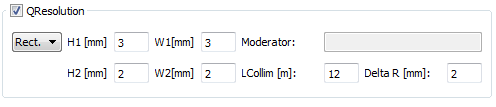
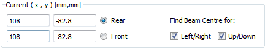
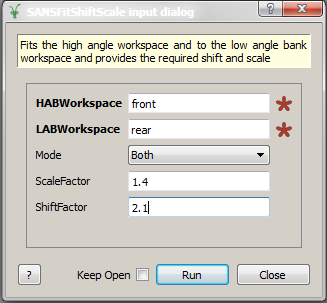
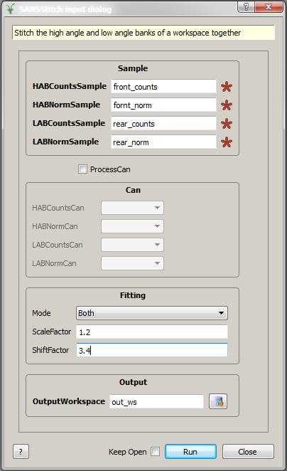

============
SANS Changes
============

.. contents:: Table of Contents
   :local:

Extensions and Improvements
---------------------------

-  QResolution calculation for SANS: The q resolution can be calculated
   for for 1D reductions. See here for
   `details <https://archive.mantidproject.org/ISIS_SANS:_Reduction_Settings#QResolution>`_.

   SANS Q resolution

-  QResolution calculation user file commands: The q resolution
   calculation can be driven through the user file. For a comprehensive
   list of commands, see
   `here <https://archive.mantidproject.org/SANS_User_File_Commands#QRESOLUTION>`_.

-  Extended Beam Centre Finder for LARMOR: The beam centre finder takes
   the rotational movement of LARMOR's detector into account.

-  Beam Centre Finder: Allow for 0 iterations. This produces the left,
   right, up and down partial workspaces which are normally used during
   the beam centre finder operation. This can be helpful if a user wants
   to see how far off the initial estimate is.

-  Beam Centre Finder: The user can now choose the search direction
   (\`UP/DOWN\` or \`LEFT/RIGHT\` or both). Having both enabled is the
   default setting

   SANS Beam Centre Finder Selection

-  Expose AddRuns command for Python scripting : See here
   (`here <https://archive.mantidproject.org/Scripting_SANS_Reductions#AddRuns.28runs.2C_instrument_.3D.27sans2d.27.2C_saveAsEvent.3DFalse.2C_binning_.3D_.22Monitors.22.2C_isOverlay_.3D_False.2C_time_shifts_.3D_None.2C_defType.3D.27.nxs.27.2C_rawTypes.3D.28.27.raw.27.2C_.27.s.2A.27.2C_.27add.27.2C.27.RAW.27.29.2C_lowMem.3DFalse.29>`__)
   for details

-  Handle cumulative sample logs for SANS: Adding files using the Add
   Tabs GUI now ensures that cumulative sample log entries
   (``good_frames``, ``good_uah_log``, ...) are added up in a
   cumulative manner and not just concatenated and then sorted via
   time-stamp.

-  Apply event time limits to Can: Event-based Can workspaces were
   previously immediately converted into histogrammed workspaces after
   loading. The binning was matched to the binning of the monitor
   workspace. Now the Can workspace is loaded as an event workspace and
   is converted into a histogrammed workspace during the reduction flow.
   The binning used is the same as for the Sample. This means that the
   treatment of the Can and the Sample is now symmetric.

-  :ref:`SANSStitch <algm-SANSStitch>`:
   Stitching of the Front/HAB and Rear/Main detectors has been
   exported to a dedicated Python algorithm.

-  :ref:`SANSFitShiftScale <algm-SANSFitShiftScale>`:
   Fitting the Front/HAB and Rear/Main detectors to match has been
   exported to a dedicated Python algorithm.

Bug Fixes
---------

-  Transmission settings in the GUI don't allow specification of a shift
   or selection of M3 at the same time. GUI logic improved. M4 not
   selectable any more when using LOQ.
-  Can save and load x errors in the :ref:`Nexus file <Nexus file>` format.
-  Removed temporary workspaces when saving in batch file mode
-  Reduction of warnings (e.g.algorithm history)
-  Fix distribution on fit algorithm
-  Corrections to ``TOFSANSResolutionByPixel`` and documentation
-  Make parsing of first line in Batch Mode silent in ISIS SANS
-  Make log level for beam centre finder independent of general log
   level
-  Fix link error in calculate transmission
-  Only accept valid user files in ISIS SANS: This includes legacy user
   files and txt files
-  Fix :ref:`SumRowColumn <algm-SumRowColumn>` algorithm
-  Fix 2D merge issue
-  Add system test for merged data in sans

`Full list of changes on github <http://github.com/mantidproject/mantid/pulls?q=is%3Apr+milestone%3A%22Release+3.6%22+is%3Amerged+label%3A%22Component%3A+SANS%22>`__
