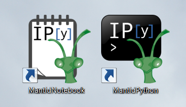
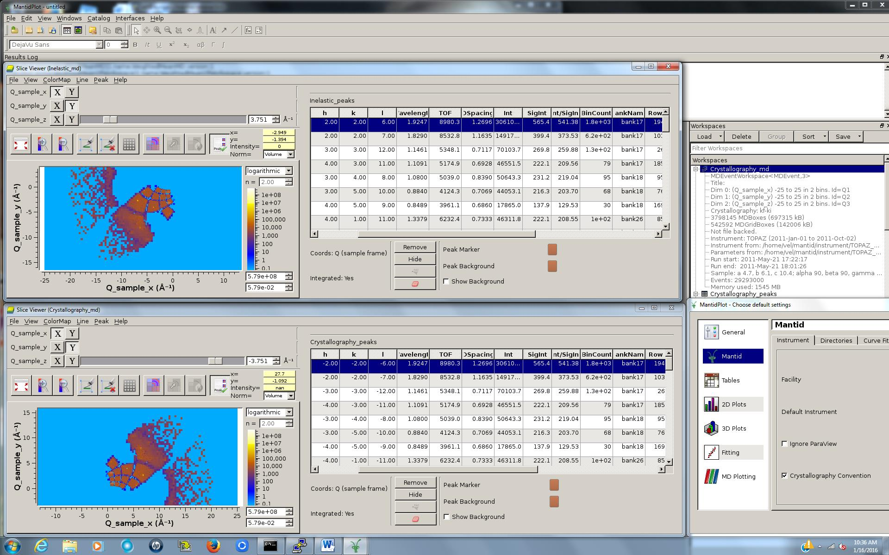
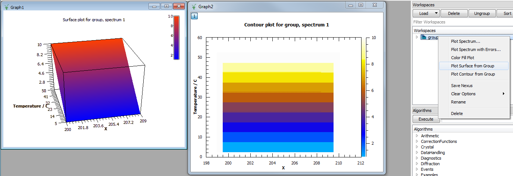
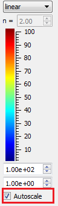

======================
UI & Usability Changes
======================

.. contents:: Table of Contents
   :local:

Installation
------------

Windows
#######

-  Shortcuts to launch an IPython console or IPython notebooks using
   Mantid's Python environment are created in the start menu and on the
   desktop when MantidPlot is installed.

OS X
####

-  Applications to launch an IPython console or IPython notebooks using
   Mantid's Python environment can optionally be installed with
   MantidPlot on OS X.

User Interface
--------------

Plotting improvements
#####################

-  HKL and Q can be displayed in the MantidPlot table and also in the
   SliceViewer and VSI plots with the opposite signs if
   Q.convention=Crystallography is set Mantid.user.properties or
   Crystallography Convention is checked in Preferences.
   :ref:`LoadMD <algm-LoadMD>` will convert old MD files when using Crystallography
   convention (kf-ki) if they were saved in the default convention
   (ki-kf). The convention used for MDWorkspaces and PeaksWorkspaces
   will be displayed when the workspace is right-clicked.
   The new :ref:`ChangeQConvention <algm-ChangeQConvention>` algorithm should only be used on MD
   workspaces that contain only Q or HKL dimensions. If there are other
   dimensions, user should still run this algorithm (so that the
   convention flag is changed), but then run :ref:`TransformMD <algm-TransformMD>` with -1 for the
   non-Q dimensions.

-  Plot MD plots now show a context menu option to change the type of
   normalization (volume/none/number of events).
-  The VSI has been updated to use ParaView v5.0.0, which includes
   changes to the color/opacity presets and a rewritten OpenGL v3.2
   rendering engine.
-  The Viridis colormap is available in the VSI.
-  A new right-click option on WorkspaceGroups enables a 3D surface or
   contour plot to quickly be generated from groups. Data from each
   workspace in the group can be plotted against workspace index or any
   numeric, single-valued log value (for example temperature, magnetic
   field...) If the desired data has not been added to the workspaces as
   a log, it can be supplied manually in the dialog (or added using the
   :ref:`AddSampleLog <algm-AddSampleLog>` algorithm).

-  ColorFill plots and SliceViewer now use the global option set under
   View/Preferences/2D Plots/Autoscale to determine whether or not the
   color scale will be reset every time the data is updated. This
   enables turning the option off when these tools are being used to
   view live data. A checkbox has been added to the SliceViewer to
   control this option on a plot-by-plot basis as well.

Algorithm Toolbox
#################

-  The categories found under the Algorithm tool box have been made
   neater. They should now be easier to find since lists are shorter. Of
   course you can still use the search box and type in the first few
   letters of any algorithm if you have trouble finding it.

   -  As part of this improvement we have removed the PythonAlgorithms
      category, which contained a large mix of algorithms for different
      areas. These have now been merged into the categories that
      describe their use.

Scripting Window
################

-  The scripting window now allows soft line wrapping of text which can
   be toggled on and off.

Documentation
#############

-  The help pages for all of the workspace types, together with the
   instrument, sample and run objects have been improved and now contain
   a collection of automatically tested Python usage examples. This will
   be available in both the :ref:`online <concepts contents>`
   and offline help pages.
-  We have improved the way category links work at the bottom of the
   Algorithm help pages, so they handle subcategories much better.
-  The documentation pages for :ref:`MoveInstrumentComponent <algm-MoveInstrumentComponent>` and
   :ref:`RotateInstrumentComponent <algm-RotateInstrumentComponent>` have been improved and pictures have been
   added to describe the effects on ComponentAssemblies (components made
   up of other components) such as tubes or banks.
-  Latex equations are once again being generated in the Qt Help on OS
   X.

Bugs Resolved
-------------

-  When viewing an MDEventWorkspace, the Axes Grid is now visible.
-  When duplicating a window (Graph, Color Fill plot or table), the data
   is now copied into the newly duplicated window.
-  Fixed a bug which could cause a crash when trying to "List Data" from
   a large MDEventWorkspace.

SliceViewer Improvements
------------------------

-  Default normalization for MDWorkspaces is automatically chosen. This
   makes the SliceViewer consistent with the Vates Simple Interface 3D
   visualisation.
-  Automatic rescaling of the color scale when data is reloaded can be
   turned off using a new checkbox. The default for this option can be
   set in View/Preferences/2D Plots/Autoscale.
-  Fixed bug that caused integration radius of peaks in the SliceViewer
   to be plotted incorrectly.

Full list of `GUI <http://github.com/mantidproject/mantid/pulls?q=is%3Apr+milestone%3A%22Release+3.6%22+is%3Amerged+label%3A%22Component%3A+GUI%22>`_
and
`Documentation <http://github.com/mantidproject/mantid/pulls?q=is%3Apr+milestone%3A%22Release+3.6%22+is%3Amerged+label%3A%22Component%3A+Documentation%22>`_
changes on github
