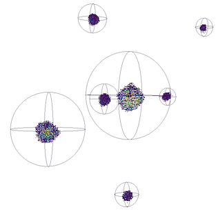

======================
UI & Usability Changes
======================

.. contents:: Table of Contents
   :local:

Installation
------------

Windows
#######

OS X
####

User Interface
--------------

Plotting Improvements
#####################

Line plots
^^^^^^^^^^

- The default for plotting line plots has been changed to include plotting error bars on every data point.
  This in general makes more sense than the previous approach of missing some points based on the data density.
- However it can make dense data plots with errors look more obscured, so if you preferred the old approach you can change it back by unselecting the option Draw All Errors in the View->Prefences menu.

Instrument View
###############

-  The instrument view is now exposed to python as a stand-alone widget.
   In it's current implementation, the instrument view depends on the
   global workspace list in order to load data from workspaces. Example script:

.. code-block:: python

   from threading import Thread
   import time
   import sys
   import PyQt4
   import mantid.simpleapi as simpleapi
   import mantidqtpython as mpy

   ConfigService = simpleapi.ConfigService
   def startFakeEventDAE():
       # This will generate 2000 events roughly every 20ms, so about 50,000 events/sec
       # They will be randomly shared across the 100 spectra
       # and have a time of flight between 10,000 and 20,000
       try:
           simpleapi.FakeISISEventDAE(NPeriods=1,NSpectra=100,Rate=20,NEvents=1000)
        except RuntimeError:
           pass

   def captureLive():
       ConfigService.setFacility("TEST_LIVE")

       # start a Live data listener updating every second, that rebins the data
       # and replaces the results each time with those of the last second.
       simpleapi.StartLiveData(Instrument='ISIS_Event', OutputWorkspace='wsOut', UpdateEvery=0.5,
                               ProcessingAlgorithm='Rebin', ProcessingProperties='Params=10000,1000,20000;PreserveEvents=1',
                               AccumulationMethod='Add', PreserveEvents=True)

    #--------------------------------------------------------------------------------------------------
    InstrumentWidget = mpy.MantidQt.MantidWidgets.InstrumentWidget
    app = PyQt4.QtGui.QApplication(sys.argv)

    eventThread = Thread(target = startFakeEventDAE)
    eventThread.start()

    while not eventThread.is_alive():
        time.sleep(2) # give it a small amount of time to get ready

    facility = ConfigService.getFacility()
    try:
        captureLive()

        iw = InstrumentWidget("wsOut")
        iw.show()
        app.exec_()
    finally:
        # put back the facility
        ConfigService.setFacility(facility)

Algorithm Toolbox
#################

Scripting Window
################

- If `MantidPlot` was launched with the `-x` option but the script was already opened by the recent files list then
  the wrong script would be executed. This bug has been fixed. `#15682 <https://github.com/mantidproject/mantid/issue/15682>`_

Documentation
#############

- Documentation has been added for fitting functions :ref:`BSpline <func-BSpline>` and
  :ref:`CubicSpline <func-CubicSpline>` then attempts to be more verbose about their use and how to
  implement them. The Documentation now contains example images of splines
  and also concrete equations that describe them
  `#15064 <https://github.com/mantidproject/mantid/pull/15064>`_

Bugs Resolved
-------------

-  VSI: Fix Mantid crash when pressing :ref:`Scale <algm-Scale>` or Cut when "builtin" node
   is selected in Pipeline Browser

-  VSI: The TECHNIQUE-DEPENDENT initial view now checks for Spectroscopy before Neutron Diffraction.

-  A bug was fixed in the Fit property browser where the "Plot Difference" and other checkboxes affected the display of parameter errors. Now only the "Show Parameter Errors" box will control this.

-  Plots from tables: the axis labels correspond to the data plotted and not just the first two columns.

-  Plots from tables: the title of the plot is the title of the TableWorkspace rather than the default "Table" (this is useful when several tables and plots are open)

-  Plots from tables auto-update when the TableWorkspace is replaced in the ADS. If extra rows are added then the new points are added to the graph.

SliceViewer Improvements
------------------------

-  The SliceViewer is now able to display ellipsoidal peak shapes. Note
   that the displayed ellipse is the result of the viewing plane cutting
   the peak ellipsoid.

.. figure::  ../../images/Elliptical_peaks_slice_viewer.png
   :align: center

VSI Improvements
----------------

-  The representation of points in the splatter plot was changed from opaque cubes to translucent spheres.

- The sphere and ellipse wireframes have been simplified so that it is easier to see the enclosed points.

- Removed the error-prone right-click option to view peaks workspaces in the VSI. One should load a MDWorkspace,
  then drag the corresponding peaks workspace into the VSI window.

|

Full list of
`GUI <http://github.com/mantidproject/mantid/pulls?q=is%3Apr+milestone%3A%22Release+3.7%22+is%3Amerged+label%3A%22Component%3A+GUI%22>`_
and
`Documentation <http://github.com/mantidproject/mantid/pulls?q=is%3Apr+milestone%3A%22Release+3.7%22+is%3Amerged+label%3A%22Component%3A+Documentation%22>`_
changes on GitHub
