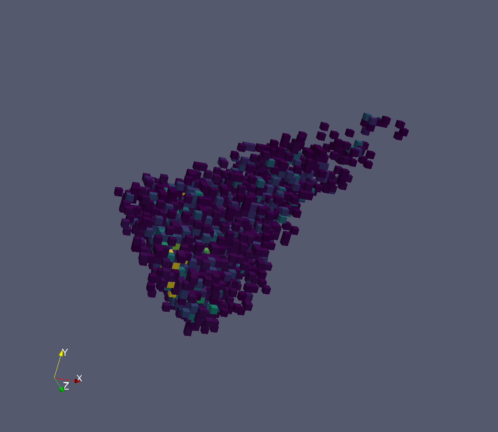

===================
Diffraction Changes
===================

.. contents:: Table of Contents
   :local:

Crystal Improvements
--------------------

Single Crystal Diffraction
--------------------------

- HFIR HB3A's data reduction interface application (MantidPlot/Interfaces/Diffraction/HFIR 4Circle Reduction)
  has been expanded and improved from previous release. It provides an integrated user-friendly interface for
  instrument scientists and users to access data, calculate and refine UB matrix, merge multiple data sets
  for slice-view and peak integration.

- :ref:`IntegratePeaksMDHKL <algm-IntegratePeaksMDHKL>` has been added to integrate data in HKL space.  The
  main usage will be to normalize the data using
  :ref:`MDNormSCD <algm-MDNormSCD>` and then integrate the resulting MDHistoWorkspace,
  but it also integrates MDHistoWorkspaces and MDEventWorkspaces without normalizing.
  The MD data must be in units of HKL.  A 3D box is created for each peak and the background
  and peak data are separated.  The intensity and sigma of the intensity is found from the grid inside the peak and
  the background is subtracted.  The boxes are created and integrated in parallel and less memory is required than
  binning all HKL space at once. The figure shows the grid points within an HKL box that are in one peak from Si data.

- Some improvements were done for creating peaks from python. :ref:`CreatePeaksWorkspace <algm-CreatePeaksWorkspace>`
  copies the goniometer from the input MatrixWorkspace to PeaksWorkspace. createPeak for PeaksWorkspace copies goniometer
  from PeaksWorkspace to peak. setGoniometer for a peak can be done from python and setQLabFrame and setQSampleFrame work
  correctly now with one argument.

- :ref:`SCDCalibratePanels <algm-SCDCalibratePanels>` has been rewritten to calibrate the position and rotations of
  each panel independently in parallel.  There are options to calibrate the panel size and the L1 for all the panels.
  Only the U of the UB matrix is refined.  There is a script, scripts/SCD_Reduction/SCDCalibratePanelsResults.py, that takes the output of
  this algorithm and plots the theoretical vs calculated position of each peak for each panel.  The RMSD in mm is
  calculated and printed in a log file and on the plots.

- Given a PeaksWorkspace or MatrixWorkspace with an instrument,
  :ref:`SetDetScale <algm-SetDetScale>`
  will set or change the detector bank scales that are used in SaveHKL and AnvredCorrection.  The input format is the same as
  used in anvred3.py, so DetScaleList input can be pasted from the definition of detScale there.  The default values can be
  set in the instrument parameter file. Default values are in the parameter file for the TOPAZ instrument.

- :ref:`SaveLauenorm <algm-SaveLauenorm>`
  was modified to have an option to use the detector bank scales from the instrument parameters. The values can be
  set to have defaults in the instrument parameter file or by
  :ref:`SetDetScale <algm-SetDetScale>`.

Engineering Diffraction
-----------------------

- EnggFocus: bins are now masked at the beginning of the workflow
  (when using the option MaskBinsXMins)

- SaveDiffFittingAscii an algorithm which saves a TableWorkspace containing
  diffraction fitting results as an ASCII file

- New *Fit All* button on the Fitting Tab will enable user to
  batch-process all the runs and banks when a range of run number
  is given. During the Fit process,
  SaveDiffFittingAscii algorithm
  will be utilised to save *engggui_fitting_fitpeaks_param*
  TableWorkspace as a `csv` file.

- New *Load* button on the Fitting Tab, will enable user to load the
  focused file to the canvas, so that the user can select the peaks
  manually beforehand

- New tool-tip *How to use* quickly tells users how to use the peak
  picker tool by simply hovering their cursor over it.

Powder Diffraction
------------------

- :ref:`SNSPowderReduction <algm-SNSPowderReduction>` has changed
  parameters. ``Instrument``, ``RunNumber``, and ``Extension`` have
  been replaced with a single ``Filename`` parameter. This has been
  paired with changes to the Powder Diffraction interface as
  well. There were also a variety of bugfixes related to the output
  workspaces. While it did not affect the saved data files, the output
  workspaces were not always correctly normalized or in the requested
  units. There is also an additional ``GroupingFile`` parameter which
  allows overriding the grouping that is specified in the
  ``CalibrationFile``. The documentation for this algorithm has been
  greatly expanded as well.

- :ref:`PDFFourierTransform <algm-PDFFourierTransform>` has been modified to
  look at the signal as well when looking at the ``Q``-range to use
  for the transform.

- `Crystallography Powder Diffraction Script <http://docs.mantidproject.org/v3.8.0/api/python/techniques/CryPowderDiffractionISIS-v1.html>`_: S-Empty option has been enabled for
   the Crystallography Powder Diffraction Script. In order to use the
   S-Empty option, simply provide the S-Empty run number within the
   ``.pref`` file.

- :ref:`CorelliCrossCorrelate <algm-CorelliCrossCorrelate>`: The
  weights applied to events have changed by a factor of the duty cycle
  (:math:`c\approx0.498`) as requested by the instrument scientists.

- `Pearl Powder Diffraction Script <http://docs.mantidproject.org/v3.8.0/api/python/techniques/PearlPowderDiffractionISIS-v1.html>`_:
  A workflow diagram for ``pearl_run_focus`` function has been created.

- `CalibrateRectangularDetectors` has been modified to output
  ``.h5`` formatted calibration files as well as the other versions it
  already supported.

- New algorithm :ref:`PDCalibration <algm-PDCalibration>` for
  pixel-by-pixel calibration in time-of-flight space.

Imaging
-------

- An updated version of the IMAT instrument definition now includes
  prototype diffraction detector banks.

Tomographic reconstruction graphical user interface
###################################################

- Fixed the submission of custom commands.

Full list of `diffraction <http://github.com/mantidproject/mantid/pulls?q=is%3Apr+milestone%3A%22Release+3.8%22+is%3Amerged+label%3A%22Component%3A+Diffraction%22>`_
and
`imaging <http://github.com/mantidproject/mantid/pulls?q=is%3Apr+milestone%3A%22Release+3.8%22+is%3Amerged+label%3A%22Component%3A+Imaging%22>`_ changes on GitHub.
