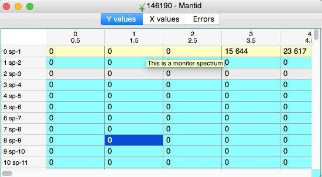
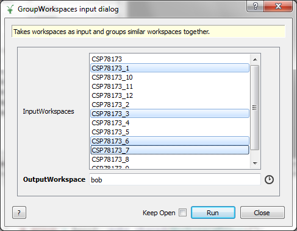
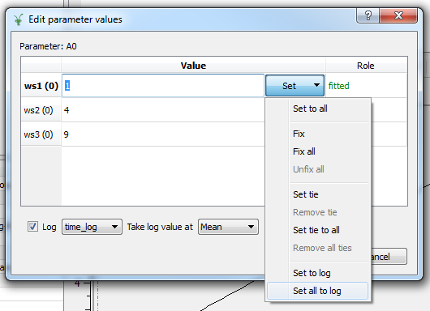

======================
UI & Usability Changes
======================

.. contents:: Table of Contents
   :local:

Installation
------------

Windows
#######

* IPython has been upgraded to version 3.2.1

User Interface
--------------

Instrument View
###############
* The instrument view will now save the state of the window to a Mantid project file.

Workspace Matrix View
#####################
* Masked spectra (including masked monitors) will be highlighted with background colour (typically light grey).
* Unmasked monitor spectra will have a dynamic background colour depending on the system settings (typically light yellow, as before).

Plotting Improvements
#####################
* A new option has been added to the "Plot Spectrum" and "Plot Spectrum with Errors" dialogs. The "Tiled plot" checkbox enables such a plot to be produced as a simple right-click option.

  - When this option is used for a workspace group, each workspace will its own subplot, with all specified spectra in it.
  - When the option is used for a single workspace, each of the specified spectra will have its own subplot.
* Using the Label Tool on a plot to add Sample Logs as labels now opens up a dialogue for the selected workspace with all the available Sample Logs listed and the ability to import the selected one onto the plot as a label.

Algorithms
##########

- Algorithms can now use a multiple selection list box for property input, :ref:`MergeRuns <algm-MergeRuns>` and :ref:`GroupWorkspaces <algm-GroupWorkspaces>` use this so far. To select multiple rows use the Shift or Ctrl (Cmd) keys while clicking  with the mouse.

Scripting Window
################

- All `matplotlib` examples now work out of the box when run inside the MantidPlot scripting environment.

Progress Reporting
##################

- The progress reporting for algorithms has been improved, so that the progress is reported correctly when processing workspace groups or multi-period workspaces.
- The progress reporting for algorithms has been improved, so that the progress is reported correctly when processing workspace groups or multi-period workspaces.

Documentation
#############

- Added Ragged Workspace as a concept page

Options Window
###############
- Within Preferences->Mantid->Options ticking a category off/on will now untick/tick all subcategories. Also having some subcategories on and off will now show a partially ticked box for that category. 

SliceViewer Improvements
------------------------
* When opening the SliceViewer, it will default to showing the first two non-integrated dimensions
* The SliceViewer now uses bin centres instead of bin edges when slicing on a histogram workspace
* The SliceViewer will now save the state of the window to a Mantid project file.

VSI Improvements
----------------
* ParaView updated to version 5.1.2
* VSI will now save the state of the window to a Mantid project file.

SpectrumViewer Improvements
---------------------------
* The SpectrumViewer will now save the state of the window to a Mantid project file.

Multi-dataset fitting interface improvements
--------------------------------------------
* Fitting a single dataset with a composite function no longer causes a crash

* "Set to log" and "Set all to log" options have been added to the parameter editing dialog. These enable a parameter to be set to a value from a sample log for one or all spectra.

Bugs Resolved
-------------
- Floating windows now always stay on top of the main window in OSX.
- The sliceviewer will now rebin an existing binned workspace correctly.
- 2D plots now display correctly for point data workspaces as well as for histogram data
- Cuts aligned with an axis no longer generate an empty integrated line plot.

Full list of
`GUI <http://github.com/mantidproject/mantid/pulls?q=is%3Apr+milestone%3A%22Release+3.8%22+is%3Amerged+label%3A%22Component%3A+GUI%22>`_
and
`Documentation <http://github.com/mantidproject/mantid/pulls?q=is%3Apr+milestone%3A%22Release+3.8%22+is%3Amerged+label%3A%22Component%3A+Documentation%22>`_
changes on GitHub
