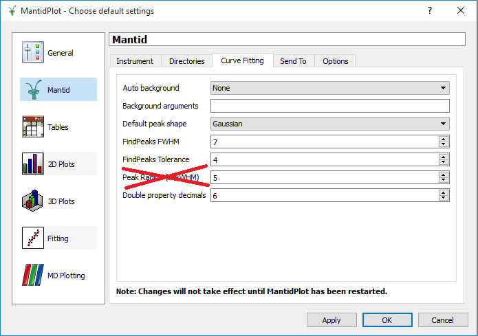

=================
Framework Changes
=================

.. contents:: Table of Contents
   :local:

Changes
-------

- Mantid now supports automatic updates to the facilities.xml file in the same way that it does the instrument definitions.  This allows extensions and changes to the list of supported instruments without needing to install a new release of Mantid.
- This has been initially put into place to support a data file naming change for Vesuvio, but will help for future changes as well.
- Mantid is aware of the change to file naming for Vesuvio, you can continue to use EVS or VESUVIO as a prefix when trying to load files from this instrument, and Mantid will map that to the correct filenames.
- Mantid will correctly handle the naming format changes to Polaris, it will automatically select between the old and new filename format whilst loading files correctly.

Algorithms
----------

New
###

- :ref:`ConvertToConstantL2 <algm-ConvertToConstantL2>` is the new name for CorrectFlightPaths.
- :ref:`BinWidthAtX <algm-BinWidthAtX>` calculates the bin width at X, averaged over all histograms.
- :ref:`MedianBinWidth <algm-MedianBinWidth>` provides the median bin widths of histograms.

Improved
########

- :ref:`CalculateFlatBackground <algm-CalculateFlatBackground>` has a new mode 'Moving Average', which takes the minimum of a moving window average as the flat background.
- :ref:`StartLiveData <algm-StartLiveData>` and its dialog now support dynamic listener properties, based on the specific LiveListener being used.
- All algorithms using AsciiPointBase now have a new property 'Separator' which allows the delimiter to be set to either comma, space or tab. This affects ``SaveReflCustomAscii``, ``SaveReflThreeColumnAscii``, ``SaveANSTOAscii`` and ``SaveILLCosmosAscii``.
- :ref:`ReplaceSpecialValues <algm-ReplaceSpecialValues>` allows for 'small' values, which are below a user specified threshold, to be replaced.
- :ref:`Stitch1DMany <algm-Stitch1DMany>` has a new property 'ScaleFactorFromPeriod', which enables it to apply scale factors from a particular period when stitching group workspaces. The documentation for this algorithm has also been improved.
- ``SaveMDWorkspaceToVTK`` has a working progress bar.
- :ref:`SumSpectra <algm-SumSpectra>` has an option to ignore special floating point values called 'RemoveSpecialValues'. This is off by default. When enabled it will ignore values such as NaN or Infinity during the summation of the spectra.  It was also updated to fix special values being used in some cases when the option was selected.
- :ref:`MonteCarloAbsorption <algm-MonteCarloAbsorption>`:
   - An `Interpolation` option has been added. The availabile options are: `Linear` & `CSpline`.
   - The method of selecting the scattering point has ben updated to give better agreement with numerical algorithms (e.g. :ref:`CylinderAbsorption <algm-CylinderAbsorption>`).
- :ref:`SetSample <algm-SetSample>` now accepts an Angle argument for defining a rotated flat plate sample.
- :ref:`SavePlot1D <algm-SavePlot1D>` now supports optional ``SpectraList`` for plotting
- :ref:`MaskDetectors <algm-MaskDetectors>` has a new option to mask detectors by the instrument's component name. It can accept a masked workspace with a differing number of spectra to the input workspace, providing that the number of detectors match. This can be useful in the case of hardware grouped detectors.
- :ref:`LoadIsawDetCal <algm-LoadIsawDetCal>` now accepts multiple files in a single ``Filename`` property.
- :ref:`SavePlot1D <algm-SavePlot1D>` now supports optional ``SpectraList`` for plotting
- :ref:`MayersSampleCorrection <algm-MayersSampleCorrection>`: The calculation of the azimuth angle has been fixed. Previously it was set equal to the Mantid definition of phi but the old code defined it as the angle away from the scattering plane.
- :ref:`MatchPeaks <algm-MatchPeaks>` performs circular shift operation (numpy roll) along the x-axis to align the peaks in the spectra.
- :ref:`FindEPP <algm-FindEPP>` is improved to better determine the initial parameters and range for the fitting.
- :ref:`StartLiveData <algm-StartLiveData>` can now accept LiveListener properties as parameters, based on the value of the "Instrument" parameter.

Renamed
#######

- :ref:`CorrectFlightPaths <algm-ConvertToConstantL2>` has been renamed to :ref:`ConvertToConstantL2 <algm-ConvertToConstantL2>`.

Bug Fixes
#########

- Bin masking information was incorrectly saved when converting workspaces into nexus files, which is now fixed.
- :ref:`LoadEventNexus <algm-LoadEventNexus>` should no longer leak memory when the execution is cancelled.
- :ref:`LoadNexusProcessed <algm-LoadNexusProcessed>` will now load the stored workspace names from a processed Nexus file in the case of multiperiod data.
- If a run is aborted and restarted, the ``running`` log in the workspace will correctly reflect this. (``running`` will be false at all times before the abort.)
- Fixed several issues with masked detectors and neighbour counts in the nearest-neighbour code used by a few algorithms.
- Issues with :ref:`CalculateFlatBackground <algm-CalculateFlatBackground>` with  **Return Background** option returning fake values has been fixed.
- :ref:`ShiftLogTime <algm-ShiftLogTime>` now correctly handles shift in the negative direction

Deprecated
##########

- ``AbortRemoteJob`` is deprecated in favour of v2.
- ``Authenticate``  is deprecated in favour of v2.
- :ref:`CentroidPeaksMD	 <algm-CentroidPeaksMD>`  is deprecated in favour of v2.
- ``ConvertEmptyToTof``
- :ref:`ConvertUnitsUsingDetectorTable	 <algm-ConvertUnitsUsingDetectorTable>`.
- ``DownloadRemoteFile`` is deprecated in favour of v2.
- :ref:`FFTSmooth	 <algm-FFTSmooth>` is deprecated in favour of v2.
- OneStepMDEW.
- ``QueryAllRemoteJobs`` is deprecated in favour of v2.
- :ref:`RefinePowderInstrumentParameters	 <algm-RefinePowderInstrumentParameters>` is deprecated in favour of v2.
- ``StartRemoteTransaction`` is deprecated in favour of v2.
- :ref:`LoadILLAscii	 <algm-LoadILLDiffraction>`.
- ``StopRemoteTransaction`` is deprecated in favour of v2.
- ``SubmitRemoteJob`` is deprecated in favour of v2.
- Transpose3D is deprecated in favour :ref:`TransposeMD <algm-TransposeMD>`.
- The Python function `IMDDimension.getName()` has been deprecated in favour of `IMDDimension.name`.
- The duplicate Python function `Workspace.getName()` has been deprecated in favour of `Workspace.name()`.

Removed
#######

The following (previously deprecated) algorithms versions have now been removed:

- LoadEventPreNexus v1
- LoadLogsForSNSPulsedMagnet v1
- Lorentzian1D v1
- ProcessDasNexusLog v1
- LoadILL v1
- SANSDirectBeamScaling v1

CurveFitting
------------

- Recommendations for which fitting method to use for a given data set has been added to :ref:`FittingMinimzers page <FittingMinimizers>`.
- Improved documentation of the these fitting minimizers.
- Algorithm :ref:`CalculateCostFunction <algm-CalculateCostFunction>` calculates a value of any available cost function.
- Algorithm :ref:`EstimateFitParameters <algm-EstimateFitParameters>` estimates the initial values of a fiting function in given intervals.
- `Exclude` is new property of :ref:`Fit <algm-Fit>`, which allows for a user defined range to be excluded from a fit.
- System tests and Fitting Benchmarks have been added for testing the minimizer, the scripts generate the tables displayed on :ref:`FittingMinimzers page <FittingMinimizers>`. This System tests also demo how these tables can be created as a standard Mantid script.

The work on benchmarking fitting has received funding from the Horizon 2020 Framework
Programme of the European Union under the SINE2020 project Grant No 654000

Improved
########

- The `Peak Radius` global setting for 1D peaks is replaced with `PeakRadius` property of the :ref:`Fit <algm-Fit>` algorithm (see algorithm's :ref:`description <algm-Fit>` for the details).

- The output and normalization MDHistoWorkspaces from :ref:`MDNormSCD <algm-MDNormSCD>` and :ref:`MDNormDirectSC <algm-MDNormDirectSC>` have the 'displayNormalization' set to 'NoNormalization'. For older outputs, the `setDisplayNormalization` function is now exposed to python.

Full list of
`Framework <http://github.com/mantidproject/mantid/pulls?q=is%3Apr+milestone%3A%22Release+3.9%22+is%3Amerged+label%3A%22Component%3A+Framework%22>`__
and
`Python <http://github.com/mantidproject/mantid/pulls?q=is%3Apr+milestone%3A%22Release+3.9%22+is%3Amerged+label%3A%22Component%3A+Python%22>`__
changes on GitHub
