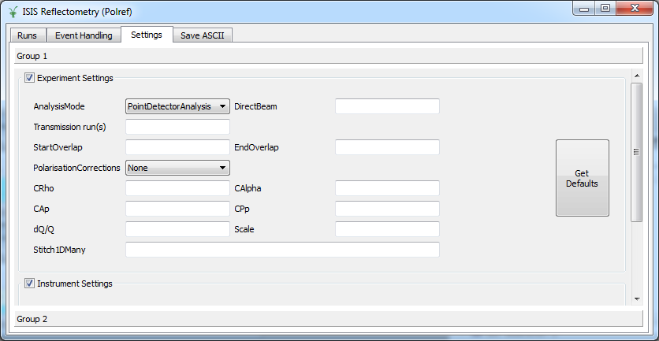
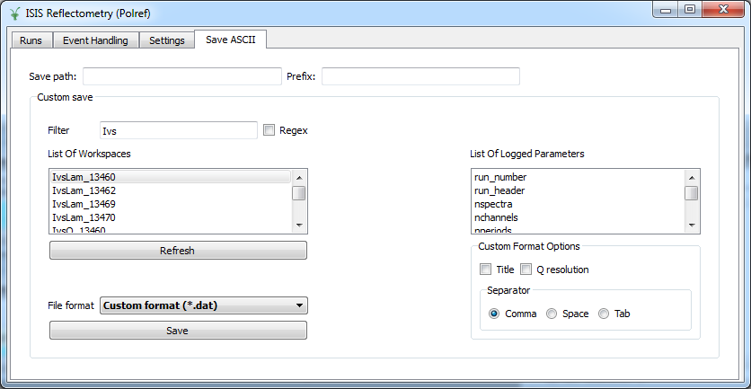

=====================
Reflectometry Changes
=====================

.. contents:: Table of Contents
   :local:

Algorithms
----------

* New versions of algorithms :ref:`algm-ReflectometryReductionOne` and :ref:`algm-CreateTransmissionWorkspace`
  have been added. The new versions fix the following issues:

  * Duplicate steps, such as :ref:`algm-ConvertUnits` and :ref:`algm-Rebin`, have been removed.
  * Monitor normalization has been refactored. An improvement in performance of a factor x3 has
    been observed when the reduction is performed with no monitor normalization.
  * The monitor and detectors of interest are first extracted from the input workspace before being converted to
    wavelength. This fixes a problem by which the first monitor was distorting the rest of the data due to
    ``AlignBins`` in :ref:`algm-ConvertUnits`.

* New versions of :ref:`algm-ReflectometryReductionOneAuto`, :ref:`algm-CreateTransmissionWorkspaceAuto` and
  :ref:`algm-SpecularReflectionPositionCorrect` have been added. The new versions fix the following known issues:

  * When :literal:`CorrectionAlgorithm` was set to :literal:`AutoDetect` the algorithm was not able to find polynomial
    corrections, as it was searching for :literal:`polynomial` instead of :literal:`polystring`.
  * When a correction algorithm was applied, monitors were integrated if :literal:`NormalizeByIntegratedMonitors`
    was set to true, which is the default. In the new version of the algorithms, monitors will never be integrated if a correction algorithm
    is specified, even if :literal:`NormalizeByIntegratedMonitors` is set to true.
  * Fix some problems when moving the detector components in the instrument. The new versions use :literal:`ProcessingInstructions`
    to determine which detector components need to be moved. Detectors will be moved to an angle :math:`2\theta` if :math:`\theta` is
    specified. If :math:`\theta` is not provided, detectors will not be moved.
  * Monitor integration range was not being applied properly to CRISP data. The problem was that in the parameter
    file the wavelength range used to crop the workspace in wavelength is [0.6, 6.5] and the monitor integration
    range is outside of these limits ([4, 10]). This was causing the algorithm to integrate over [0.6, 4].
  * :ref:`algm-ReflectometryReductionOneAuto` now outputs three workspaces: a workspace in wavelength, a workspace in Q with native binning,
    and a rebinned and scaled workspace in Q. The latter is rebinned according to ``MomentumTransferMin``, ``MomentumTransferMax``
    and ``MomentumTransferStep``. If these are not provided, the algorithm will attempt to determine the bin width
    running :ref:`algm-CalculateResolution`. When this is not possible, the rebinning will not take place.

* :ref:`algm-Stitch1D` documentation has been improved, it now includes a workflow diagram illustrating
  the different steps in the calculation and a note about how errors are propagated.

* :ref:`Stitch1DMany <algm-Stitch1DMany>` has a new property, ``ScaleFactorFromPeriod``, which enables it to apply
  scale factors from a particular period when stitching multi-period runs. Its documentation has also been
  updated and improved, including more detail on algorithm properties and adds a workflow description and diagram.

* :ref:`algm-ConvertToReflectometryQ` corrects the detector position before performing any type of calculation.
  Detectors are corrected to an angle :math:`\theta` read from the log value *stheta*.

Instrument definition files and parameter files
-----------------------------------------------

* INTER parameter file was updated. The monitor background range, wavelength range and point detector range were updated,
  and two additional properties, ``TransRunStartOverlap`` and ``TransRunEndOverlap``, that specify the integration range
  to be used by :ref:`algm-Stitch1D`, have been added.
* OFFSPEC parameter file was updated with ``TransRunStartOverlap`` and ``TransRunEndOverlap``
* POLREF parameter file was updated with a new monitor background range, point detector range and parameters
  ``TransRunStartOverlap`` and ``TransRunEndOverlap``.
* SURF parameter file was updated with a new multi detector range.

Reflectometry Reduction Interfaces
----------------------------------

ISIS Reflectometry (Polref)
###########################

- A new tab, 'Event handling' has been added. This tab allows users to select custom time slices to analyze event data.
- A new tab, 'Settings' has been added. This tab displays global options for experiment and instrument settings.
- A new tab, 'Save ASCII' has been added. This tab is similar in function and purpose to the 'Save Workspaces' window accessible from Interfaces->ISIS Reflectometry->File->Save Workspaces.

- The interface is now arranged in two different groups. Groups apply to tabs 'Run', 'Event Handling' and 'Settings'.
- When runs are transferred to the processing table groups are now labeled according to run title.
- ``StartOverlap`` and ``EndOverlap`` are used to calculate the integration range in :ref:`algm-Stitch1DMany`, when specified.
- Column :literal:`dQ/Q` is used as the rebin parameter to stitch workspaces.
- An issue by which the interface was not populating ``dQ/Q``, ``Q min`` and ``Q max`` correctly for multi-period datasets has been fixed.
- A shift in Y between different slices has been fixed.
- When the instrument is changed from the GUI, the Mantid default instrument is updated accordingly.
- Error messages are displayed if the user either attempts to transfer zero runs or transfer runs with a different strategy to the one they used to search for runs with. 
- Fixed a bug where if the user answered 'no' to a popup asking if they wanted to process all runs, the progress bar would show activity as though a data reduction was occurring.
- Documentation regarding the interface has been updated accordingly.

ISIS Reflectometry
##################

- Processing runs now produces the un-binned IvsQ workspace as well.
- Error in transfer button not working fixed.
- Error in 'Save Workspaces' dialog not populating the save path correctly fixed.

|

`Full list of changes on github <http://github.com/mantidproject/mantid/pulls?q=is%3Apr+milestone%3A%22Release+3.9%22+is%3Amerged+label%3A%22Component%3A+Reflectometry%22>`__
