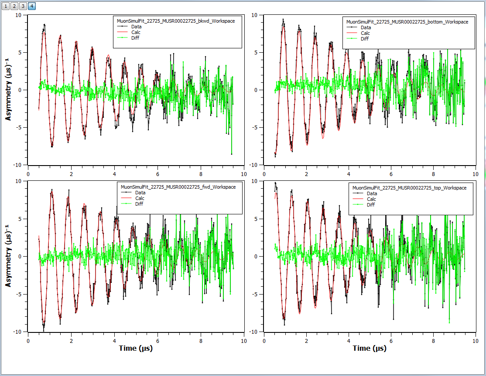

======================
UI & Usability Changes
======================

.. contents:: Table of Contents
   :local:

Installation
------------

Windows
#######

OS X
####

User Interface
--------------

- ParaView's python scripting interface is available from within MantidPlot and mantidpython. Type `from paraview.simple import *` to get started.
  `Additional documentation <http://www.paraview.org/ParaView3/Doc/Nightly/www/py-doc/>`_

Instrument View
###############
 - New peak comparison tool on the pick tab. The user can select two peaks and information relating to their properties and the angles between them.

Plotting Improvements
#####################
- Fixed a bug where left and right Y axes went out of sync when a fit was run.
- Exposed the ``plotSubplots`` command to Python. This creates a tiled (multilayer) plot with one workspace per tile.

   plotSubplots image

Algorithm Toolbox
#################

- Add compressorType option to SaveMDWorkspaceToVTK.

Scripting Window
################

Documentation
#############

Bugs Resolved
-------------

- Fixed a bug where checking or unchecking "show invisible workspaces" in View->Preferences->Mantid->Options would have no effect on workspaces loaded in the dock.
- The Spectrum Viewer now reports two theta and azimuthal angle correctly.
- Fixed crash when clicking "Help->Ask for Help" on Linux-based systems with Firefox set as the default browser.  
- Fixed crash when loading data and the algorithm widget is hidden
- Fixed exception being thrown when saving project with custom interfaces open
- The "Plot Surface from Group" and "Plot Contour from Group" options have been fixed and now work for both histogram and point data. Note that all workspaces in the group must have the same X data.
- Fixed importing string logs and string series logs into MantidPlot

SliceViewer Improvements
------------------------

|

Full list of
`GUI <http://github.com/mantidproject/mantid/pulls?q=is%3Apr+milestone%3A%22Release+3.9%22+is%3Amerged+label%3A%22Component%3A+GUI%22>`_
and
`Documentation <http://github.com/mantidproject/mantid/pulls?q=is%3Apr+milestone%3A%22Release+3.9%22+is%3Amerged+label%3A%22Component%3A+Documentation%22>`_
changes on GitHub
