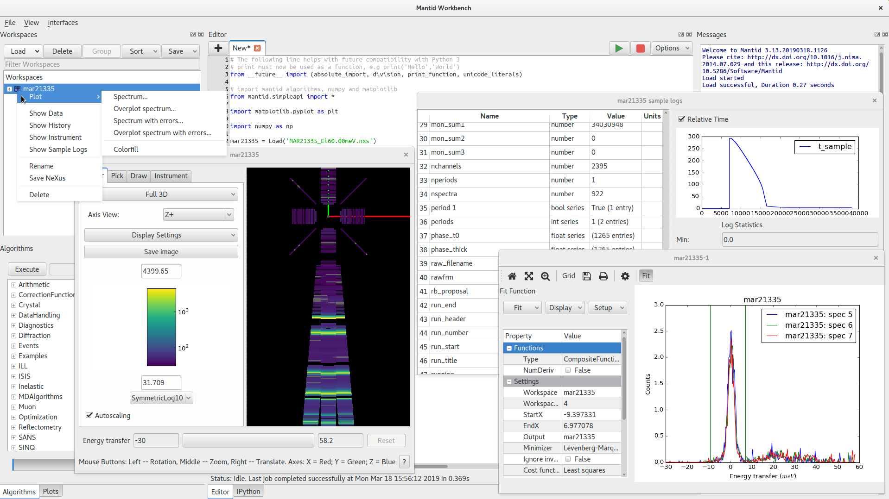

.. _v4.0.0:

==========================
Mantid 4.0.0 Release Notes
==========================

   Overview of the MantidWorkbench

.. contents:: Table of Contents
   :local:

We are proud to announce version 4.0.0 of Mantid.

This major release sees the introduction of a brand new graphical user interface, ``MantidWorkbench``, which will eventually
replace ``MantidPlot``. The ``MantidWorkbench`` has been built from the ground up to allow more automated testing in an
effort to vastly improve on the stability of ``MantidPlot``. In addition it offers:

- `matplotlib <https://matplotlib.org/>`_-based plotting: Matplotlib is the defacto-standard plotting package for the
  scientific community and one of its core goals is to produce publication-quality plots

- cleaner interface: ``MantidPlot`` had many toolbars, buttons and menus that would confuse new users.
  ``MantidWorkbench`` aims to have a simpler interface and removes many legacy tools that were unused from ``MantidPlot``

- support for high-dpi displays: Based on Qt5, allowing for improved handling of high-resolution screens such as retina
  displays

Please see :ref:`the full workbench release notes <workbench_v4_release_notes>` for more information along with the new
:ref:`documentation <workbench>`.

This is just one of the many improvements in this release, so please take a look at the release notes, which are filled
with details of the important changes and improvements in many areas. The development team has put a great effort into
making all of these improvements within Mantid and we would like to thank all of our beta testers for their time and
effort helping us to make this another reliable version of Mantid.

Citation
--------

Please cite any usage of Mantid as follows:

- *Mantid 4.0.0: Manipulation and Analysis Toolkit for Instrument Data.; Mantid Project*. `doi: 10.5286/SOFTWARE/MANTID4.0 <http://dx.doi.org/10.5286/SOFTWARE/MANTID4.0>`_

- Arnold, O. et al. *Mantid-Data Analysis and Visualization Package for Neutron Scattering and mu-SR Experiments.* Nuclear Instruments and Methods in Physics Research Section A: Accelerators, Spectrometers, Detectors and Associated Equipment 764 (2014): 156-166 `doi: 10.1016/j.nima.2014.07.029 <https://doi.org/10.1016/j.nima.2014.07.029>`_ (`download bibtex <https://raw.githubusercontent.com/mantidproject/mantid/master/docs/source/mantid.bib>`_)

Changes
-------

.. toctree::
   :hidden:
   :glob:

   *

- :doc:`Framework <framework>`
- :doc:`General UI & Usability <ui>`

  - :doc:`MantidPlot <mantidplot>`

  - :doc:`MantidWorkbench <mantidworkbench>`
- :doc:`Diffraction <diffraction>`
- :doc:`Muon Analysis <muon>`
- Low Q

  - :doc:`Reflectometry <reflectometry>`

  - :doc:`SANS <sans>`
- Spectroscopy

  - :doc:`Direct Geometry <direct_inelastic>`

  - :doc:`Indirect Geometry <indirect_inelastic>`

- :doc:`Kafka Live Streaming <kafka>`

Full Change Listings
--------------------

For a full list of all issues addressed during this release please see the `GitHub milestone`_.

.. _download page: http://download.mantidproject.org

.. _forum: http://forum.mantidproject.org

.. _GitHub milestone: http://github.com/mantidproject/mantid/pulls?utf8=%E2%9C%93&q=is%3Apr+milestone%3A"Release+4.0"+is%3Amerged

.. _GitHub release page: https://github.com/mantidproject/mantid/releases/tag/v4.0.0
