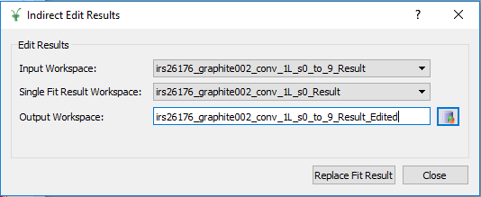
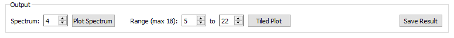
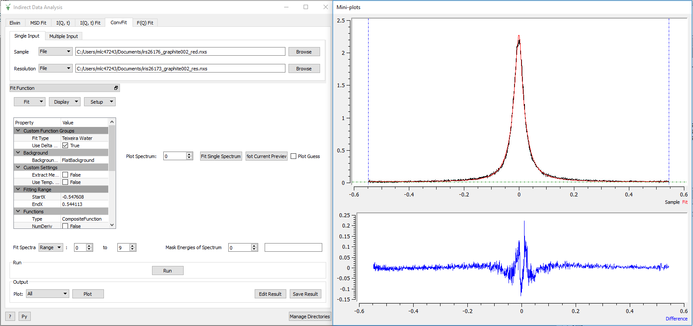
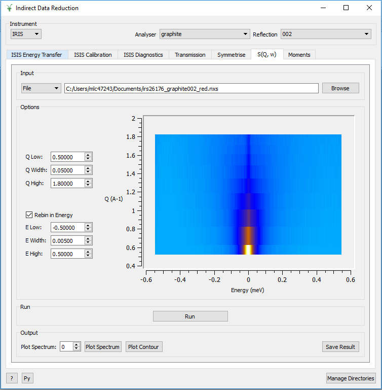
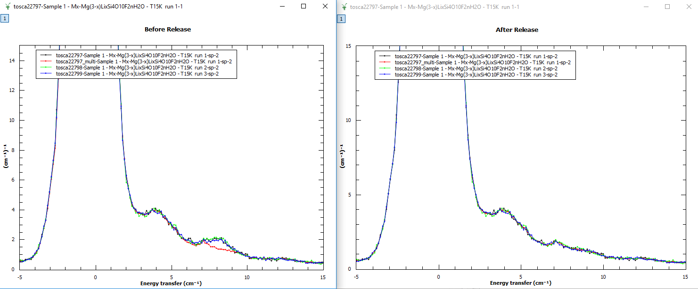
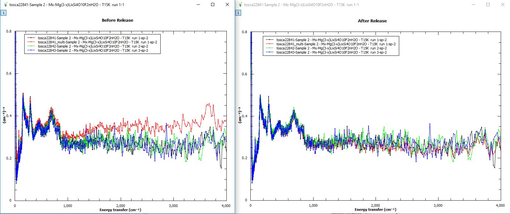

==========================
Indirect Inelastic Changes
==========================

.. contents:: Table of Contents
   :local:

Algorithms
----------

New Algorithms
##############

- :ref:`BASISCrystalDiffraction <algm-BASISCrystalDiffraction>` replaces :ref:`BASISDiffraction <algm-BASISDiffraction>`, now deprecated.
- :ref:`BASISPowderDiffraction <algm-BASISPowderDiffraction>` obtains scattered elastic intensity versus momentum transfer and versus scattering angle.
- TOF correction for neutrons incorrectly interpreted as slow neutrons in :ref:`BASISPowderDiffraction <algm-BASISPowderDiffraction>`.
- Deprecated algorithm BASISReduction311 has been removed.
- :ref:`LoadEMU <algm-LoadEMU>` loader for an ANSTO EMU backscattering event file.
- :ref:`IndirectReplaceFitResult <algm-IndirectReplaceFitResult>` will replace the results of a fit found in one workspace with the
  single fit data provided within a second workspace.

Improvements
############

- :ref:`BASISReduction <algm-BASISReduction>` user interface contains slightly different naming convention for selection of reflection and works for old and new DAS.

:ref:`Release 4.0.0 <v4.0.0>`

All Indirect Interfaces
-----------------------

Improvements
############

- The Run button has been moved to be above the output options.
- The Run, Plot and Save buttons are disabled while processing or plotting is taking place.

Data Analysis Interface
-----------------------

New Features
############

- IqtFit and ConvFit have a new option to edit the *_Results* workspace. This option allows
  the selection of two *_Result* workspaces (one containing the results of a sequential fit
  for multiple spectra (1), and the other containing the results of a fit for a single
  spectrum(2)). The algorithm :ref:`IndirectReplaceFitResult <algm-IndirectReplaceFitResult>`
  will replace the relevant data found in workspace (1) with the data found in workspace (2).

Improvements
############

- The *Fit Single Spectrum* buttons on MSDFit, I(Q,t)Fit, ConvFit and F(Q)Fit are now disabled
  during fitting.
- When the :ref:`InelasticDiffSphere <func-InelasticDiffSphere>`, 
  :ref:`InelasticDiffRotDiscreteCircle <func-InelasticDiffRotDiscreteCircle>`,
  :ref:`ElasticDiffSphere <func-ElasticDiffSphere>` or 
  :ref:`ElasticDiffRotDiscreteCircle <func-ElasticDiffRotDiscreteCircle>` functions are selected in
  the ConvFit tab, the Q values are retrieved from the workspaces, preventing a crash when plotting
  a guess.
- The Plot buttons in MSDFit, I(Q,t)Fit, ConvFit and F(Q)Fit are disabled after a Run when the
  result workspace only has one data point to plot.
- There is now an option to choose which output parameter to plot in MSDFit.
- An option to skip the calculation of Monte Carlo Errors on the I(Q,t) Tab has been added.
- During the calculation of Monte Carlo Errors, a progress bar is now shown.
- In the I(Q,t) Tab, it is now possible to select which spectrum you want to plot for Plot Spectrum.
- In the I(Q,t) Tab, it is now possible to select a range of spectra for a Tiled Plot. The interface
  allows a maximum of 18 plots.

- The WorkspaceIndex and Q value in the FitPropertyBrowser are now updated when the Plot Spectrum
  number is changed. This improvement can be seen in ConvFit when functions which depend on Q value
  are selected.
- Fit and Fit Sequential in the Fit combobox above the FitPropertyBrowser are now disabled while
  fitting is taking place.
- The option to choose which workspace index to Plot Spectrum for and from which output workspace
  is now given in Elwin.
- ConvFit now allows the loading of Dave ASCII files which end with *_sqw.dave*.
- The AddWorkspace windows (opened from the Multiple Input tab) now stay open after adding a
  workspace to the data table. This is found on the MSDFit, I(Q,t)Fit, ConvFit and F(Q)Fit
  interfaces.
- It is now possible to load a Nexus file without it's history on the Elwin interface by unchecking
  the Load History checkbox.
- It is now possible to undock the mini-plots on the MSDFit, IqtFit, ConvFit and F(Q)Fit interfaces.

Bugfixes
########

- The workspace(s) loaded into F(Q) Fit are checked for EISF or Width values, and an error message
  is displayed if neither are present. This prevents an unexpected crash.
- The parameter values for a selected spectrum are now updated properly when a Fit is run using the
  Fit String option in ConvFit.
- An unexpected crash is prevented when *Plot Current Preview* is clicked when no data is loaded. A
  meaningful error message is now displayed.
- The Probability Density Functions (PDF) workspaces for the FABADA minimiser in ConvFit no longer
  overwrite each other.
- Loading a resolution file before a reduced file in ConvFit no longer causes an unexpected error.
- A bug where fixed parameters don't remain fixed when using the FABADA minimizer in ConvFit has been
  fixed.
- The expression for the Fit type :ref:`MSDYi <func-MSDYi>` in MSDFit was incorrect and has now been
  corrected.
- The x-axis labels in the output plots for MSDFit are now correct.
- An unexpected error is now prevented when clicking *Plot Guess* from the *Display* combo box in
  ConvFit without first loading a reduced file.
- The output workspace ending with *_Results* now contains workspaces with corrected names which
  detail the fit functions used.
- Selecting multiple data using the All Spectra checkbox without first selecting a sample file used
  to cause an unexpected error. This is now prevented. Meaningful error messages are also displayed
  when a sample or resolution file are not selected.
- In the Elwin interface, the errors are now propagated correctly through to the workspace with
  extension *_elt*.
- The :ref:`HallRoss <func-Hall-Ross>` fit function was updated to have :math:`\hbar` in its formula.
  The :ref:`TeixeiraWater <func-TeixeiraWater>` and :ref:`ChudleyElliot <func-ChudleyElliot>` fit
  functions now have a functionDeriv1D method.
- A bug causing the output *_Results* workspace from a single fit to have an incorrect name has been
  fixed.
- A bug causing the preview plot in Elwin not to update when changing the selected workspace has been
  fixed.
- Fixed an issue on FQFit where a workspace with only one data point could be loaded.

Data Corrections Interface
--------------------------

Improvements
############

- Added 'Interpolation' combobox to Calculate Monte Carlo Absorption. This allows the method of
  interpolation to be selected. Allowed values: ['Linear', 'CSpline'].
- Added 'MaxScatterPtAttempts' spinbox to Calculate Monte Carlo Absorption. This sets the maximum
  number of tries to be made to generate a scattering point.
- In the Calculate Monte Carlo Absorption Tab, all of the options in the Monte Carlo section are now
  read from an instrument parameter files once a file has been loaded.
- The option to choose which spectrum to *Plot Spectrum* for is now available in the
  ContainerSubtraction tab and ApplyAbsorptionCorrections tab.

Bugfixes
########
- Fixed a bug where ApplyAbsorptionCorrections would not apply corrections if the *_Corrections* group workspace
  did not contain sample attenuation (*_ass*).

Data Reduction Interface
------------------------

Improvements
############

- Added 'Default' detector grouping option back into ISISEnergyTransfer for TOSCA, to allow a
  default grouping using the grouping specified in the Instrument Parameter File.
- ISISEnergyTransfer now allows overlapping detector grouping.
- It is now possible to choose which spectrum to *Plot Output* for in the S(Q, w) tab.
- An automatic contour plot of *rqw* is now displayed in the S(Q, w) tab when a sample is loaded.

Bugfixes
########

- Symmetrise tab has changed so you can no longer click the run button before preview, and 
  preview will not run even if clicked unless the max or min bars on the top graph have changed
  from their default.
- A bug where the output reduced files had large file sizes depending on the size of the batch
  being reduced from the :ref:`ISISIndirectEnergyTransfer <algm-ISISIndirectEnergyTransfer>`
  algorithm on the ISISEnergyTransfer interface has been fixed. The
  :ref:`ISISIndirectEnergyTransferWrapper <algm-ISISIndirectEnergyTransferWrapper>` algorithm
  should be used instead in order to avoid these large file sizes.
- A bug where using a cropped calibration file (from a previous run) on the ISISEnergyTransfer
  interface would cause an error has been fixed.
- A bug where specifying a custom detector grouping for OSIRIS was not working has been fixed.
- A crash caused by data being loaded multiple times on the transmission tab has been fixed, as
  part of this fix the preview now shows a preview of the plot on run being clicked and not 
  before as this was the cause of the issue.
- A bug caused by incorrect masked detectors during a reduction of an individual runs has been
  fixed. This could sometimes cause unexpected peaks in the output plots.

- A bug caused by incorrect masked detectors during a reduction for a summed run has been fixed.
  This would cause the summed runs intensity to be higher than that of the individual runs with
  the same run numbers.

Bayes Interface
---------------

New Features
############

- It is now possible to produce a contour plot from the output on the Stretch Tab.

Improvements
############

- There is no longer a plot output option for 'Fit' in the Quasi Tab. The graph 'Fit.2' is also
  now plotted when you click *Plot Current Preview*.
- The sample logs are now copied over properly for the result workspace in the ResNorm tab.
- *_sqw* files can now be loaded as Vanadium in the ResNorm tab.
- In the Quasi tab, fit. 3 and diff. 3 are now stored in the fit workspaces. The probabilities
  for 3 peaks is now available in the probability workspace.

Bugfixes
########

- An unwanted 'Fit' plot is no longer plotted in ResNorm when you click *Plot* in the output options.

Diffraction Interface
---------------------

Improvements
############

- Any zeros within the vanadium file are replaced with a substitute value of 10% the minimum 
  y value found within that file. This prevents infinity values being produced when dividing the 
  input file by the vanadium file.

Bugfixes
########
- An unexpected error when using manual grouping has been fixed.
