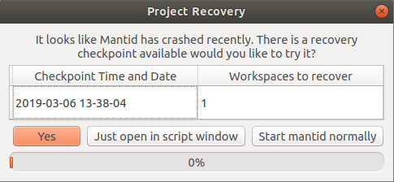

==================
MantidPlot Changes
==================

.. contents:: Table of Contents
   :local:

Changes
-------

- Added time standard deviation to the sample log dialog
- All File Browser dialog boxes will now (by default) display all valid file extensions as the first file filter.
- Plot -> Advanced now allows for plotting against any property in the ``Run`` object that can be represented as a single number. It uses the time-average value for time series properties and the average for others.
- A new option in the right-click menu for the results log allows users to set the number of lines retained by the widget. The default is 8192. This avoids memory problems for long running instances.

Project Recovery
################

- A recovery checkpoint can be forced manually using ``mantidplot.app.saveRecoveryCheckpoint()`` in either the interpreter or script windows in python
- A lock file is now created at the start of saving so if MantidPlot crashes when saving it will no longer use that checkpoint as it is incomplete.
- If project recovery fails when attempting to recover a checkpoint it will open a new GUI offering multiple checkpoints to the user and the ability to open them in a script window. (See image below)

- Project Recovery now has the ability to be changed from inside of ``MantidPlot`` without using the config files directly, this can be found in view->preferences->mantid->projectrecovery
- Project Recovery will no longer save groups. This fixes an issue which would cause crashes if you deleted a workspace from a group.
- MantidPlot no longer checks for the existence of files in the "Recent Files" menu. This fixes the case where files on slow mounted network drives can cause a lag on MantidPlot startup.
- Workspaces now save locally as a number of how many workspaces have already been saved instead of workspace names.
- Project Recovery will now attempt to recover multiple instances of Mantid that are ran at the same time.
- The project recovery prompt on Mantid restart is improved and shows which checkpoint you will be getting. (See image below).
- Project Recovery will now output less unhelpful logging information into the results log.

Bugfixes
--------

- Fixed issue where an open set of data from ``ITableWorkspace`` wouldn't update if the data was changed via python
- Fixed an issue where MantidPlot would crash when renaming workspaces.
- Fixed issue with filenames containing spaces that are passed to Mantid when launched from the command line
- Workspaces with a '#' in their name will no longer cause issues in the loading of a recovered project.
- Project Recovery will actually recover fully cases where multiple workspaces were passed as a list to an algorithm (Fixes a known bug with GroupWorkspaces as well)
- Project Recovery will now run normally when you select no or the recovery fails when recovering from a ungraceful exit.
- When autosaving or saving a recovery checkpoint with the Instrument View open the results log would be filled with excess logging and no longer does this.
- Fixed an issue where Project Recovery would start regardless of the config options
- Project recovery will now successfully recover live data, it will however be unable to recover any data that was up at the time, but will start the live data streams again from scratch.
- If an empty group workspace is present in the ADS it will no longer crash the save thread of project recovery and instead will delete it from the ADS and ignore it.
- A bug has been fixed in Indirect I(Q,t) interface when analyzing ``IN16B`` reduced data.
- Stop MantidPlot from attempting to contour plot/colorfill plot when a workspace has a TextAxis.
- The general fitting interfaces do not display fit functions that are not supposed to be used with those interfaces.
- Project Recovery in some cases would be unable to run algorithms in the correct order due to Operating System time precision, this is has been fixed by adding the execCount to the comment part of the scripts being built for recovery.

:ref:`Release 4.0.0 <v4.0.0>`
