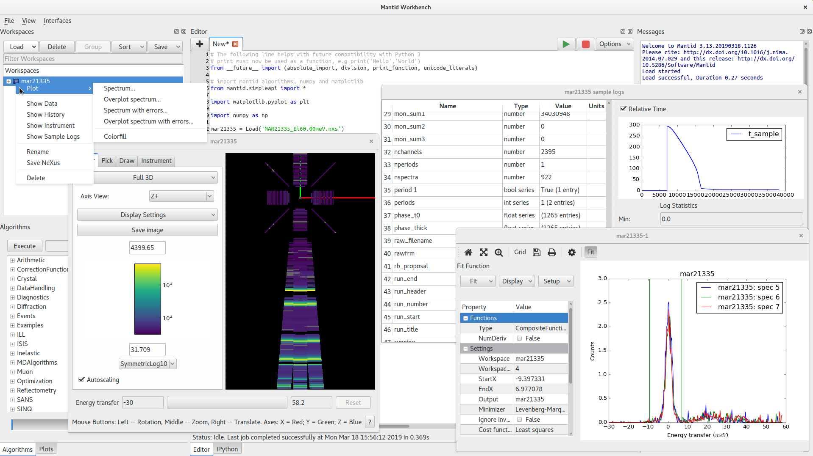

.. _workbench_v4_release_notes:

===============
MantidWorkbench
===============

.. contents:: Table of Contents
   :local:

   Overview of the new MantidWorkbench interface

This release sees the introduction of a brand new graphical user interface, ``MantidWorkbench``, which will eventually replace ``MantidPlot``. The
workbench has been built from the ground up to allow more automated testing in an effort to vastly improve on the stability of ``MantidPlot``.

Key goals:

- `matplotlib <https://matplotlib.org/>`_-based plotting: Matplotlib is the defacto-standard plotting package for the scientific community
  and one of its core goals is to produce publication-quality plots

- cleaner interface: MantidPlot had many toolbars, buttons and menus that would confuse new users.
  ``MantidWorkbench`` aims to have a simpler interface and removes many legacy tools that were unused from ``MantidPlot``

- support for high-dpi displays: Based on Qt5, allowing for improved handling of high-resolution screens such as retina displays

Features Available
------------------

The following features are available in this first release of the ``MantidWorkbench``:

- :ref:`Workspace toolbox <WorkbenchWorkspaceToolbox>`: Display and interact with the workspaces generated by mantid
- :ref:`Matplotlib plots <WorkbenchPlotWindow>`: Line, errorbar and color plots from workspace menu
- *Workspace data views*: Display data from ``MatrixWorkspace`` / ``TableWorkspace`` and edit ``TableWorkspace``
- `Instrument view <https://www.mantidproject.org/MantidPlot:_Instrument_View>`__: Visualize an instrument attached to a workspace
- *Sample log viewer*: Display information, plots and statistics about the sample logs in a workspace
- :ref:`Workspace history window <WorkbenchWorkspaceHistoryWindow>`: Display the algorithms that have been applied to a workspace
- :ref:`Python script editor <WorkbenchScriptWindow>`: Edit and execute Python scripts
- :ref:`Algorithm toolbox <WorkbenchAlgorithmToolbox>`: Choose algorithms to execute on workspaces
- :ref:`Plots toolbox <WorkbenchPlotsToolbox>`:  Display and interact with existing plots
- :ref:`IPython console <WorkbenchIPythonConsole>`: Immediate execution of Python commands
- :ref:`Messages window <WorkbenchMessagesWindow>`: Display mantid log messages and Python output

See the `<workbench>`_ documentation for complete guide to the new interface.

Future
------

This first release introduces features that we consider applicable to most if not all scientific areas that Mantid covers.
Our development model focuses on getting useful things out to users and iterating on this feedback. However, we realise that
there are key features, e.g. the slice viewer, that are missing. The following is a planned list of features that we will
be continuing to develop:

- Port of all scientific interfaces required
- Slice Viewer/Spectrum Viewer
- Generating a script from a plot
- Improved tools for editing plot properties
- Subplot (grid of plots) tools
- Built-in help
- About window
- Script repository tool

There is also planned time for working on feedback that we hope to receive on this first iteration of the interface.

The date for ``MantidPlot`` to be removed from the installation has not yet been set. The removal will be announced
well in advance.

Feedback
--------

We would be grateful of any feedback on the new interface to any of the usual means of communication:

- there is a `forum thread <http://forum.mantidproject.org/t/mantid-4-0-workbench/463>`_ that can be used to report feedback
- the standard ``mantid-help`` mailing address
- if you are at a facility then we are more than happy to come and have a chat.

:ref:`Release 4.0.0 <v4.0.0>`
