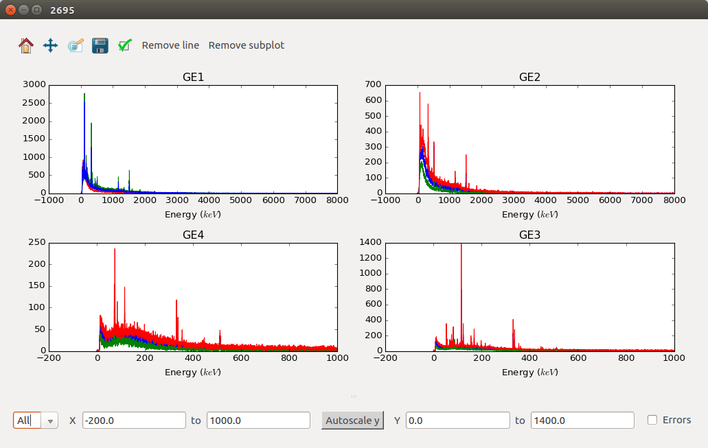

============
Muon Changes
============
.. image::  ../../images/frequency_domain_analysis_2_home.png
   :align: right
   :height: 600px

.. image::  ../../images/elemental_analysis.png
   :align: right
   :height: 300px

.. contents:: Table of Contents
   :local:
   
Interface
---------

New
###
- Elemental Analysis added to Muon Interfaces: Includes a selectable Periodic Table. There are two versions (Elemental Analysis and Elemental Analysis Old). The old interface is deprected and may not be included in future releases. The difference between the old and new versions of the interface is TODO.
- New Frequency Domain Analysis GUI added, the original one is now marked as old and is deprecated so may not be included in future releases. See the :ref:`documentation <Frequency_Domain_Analysis_2-ref>` for more details.

Improvements
############
- TF Asymmetry mode now displays the chi squared value at the top of the browser.
- ALC interface now sorts the data into ascending order.
- Muon Analysis now includes number of event per frame and number of events per frame per detector in the run info box on the home tab.
- Frequency Domain Analysis now lets the user select the phase table in MaxEnt mode.
- CHRONUS now has a transverse and longitudanal default grouping table, the main field direction is read from the file to determine which to use.
- MaxEnt now produces better warning messages for invalid properties.

Bugfixes
########
- Results table now includes all logs that are common to all of the loaded files.
- When turning TF Asymmetry mode off it no longer resets the global options.
- Results table will produce correct values for co-added runs.
- The x limits on the settings tab will now correct themselves if bad values are entered. 
- The `load current run` button now works for CHRONUS in muon analysis.
- ALC interface now removes all of the fitting regions for the baseline modelling when the data changes.
- ALC interface now produces a warning if the custom grouping is not valid.
- The Frequency Domain Analysis interface now crops the raw data by first and last good times before the calculation of the PhaseQuad workspace.

Algorithms
----------

New
###

- :ref:`ApplyMuonDetectorGrouping <algm-ApplyMuonDetectorGrouping>` added to allow scripting of the Muon Analysis GUI workflow. Applies grouping counts/asymmetry to muon data and stores the result in the ADS.
- :ref:`ApplyMuonDetectorGroupPairing <algm-ApplyMuonDetectorGroupPairing>` added to allow scripting of the Muon Analysis GUI workflow. Applies a group pairing asymmetry calculation to muon data and stores the result in the ADS.
- :ref:`LoadAndApplyMuonDetectorGrouping <algm-LoadAndApplyMuonDetectorGrouping>` added to allow scripting of the Muon Analysis GUI workflow. The grouping/pairing information is loaded from an XML format file, which can be produced through the muon analysis GUI via the 'Save Grouping' button. Replicates the `Load Grouping` button of the grouping tab, adds workspaces to the ADS.
- :ref:`LoadPSIMuonBin <algm-LoadPSIMuonBin>` added the ability to load a .bin file from the PSI facility in switzerland, as a workspace.
- :ref:`MuonPreProcess <algm-MuonPreProcess>` added to simplify new GUI backend. Performs a series of common analysis pre-processing steps on Muon data. Sample logs are modified to record the input parameters.
- :ref:`MuonGroupingCounts <algm-MuonGroupingCounts>` added to simplify new GUI backend. Applies a grouping (summation of counts) across a set of detectors in Muon data.
- :ref:`MuonPairingAsymmetry <algm-MuonPairingAsymmetry>` added to simplify new GUI backend. Applies a pairing asymmetry calculation between two detector groups from Muon data.
- :ref:`MuonGroupingAsymmetry <algm-MuonGroupingAsymmetry>` added to simplify new GUI backend. Applies an estimate of the  group asymmetry to a particular detector grouping in Muon data.

Improvements
############
- :ref:`MuonMaxent <algm-MuonMaxent>` has validation checks on its input.  

Bugfixes
########

- :ref:`EstimateMuonAsymmetryFromCounts <algm-EstimateMuonAsymmetryFromCounts>` had a bug that meant the first good bin was excluded from calculating the normalization.

:ref:`Release 4.0.0 <v4.0.0>`
