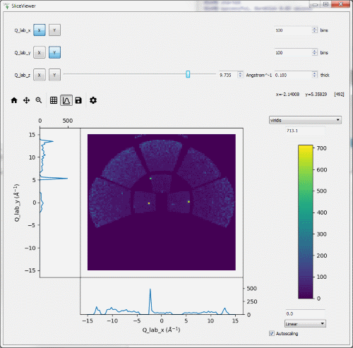

.. _v4.1.0:

===========================
Mantid 4.1.0 Release Notes
===========================

.. contents:: Table of Contents
   :local:

**Due to support ending for windows 7 and 8. This is the last release to support Windows 7 or 8.  Releases following this may continue to work for these releases, but will not have been verified or tested by the development team on anythin earlier than Windows 10.
This is also the final release that will support Ubuntu 16.04.**

We are proud to announce version 4.1.0 of Mantid.

We have made significant improvements to support within the Mantid workbench for a number of techniques, adding serval technique specific user interfaces ported ver from Mantidplot.  It also includes a fresh new implmentation of the sliceviewer that merges in a lot of the popular functionality of the spectrum viewer into one capable tool.  This version also introduces the new muon interface that is the result of a long effort to rebuild the interface using modern design and engineering standards, resulting in a much more stable, extensible interface, but also just so much better to use.

This is just a few of many improvements in this release, so please take a
look at the release notes, which are filled with details of the
important changes and improvements in many areas. The development team
has put a great effort into making all of these improvements within
Mantid, and we would like to thank all of our beta testers for their
time and effort helping us to make this another reliable version of Mantid.

Throughout the Mantid project we put a lot of effort into ensuring
Mantid is a robust and reliable product. Thank you to everyone that has
reported any issues to us. Please keep on reporting any problems you
have, or crashes that occur on our `forum`_.

Installation packages can be found on our `download page`_
which now links to sourceforge to mirror our download files around the world, you can also
access the source code on `GitHub release page`_.

Citation
--------

Please cite any usage of Mantid as follows:

- *Mantid 4.1.0: Manipulation and Analysis Toolkit for Instrument Data.; Mantid Project*. `doi: 10.5286/SOFTWARE/MANTID4.1 <http://dx.doi.org/10.5286/SOFTWARE/MANTID4.1>`_

- Arnold, O. et al. *Mantid-Data Analysis and Visualization Package for Neutron Scattering and mu-SR Experiments.* Nuclear Instruments
  and Methods in Physics Research Section A: Accelerators, Spectrometers, Detectors and Associated Equipment 764 (2014): 156-166
  `doi: 10.1016/j.nima.2014.07.029 <https://doi.org/10.1016/j.nima.2014.07.029>`_
  (`download bibtex <https://raw.githubusercontent.com/mantidproject/mantid/master/docs/source/mantid.bib>`_)

Changes
-------

.. toctree::
   :hidden:
   :glob:

   *

- :doc:`Framework <framework>`
- :doc:`General UI & Usability <ui>`

  - :doc:`MantidPlot <mantidplot>`

  - :doc:`MantidWorkbench <mantidworkbench>`
- :doc:`Diffraction <diffraction>`
- :doc:`Muon Analysis <muon>`
- Low Q

  - :doc:`Reflectometry <reflectometry>`

  - :doc:`SANS <sans>`
- Spectroscopy

  - :doc:`Direct Geometry <direct_geometry>`

  - :doc:`Indirect Geometry <indirect_geometry>`

Full Change Listings
--------------------

For a full list of all issues addressed during this release please see the `GitHub milestone`_.

.. _download page: http://download.mantidproject.org

.. _forum: http://forum.mantidproject.org

.. _GitHub milestone: http://github.com/mantidproject/mantid/pulls?utf8=%E2%9C%93&q=is%3Apr+milestone%3A4.1+is%3Amerged

.. _GitHub release page: https://github.com/mantidproject/mantid/releases/tag/v4.1.0
