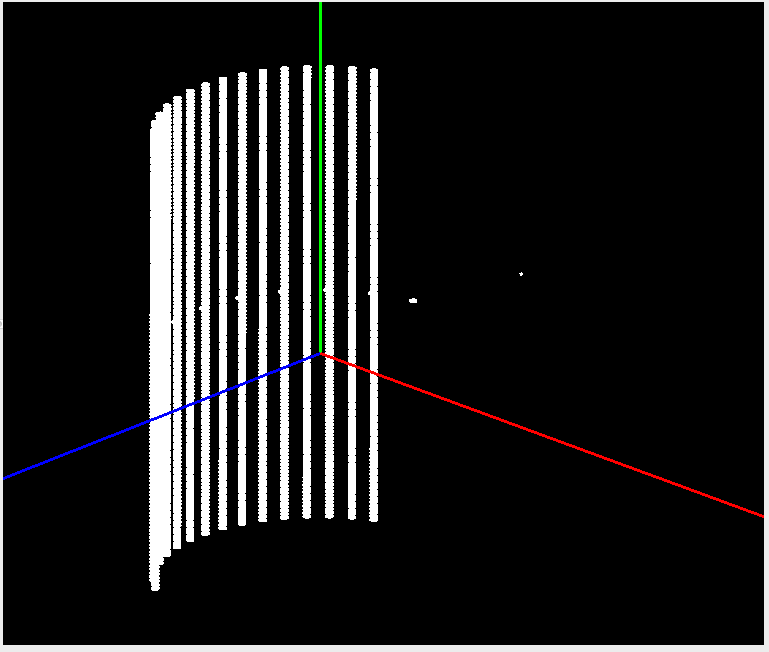
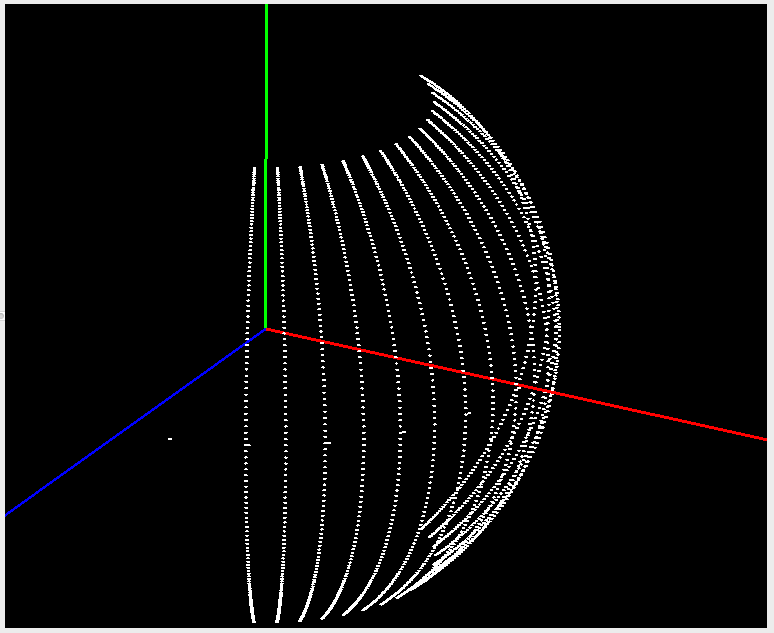
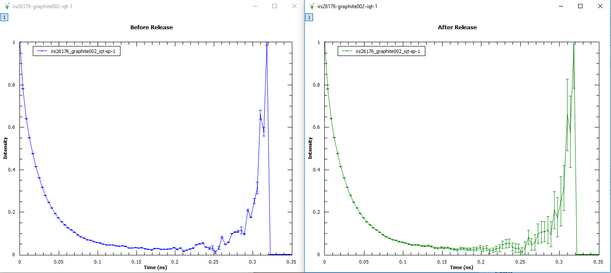
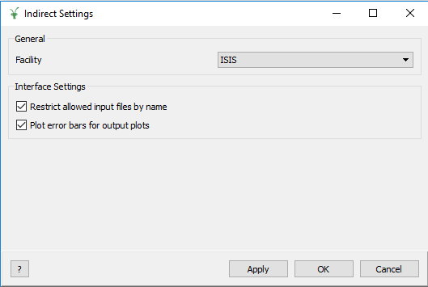
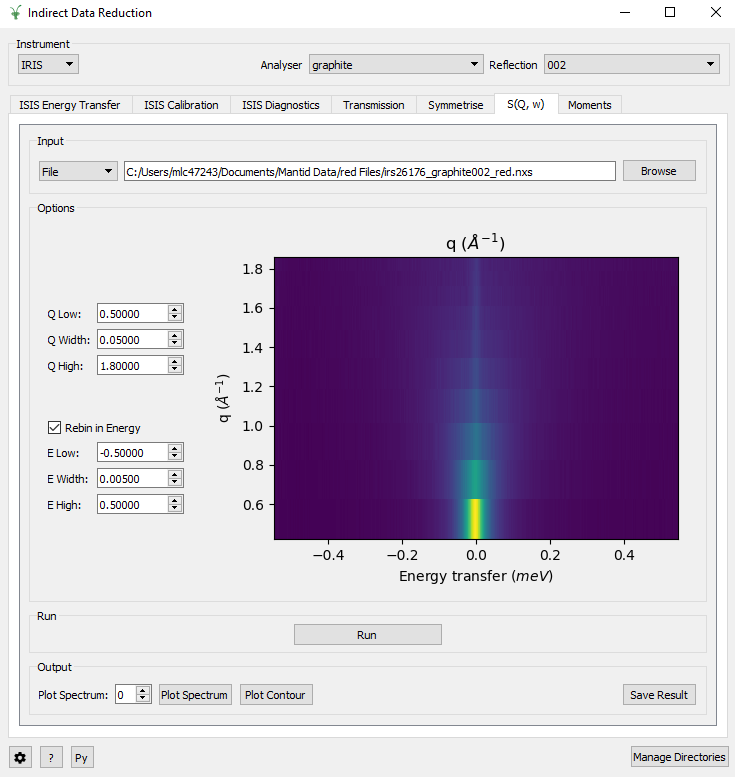

=========================
Indirect Geometry Changes
=========================

.. contents:: Table of Contents
   :local:

Instrument Definitions
----------------------

The IDF of IN16B has been rewritten to properly model the neutronic positions of the pixels as reflections with respect to spherical analysers.
This is needed for the new inverted time-of-flight mode (BATS), but also improves the model for the standard doppler mode.
Particularly, this will allow us to calculate correct absorption corrections before grouping the pixels tube by tube.
With the new IDF, the flight-paths inside the sample will properly take into account the off-plane angle, which was not the case with the previous IDF.
This change has a retroactive effect, but for reductions where the detectors were grouped, it should not produce different results.

Algorithms
----------

Improvements
############

- :ref:`IndirectILLEnergyTransfer <algm-IndirectILLEnergyTransfer>` is extended to support reduction for the new inverted TOF option (BATS) of IN16B.
- :ref:`ModeratorTzeroLinear <algm-ModeratorTzeroLinear>` now permits the passing of parameter values as input properties.
- :ref:`BASISPowderDiffraction <algm-BASISPowderDiffraction>` resolves between the run with old and new DAS.
- :ref:`BASISPowderDiffraction <algm-BASISPowderDiffraction>` now permits flux normalization by proton charge and run duration.
- :ref:`BASISReduction <algm-BASISReduction>` now permits flux normalization by proton charge and run duration.
- :ref:`BASISReduction <algm-BASISReduction>` now permits retaining events only within a time window.
- :ref:`BASISReduction <algm-BASISReduction>` can output the powder diffraction spectra.
- :ref:`BASISCrystalDiffraction <algm-BASISCrystalDiffraction>` resolves between the run with old and new DAS.
- :ref:`Abins <algm-Abins>` permits individually numbered atom contributions to simulated INS spectrum to be specified, alongside the existing option to select by element.

Data Analysis Interface
-----------------------

Improvements
############
- Improved the output options of MSD Fit, Iqt Fit, Conv Fit and F(Q)Fit so that Chi_squared can now be plotted.
- Improved the I(Q, t) tab by adding more validation checks for the input data.
- Improved the Fit and Difference plots in MSD Fit, Iqt Fit, Conv Fit and F(Q)Fit. It is now possible to adjust their
  relative sizes by dragging a 'handle' between the plots.
- Improved the I(Q, t) tab by allowing an asymmetric energy range by unticking 'Symmetric Energy Range'.
- Improved the I(Q, t) tab by adding the ability to change the plotted spectrum using the 'Spectrum' spin box.

Bug Fixes
#########
- Fixed an error caused by loading a Sample into ConvFit which does not have a resolution parameter for the analyser.
- Fixed a crash caused by changing the Preview Spectrum on Elwin after clicking Run.
- Fixed a bug where the loaded workspace in Data Analysis doesn't update after being changed on a different
  interface.
- Fixed a bug with the StartX and EndX selectors seen on the Preview Plots.
- Fixed a bug causing the errors calculated on Iqt to be too small towards the end of the spectra.

Data Corrections Interface
--------------------------

Improvements
############
- Improved the setting of sample and container neutron information by allowing the entry of cross sections as an
  alternative to a chemical formula. The cross sections can be entered in the Calculate Paalman Pings tab and
  Calculate Monte Carlo Absorption tab. This uses the :ref:`SetSampleMaterial <algm-SetSampleMaterial>` algorithm.

Bug Fixes
#########
- Fixed a bug where the output plots on the Calculate Paalman Pings and Calculate Monte Carlo Absorption tabs had
  the wrong axis labels and units.
- Fixed a bug where Calculate Paalman Pings would crash if an EFixed value had not been provided.
- Fixed a bug where Apply Aborption Corrections would crash when provided an invalid corrections workspace.

Data Reduction Interface
------------------------

Improvements
############
- Added an option called *Group Output* to group the output files from a reduction on ISISEnergyTransfer.
- Improved ISISEnergyTransfer by automatically loading the Detailed Balance from the sample logs if available.
- Removed the obsolete *Plot Raw* button in ISIS Calibration.
- Improved the validation checks for input data on all tabs.
- Improved performance of starting up the interface, by optimising the loading of parameter files.

Bug Fixes
#########
- Fixed a bug in the :ref:`Integration <algm-Integration>` algorithm causing the Moments tab to crash.
- Fixed an unexpected error when opening the Data Reduction interface with an unrelated facility selected.
- Fixed a crash on the Symmetrise, Sqw and Moments tab caused by attempting to load raw data.
- Fixed a crash on attempting to plot a loaded file before running the reduction.

Diffraction Interface
----------------------

Bug Fixes
#########
- Fixed a bug which allowed an out-of-range Spectra Min and Spectra Max.

Indirect Settings Interface
---------------------------

New Features
############
- A :ref:`Settings <inelastic-interface-settings>` GUI is now available and can be opened using the button
  next to the help *?* button on the bottom left of the interfaces. It can also be opened from the Indirect
  interfaces menu.

- The *Settings* GUI allows you to turn off the restriction of input data based on their name.
- The *Settings* GUI allows you to turn on error bars for the output plots.

Simulations Interface
---------------------

Bug Fixes
#########
- Fixed a crash in MolDyn when plotting output data.

The Workbench
-------------

- The Indirect Corrections GUI has been added to the Workbench.
- The Indirect Data Reduction GUI has been added to the Workbench.
- The Indirect Diffraction GUI has been added to the Workbench.
- The Indirect Simulations GUI has been added to the Workbench.
- The Indirect Tools GUI has been added to the Workbench.

Tools Interface
---------------

Improvements
############
- Added a verification for the chemical formula input on the Transmission tab.

:ref:`Release 4.1.0 <v4.1.0>`

