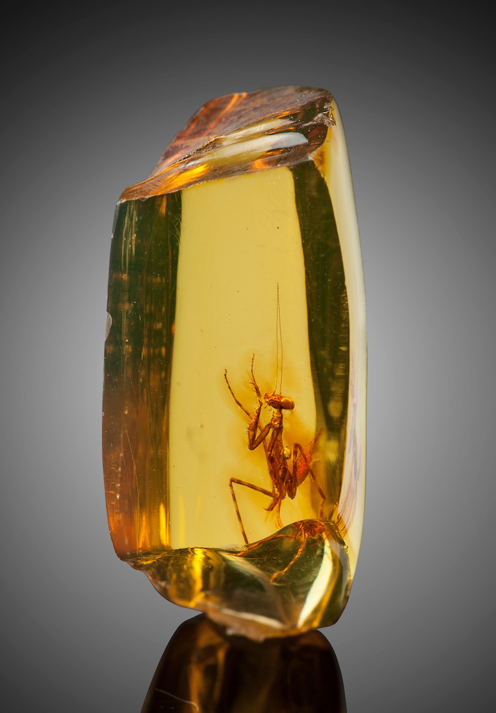

==================
MantidPlot Changes
==================

.. contents:: Table of Contents
   :local:

   
Improvements
############

The vast majority of development effort for user interfaces is now directed towards the :doc:`Mantid workbench <mantidworkbench>`, for now only significant bugs will be fixed within MantidPlot.

Bugfixes
########

* Help documentation for the manage user directories interface now correctly displays when launched from the interface.
* Fix for the Instrument View pick tab miniplot where the x axis label was not updated when a new unit was selected.
* The ErrorReporter window is now resizeable

:ref:`Release 4.1.0 <v4.1.0>`
