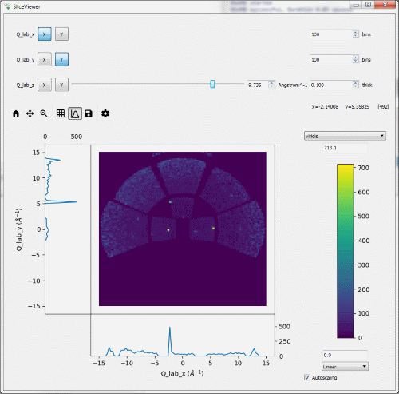
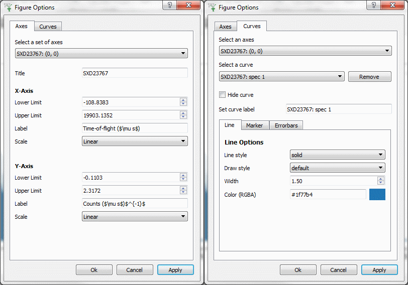

=======================
MantidWorkbench Changes
=======================

.. contents:: Table of Contents
   :local:

Installation
############

- Linux desktops now have an icon to launch the workbench without using the terminal.

User interface
##############

- All icons have been replaced with icons from Material Design: https://material.io/tools/icons.
- You can now double-click the numbers on a figure axis to adjust the axis' scale.
- Mantid's offline help is now available in Workbench.
- You can now save, load and delete custom layouts from the settings menu with quick access to user layout in the view
  menu.
  

   
SliceViewer
-----------
- We have merged much of the functionality of the Spectrum Viewer and Slice Viewer from Mantidplot into a single useful tool.
- It works much like the previous SliceViewer tool, plotting any MatrixWorkspace or MDWorkspaces, and  allowing the 2 axes for plotting to be selected, while presenting a slider for additional dimensions.
- The side plot toolbar button (that looks like a curve plot) adds line plot vertically and horizontally that will dynamically update as you move your mouse cursor across the plot.

Scientific Interfaces
---------------------
- Many of the interfaces that were missing from Workbench v4.0 have now been integrated into this release, including:

  - ISIS Reflectometry
  - Muon:
  
    - ALC
    - Elemental Analysis
    - Frequency Domain Analysis
    - Muon Analysis 2
    
  - Indirect: 
  
    - Corrections
    - Data Reduction
    - Diffraction
    - Settings
    - Simmulations
    - Tools

   
Plotting
--------

- The plot options dialog has been improved to offer you more control over your figures
- You can now plot workspaces on top of figures you've created using scripts. Simply create a matplotlib figure in the
  script window, then drag and drop a workspace on top of it.
- A colorfill plot of a workspace with logarithmic bins is plotted on a log scale.
- You can now toggle the normalization of plots in Workbench from the plot's context menu
- Double-clicking a workspace now opens a prompt to plot the workspace, instead of displaying its data

Scripting
#########
- Single line commenting in the script editor is now enabled without needing to highlight any text.
- You can now import from local python files that are in the same directory as the script you're executing.

Bugfixes
########
- An error raised when double-clicking an arrow in the algorithm toolbox
  when no algorithm was selected has been fixed.
- Help documentation for the manage user directories interface now correctly displays when launched from the interface.
- A Colorfill plot of a workspace with one spectrum plots correctly and no longer raises an error.
- The units on the y-axis of distribution workspace plots have been corrected
- Restore Default Layout no longer resizes the main window.
- Entering an invalid number into a plot's axis editor no longer causes an uncaught error

:ref:`Release 4.1.0 <v4.1.0>`
