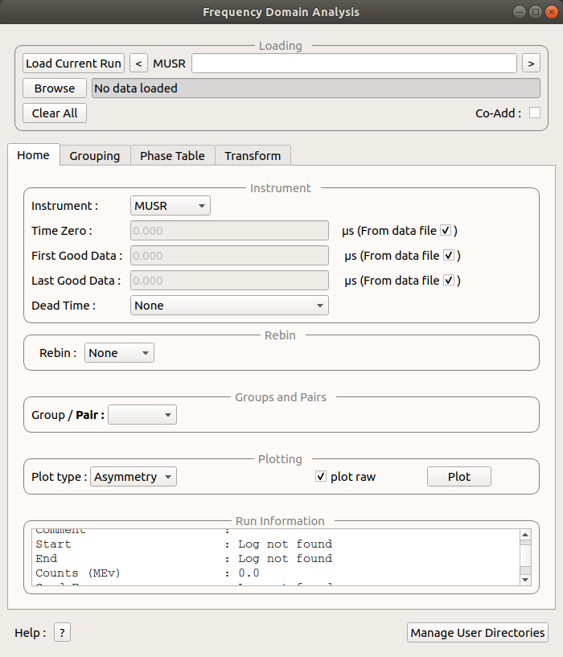
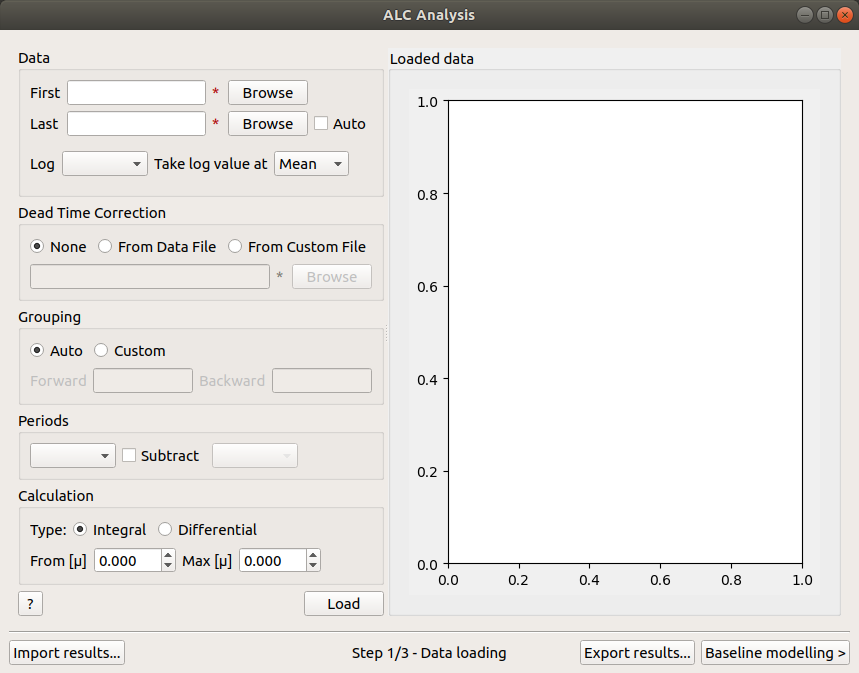
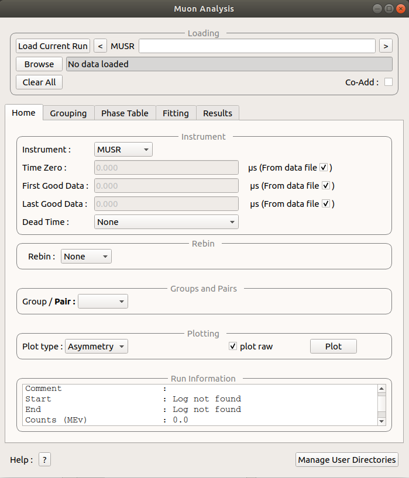
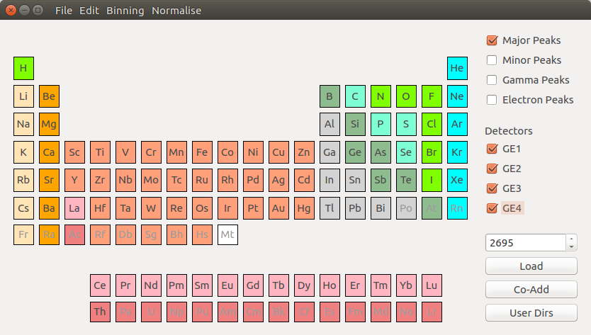

============
MuSR Changes
============

.. contents:: Table of Contents
   :local:

:ref:`Release 4.1.0 <v4.1.0>`

New
###

* :ref:`Frequency Domain Analysis <Frequency_Domain_Analysis_2-ref>` GUI added to Workbench.
* :ref:`Muon ALC GUI <MuonALC-ref>` added to Workbench.
* Added phase tab for calculating :ref:`phase tables <algm-CalMuonDetectorPhases>` and :ref:`PhaseQuad <algm-PhaseQuad>`
  workspaces to Frequency Domain Analysis GUI.
* :ref:`Muon Analysis v2 <MuonAnalysis_2-ref>` added to MantidPlot and Workbench.
* :ref:`Elemental analysis <Muon_Elemental_Analysis-ref>` interface added to Workbench.

Improvements
############

* Phase table and phase Quad options from frequency domain transform tab moved to phase calculations tab.
* The new interface is designed to better handle multiple runs while being more intuitive to use.
* Significant increase in the number of tests for the code, which means greater stability of the interface, a vast reduction
  in the number of hard crashes and a much more pleasant and productive experience overall.
* Added the possibility of choosing the order of a sequential fit.
* When plotting peaks in the Elemental Analysis interface, lines for different elements will appear in different colours.
* The Frequency Domain Analysis GUI now allows users to load and group detectors and plotting different types of spectra.
* Frequency spectra can also be created and a fit made to generate a result table.
* The tabs for each of the interfaces can be detached and turned into separate windows, making for greater customizability
  of the interface.
* When fitting data in the Muon Analysis v2 interface it is possible to customize the name assigned to the function
  and workspace group.
* The resulting workspaces (in the `Result` tab of Muon Analysis) will appear sorted by fitting function.
* In the `Result` tab of Muon Analysis it is possible to search for specific log values, exclude specific value or
  display only selected ones.
* In the `Select data to fit` window it is possible to search the spectra of interest and select the ones to be fitted.
* The order of a sequential fit can then be chosen by dragging the spectral lines and ordering them

Removed
#######

* Removed the algorithm GetNegMuMuonicXRDDialog as the new Elemental Analysis interface provides the same, improved, functionality.

Bug Fixes
#########

* Muon Analysis (original) no longer crashes when `TF Asymmetry` mode is activated.
* Frequency Domain Analysis old no longer throws an error when calculating PhaseQuads.
* Muon Analysis (original) can now produce results tables when columns contain both ranges and single values.
* Issue where imaginary box was reappearing for FFT transforms after being unselected fixed.
* Issue where FFT names include an imaginary part when there was no imaginary data used.
* Elemental Analysis no longer crashes when an ill formatted data file is loaded.
* Changed the y-axis label in Elemental Analysis to `Counts`.
