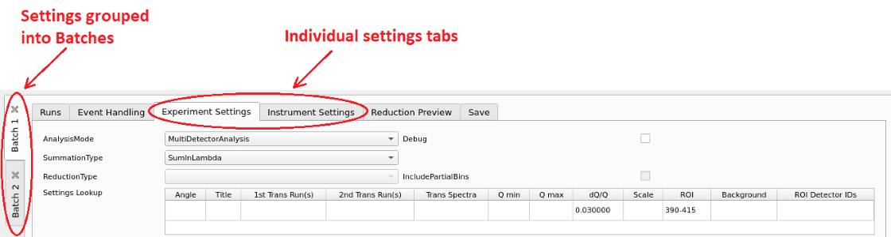

=====================
Reflectometry Changes
=====================

  *Usability improvements in the ISIS Reflectometry Interface*

.. contents:: Table of Contents
   :local:

ISIS Reflectometry Interface
----------------------------

Workbench Support
#################

The ISIS Reflectometry interface is now available in ``MantidWorkbench``, as well as ``MantidPlot``. See the :ref:`workbench documentation <workbench>` for more details and the :doc:`workbench release notes <mantidworkbench>` to see what else is included in this version.

Usability Improvements
######################

Major usability improvements have been added to the interface in this release. There are general layout improvements as well as new functionality for:

- keyboard navigation;
- input validation; and
- pre-processing and stitching transmission runs.

The rest of this section describes the changes in more detail.

Significant under-the-hood changes have also taken place to update the interface to modern design and engineering standards, resulting in a much more stable, extensible interface.

Batches and Settings
^^^^^^^^^^^^^^^^^^^^

  *Batch tabs on the left contain all of the settings for a particular reduction*

- Tabs are now grouped inside "Batches" rather than having separate "Groups" within each tab. This makes it easier to see which settings will be used for the current reduction.
- Any number of Batches is now supported - batches can be added using the Batch menu, or removed by clicking the X on the tab.
- The Settings tab has been split into two separate tabs for Experiment and Instrument Settings.
- Default values for the Experiment and Instrument Settings tabs are automatically populated for the selected instrument.

Transmission Runs
^^^^^^^^^^^^^^^^^

  *New transmission run options*

- There are now separate input boxes for the first and second transmission runs.
- Multiple runs can be specified for each transmission input - these will be summed prior to reduction. Multiple values are entered as a comma-separated list, similarly to the Run(s) column.
- Specific spectra (i.e. ``processing instructions``) can be specified for the transmission runs on the Experiment Settings tab. If none are specified then the same spectra will be used as for the input runs.
- A new ``Transmission stitch params`` input allows you to stitch parameters specifically for the transmission runs rather than using the same parameters as for the output IvsQ workspaces.
- A new ``Scale RHS transmission workspace`` check box allows you to control which workspace is scaled when stitching transmission runs.

The Toolbar
^^^^^^^^^^^

.. |filldown| image:: ../../images/arrow-expand-down.png

- A "Fill Down" |filldown| button has been added, which allows filling all selected cells below the highest selected cell, in the column that is selected.
- Filtering by run or group name is now possible using the search bar above the table. This accepts regular expressions.
- Icons have been updated to be consistent between Workbench and MantidPlot.

  *The new toolbar icons and filter box*

Keyboard shortcuts
^^^^^^^^^^^^^^^^^^

Additional keyboard shortcuts have been added to aid navigation/editing in the runs table.

+-----------------------------+---------------------------------------+
| Shortcut                    | Action                                |
+=============================+=======================================+
|``F2``                       | Edit the current cell                 |
+-----------------------------+---------------------------------------+
|``Esc``                      | Cancel editing                        |
+-----------------------------+---------------------------------------+
|``Tab``                      | Next cell                             |
+-----------------------------+---------------------------------------+
|``Shift-Tab``                | Previous cell                         |
+-----------------------------+---------------------------------------+
|``Enter``                    | Edit the next row / append a new row  |
+-----------------------------+---------------------------------------+
|``Ctrl-I``                   | Insert child row                      |
+-----------------------------+---------------------------------------+
|``Ctrl-X``                   | Cut                                   |
+-----------------------------+---------------------------------------+
|``Ctrl-C``                   | Copy                                  |
+-----------------------------+---------------------------------------+
|``Ctrl-V``                   | Paste                                 |
+-----------------------------+---------------------------------------+
|``Delete``                   | Delete the selected rows/groups       |
+-----------------------------+---------------------------------------+
|``Up``/``Down``              | Select next/previous row              |
+-----------------------------+---------------------------------------+
|``Shift-Up``/``Shift-Down``  | Extend selection to next/previous row |
+-----------------------------+---------------------------------------+
|``Ctrl-A``                   | Select all                            |
+-----------------------------+---------------------------------------+

.. figure:: ../../images/ISISReflectometryInterface/table_editing.png
  :class: screenshot
  :align: center
  :alt: Editing the Runs table

  *Editing the Runs table*

Processing and highlighting
^^^^^^^^^^^^^^^^^^^^^^^^^^^

  *Highlighting on the runs table*

- Additional highlighting has been added for rows and groups in the table to indicate which row is currently processing (yellow) and rows that are invalid and will be ignored (grey).
- A row or group's state is reset if its final output workspace(s) have been deleted
- Renamed workspaces now remain associated with the correct row/group in the table, so they can still be plotted
- Q min, Q max and dQ/Q are greyed out when they have been populated from the algorithm outputs so that you can easily distinguish between inputs and outputs
- Input validation is more intuitive - invalid values are highlighted with a red background, or, in the table, cells with an invalid value are marked with a red star
- The progress bar is more accurate, and remembers previous progress when you pause and restart processing.
- Processing in event mode is now done asynchronously, so it no longer locks up MantidPlot.

  *Examples of invalid input checks*

Bug fixes
#########

The following bugs have been fixed since the last release:

- Fixed an error about an unknown property value when starting the live data monitor from the reflectometry interface.
- Fixed a problem where auto-saving would fail if the output for a row is a group workspace.
- Fixed a problem where the live data monitor would not start. Also fixed an issue where the output workspace is created prematurely as a clone of the TOF workspace.

Removed/updated
###############

- The ``Generate Notebook`` checkbox has been removed as this was not used and not useful in its current state.
- The deprecation of ISIS Reflectometry (Old) GUI has been pushed back to November 2019.

Algorithms
----------

Improvements
############

- An additional method to calculate background has been added to :ref:`algm-ReflectometryBackgroundSubtraction`.
- The output workspaces of :ref:`algm-ReflectometrySliceEventWorkspace` now have names which describe the slice.
- In :ref:`algm-ReflectometryISISLoadAndProcess` all output workspaces have names which give information about the slice.
- In :ref:`algm-ReflectometryISISLoadAndProcess` the TOF workspaces are now grouped together.

Bug fixes
#########

- Fixed a bug in :ref:`ReflectometrySumInQ <algm-ReflectometrySumInQ>` that resulted in slightly too small bins in the output workspace.

Removed
#######

- Version 1 of `FindReflectometryLines` has been removed. Use :ref:`FindReflectometryLines-v2 <algm-FindReflectometryLines>` instead.

:ref:`Release 4.1.0 <v4.1.0>`
