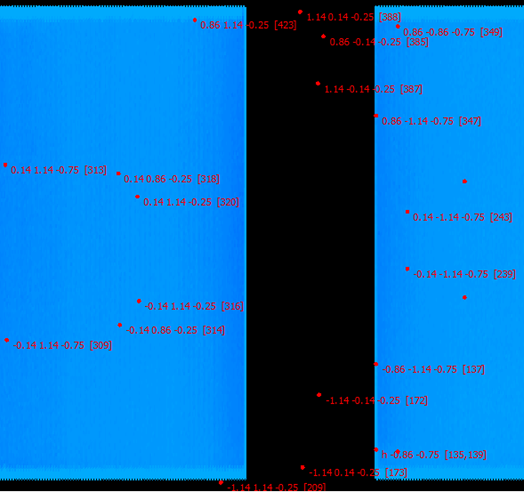
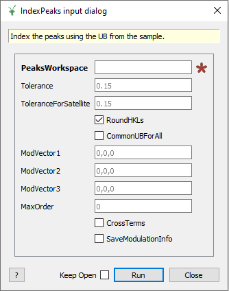

===================
Diffraction Changes
===================

.. contents:: Table of Contents
   :local:

Powder Diffraction
##################

Improvements
------------

- The HRPD scripts now mask out the Bragg peaks from the Vanadium.
- The file-naming scheme for ISIS powder is now controlled by a string template
- The file-naming of output on HRPD as been updated to closely match old script outputs
- The ISIS powder scripts for HRPD now integrate over the whole wavelength range by default when calculating the efficiency correction.
- Geometry definition for LLB 5C1
- :ref:`SNAPReduce <algm-SNAPReduce-v1>` has an additional parameter ``MaxChunkSize`` for customizing the chunking behavior
- :ref:`LorentzCorrection <algm-LorentzCorrection-v1>` has an additional parameter ``Type`` for ``SingleCrystalTOF`` (default) or ``PowderTOF``
- The create_total_scattering_pdf method in Polaris scripts now supports merging banks with a weighted mean.
- The create_total_scattering_pdf method in Polaris scripts now applies the Placzek self scattering correction from :ref:`CalculatePlaczekSelfScattering <algm-CalculatePlaczekSelfScattering>`.
- Cropping limits can now be set as a fraction of the data limits for ISIS Powder focusing as well as absolute values.

Bug Fixes
---------

- The values used to mask the prompt pulse on HRPD have been fixed.
- :ref:`AlignAndFocusPowderFromFiles <algm-AlignAndFocusPowderFromFiles-v1>` will reload the instrument if logs are skipped
- Fixed issue with :ref:`WANDPowderReduction <algm-WANDPowderReduction-v1>` handling of event workspaces
- Fixed issues with OptimizeLatticeForCellType, SelectCellOfType, SelectCellWithForm and TransformHKL when using modulated structures.

Single Crystal Diffraction
##########################

Improvements
------------

- \* **:ref:`PredictFractionalPeaks <algm-PredictFractionalPeaks>` now has the option to specify a reflection condition to restrict the number of peaks predicted,
  along with the option to not require a predicted peak to hit a detector.** \*
- :ref:`SaveHKL <algm-SaveHKL>` now saves the tbar and transmission values for shapes and materials provided by :ref:`SetSample <algm-SetSample>`.
- :ref:`SelectCellOfType <algm-SelectCellOfType>` and :ref:`SelectCellWithForm <algm-SelectCellWithForm>` now return the transformation matrix
- \* **:ref:`IndexPeaks <algm-IndexPeaks>` now has options to enter modulation vectors and additional information required for satellite peak indexing. As
  a result :ref:`IndexPeaksWithSatellites <algm-IndexPeaksWithSatellites>` has been deprecated and will be removed in a future release.** \*
- Bugs in :ref:`LoadIsawPeaks <algm-LoadIsawPeaks>` and :ref:`SaveIsawPeaks <algm-SaveIsawPeaks>` for WISH have been fixed.
- Added IDF for DEMAND (HB3A upgrade)

Bug Fixes
---------

- :ref:`IndexPeaks <algm-IndexPeaks>` has been fixed
  so that it correctly reports the number of main & satellite reflections that have been indexed. Also, if a satellite
  peak cannot be indexed its HKL is reset to 000 rather than accidentally setting it to the HKL of the main reflection.

\* **See associated Image** \*

:ref:`Release 4.2.0 <v4.2.0>`
