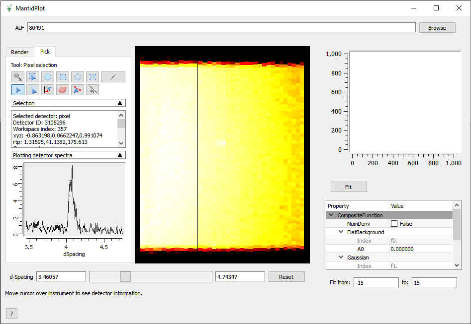

=======================
Direct Geometry Changes
=======================

.. contents:: Table of Contents
   :local:

Interfaces
##########

- Added the :ref:`ALF View <ALF_View-ref>` GUI for aligning samples on the ALF Instrument.

Algorithms
##########

- :ref:`DirectILLApplySelfShielding <algm-DirectILLApplySelfShielding>` will now first subtract the empty container background, then apply the self-shielding correction of the sample.
- Modified :ref:`MaskBTP <algm-MaskBTP-v1>` to include CHESS

Instrument Updates
##################

- Added the ``CHESS`` and ``ZEEMANS`` instruments  in the ``Facilities.xml`` to SNS for the second target station
- Added CHESS IDF.
- Updated scripts QECoverage and DGSPlanner/InstrumentWidget for CHESS

:ref:`Release 4.2.0 <v4.2.0>`
