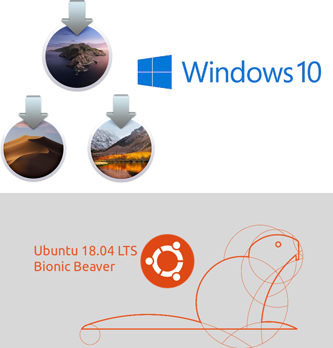

=================
Framework Changes
=================

.. contents:: Table of Contents
   :local:

Packaging
#########
- The macOS bundle now requires macOS High Sierra (10.13) as a minimum.
- The Ubuntu bundle requires Ubuntu 18.04.
- Although this release may continue to work on Windows 7/8, this will not have been verified or tested by the development team on anything earlier than Windows 10.

New
###

Algorithms
----------
- :ref:`SaveNexusESS <algm-SaveNexusESS>` to save data and nexus geometry to a single processed file.
- :ref:`LoadNGEM <algm-LoadNGEM>` added as a loader for the .edb files generated by the nGEM detector used for diagnostics. Generates an event workspace.
- :ref:`CalculatePlaczekSelfScattering <algm-CalculatePlaczekSelfScattering>` will calculate the Placzek correction from an incident spectrum as generated by :ref:`FitIncidentSpectrum <algm-FitIncidentSpectrum>`.
- :ref:`FitIncidentSpectrum <algm-FitIncidentSpectrum>` will fit a curve to an incident spectrum returning the curve and it's first derivative.

Instrument Definition Files
---------------------------

* Mantid is now resilient to corrupted Facilities.xml files, which could sometimes happen occasionally while downloading an updated file.  If Mantid finds a corrupt file it will now fall back to the originally installed file, and the corrupted one should be re-downloaded.
* A definition file for the NEAT instrument at HZB as been added along with an entry in the facilities file.
* The PEARL IDF has been updated with corrections to the instrument flight path and monitor distances.

Data Objects
------------
- New methods :py:obj:`mantid.api.SpectrumInfo.azimuthal` and :py:obj:`mantid.geometry.DetectorInfo.azimuthal`  which returns the out-of-plane angle for a spectrum

Improvements
############

Algorithms
----------
- Whitespace is now ignored anywhere in the string when setting the Filename parameter in :ref:`Load <algm-Load>`.
- Added options to :ref:`SaveMD <algm-SaveMD>` to allow selection of what will be saved. For MDHistoWorkspace only.
- :ref:`SetGoniometer <algm-SetGoniometer>` will now work on all workspaces not just Workspace2D.
- Version upgrade :ref:`LoadNexusProcessed <algm-LoadNexusProcessed>` to allow loading of both existing Mantid format Processed Nexus files and those produced via :ref:`SaveNexusESS <algm-SaveNexusESS>`.
- A new Poisson cost function has been added to :ref:`CalculateCostFunction <algm-CalculateCostFunction>`.
- In :ref:`SaveAscii <algm-SaveAscii>` it is now possible to save out also the values of the spectrum axis.
- :ref:`IndexPeaks <algm-IndexPeaks>` now has options to enter modulation vectors and additional information required for satellite peak indexing. As
  a result :ref:`IndexPeaksWithSatellites <algm-IndexPeaksWithSatellites>` has been deprecated and will be removed in a future release.
- :ref:`MaskAngle <algm-MaskAngle>` has an additional option of ``Angle='InPlane'``

Live Data
---------
- Streaming of json geometry has been added to the KafkaLiveListener. User configuration is not required for this.
  The streamer automatically picks up the geometry as a part of the run information and constructs the in-memory geometry without the need for an IDF.

Python
------
- IPython widget command executor has been updated to cope with changes to IPython >= 7.1

API
---
- :py:obj:`~mantid.api.MultipleFileProperty` can be configured to allow empty placeholder tokens.

Bug Fixes
#########
- :ref:`LoadNexusMonitors <algm-LoadNexusMonitors>` bug fix for user provided top-level NXentry name.
- :ref:`LoadInstrument <algm-LoadInstrument>` correctly handles IDF files which use all lowercase naming.
- Fix :ref:`LoadMD <algm-LoadMD>` handling for when parameter map is missing

:ref:`Release 4.2.0 <v4.2.0>`
