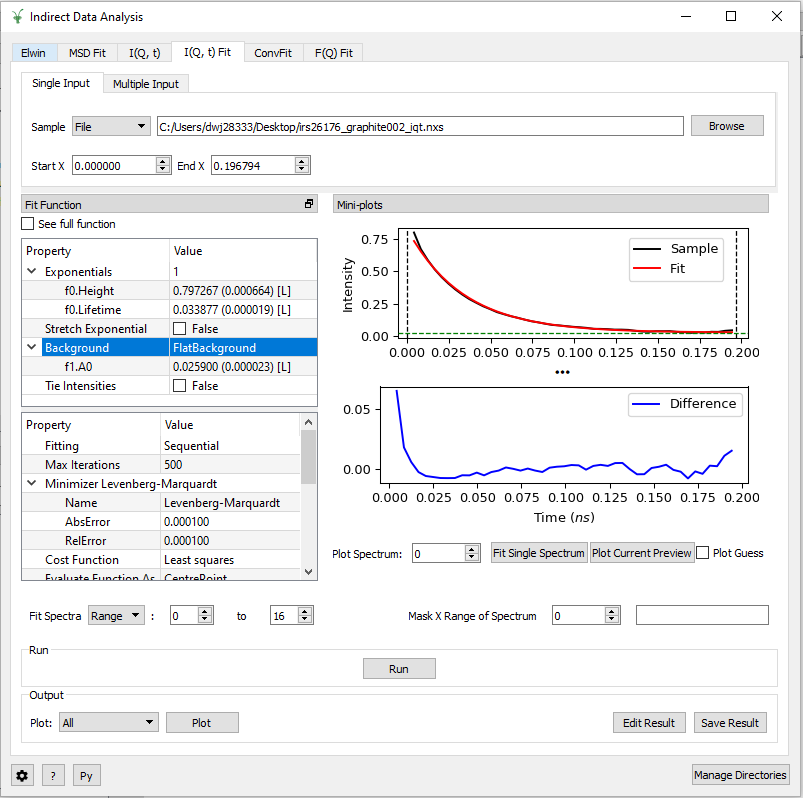

=========================
Indirect Geometry Changes
=========================

.. contents:: Table of Contents
   :local:

.. warning:: **Developers:** Sort changes under appropriate heading
    putting new features at the top of the section, followed by
    improvements, followed by bug fixes.

Improved
########

- Instrument definition is improved for IN16B to have the physical detector on the correct side of the beam axis, and different analyser focus for single detectors.
- :ref:`LoadILLIndirect <algm-LoadILLIndirect>` is extended to support also the configurations with the first tube angle at 33.1 degrees.
- :ref:`IndirectILLEnergyTransfer <algm-IndirectILLEnergyTransfer>` now offers the possibility to enable or disable the detector grouping both for Doppler and BATS modes. By default the pixels will be grouped tube by tube as before.
- :ref:`IndirectILLEnergyTransfer <algm-IndirectILLEnergyTransfer>` offers an option to discard the single detectors if they were not enabled in the measurement.
- A bug has been fixed in :ref:`MatchPeaks <algm-MatchPeaks>` which was causing wrong alignment in :ref:`IndirectILLReductionQENS <algm-IndirectILLReductionQENS>` with unmirror option 7, when the peaks in the alignment run are too narrow to be fitted.
- :ref:`SofQWNormalisedPolygon <algm-SofQWNormalisedPolygon>` now checks input properties are valid.
- :ref:`IndirectILLReductionFWS <algm-IndirectILLReductionFWS>` will now integrate the inelastic peaks correctly, based on the peak positions in the monitor spectrum.

Algorithms
----------

Improvements
############

- :ref:`IndirectQuickRun <algm-IndirectQuickRun>` and :ref:`IndirectSampleChanger <algm-IndirectSampleChanger>` have been
  extended to allow them to perform a Width Fit. This utilizes the new algorithm :ref:`IndirectTwoPeakFit <algm-IndirectTwoPeakFit>`.

Data Analysis Interface
-----------------------

Improvements
############
- Improved the output plotting options for Elwin and Iqt so that it is now possible to choose
  a list of spectra for plotting. For example, entering 0-2,4,6-8 and clicking **Plot Spectra**
  will plot the workspace indices 0, 1, 2, 4, 6, 7 and 8. The same can be done for **Plot Tiled**
  on the Iqt tab.

Data Reduction Interface
------------------------

Improvements
############
- Improved the output plotting options so that it is now possible to choose a list of spectra
  for plotting. This is the same as described for the Elwin and Iqt tab in Data Analysis.
- Improved the output plotting options so that they now show the workspace currently selected.
  The options have also been made more consistent across the interface.

Data Corrections Interface
--------------------------

Improvements
############
- Improved the output plotting options so that it is now possible to choose a list of spectra
  for plotting.
- Improved the output plotting options so that they now show the workspace currently selected.
  The options have also been made more consistent across the interface.

Simulations Interface
---------------------

Improvements
############
- Improved the output plotting options so that it is now possible to choose a list of spectra
  for plotting for the relevant tabs.
- Improved the output plotting options so that they now show the workspace currently selected.
  The options have also been made more consistent across the interface.
- Improved the format of Abins HDF5 files to include readable set of advanced parameters. Values
  in the AbinsParameters module have been re-organised into a logical heirarchy; user scripts
  may need to be modified to match this.

Diffraction Interface
---------------------

Improvements
############
- Improved the output plotting options so that it is now possible to choose a list of spectra
  for plotting. It also possible to do a contour plot using **Plot Contour**.
- Improved the output plotting options so that they now show the workspace currently selected.

The Workbench
-------------

- The Indirect Bayes GUI has been added to the Workbench.
- The Indirect Data Analysis GUI has been added to the Workbench.

:ref:`Release 4.2.0 <v4.2.0>`
