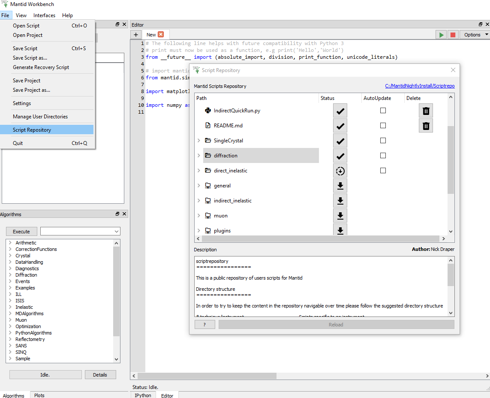
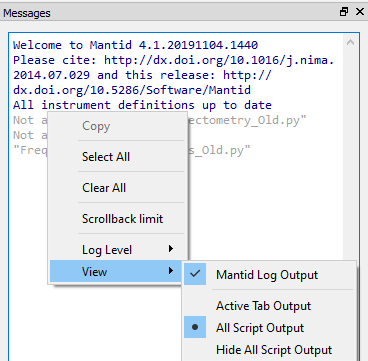
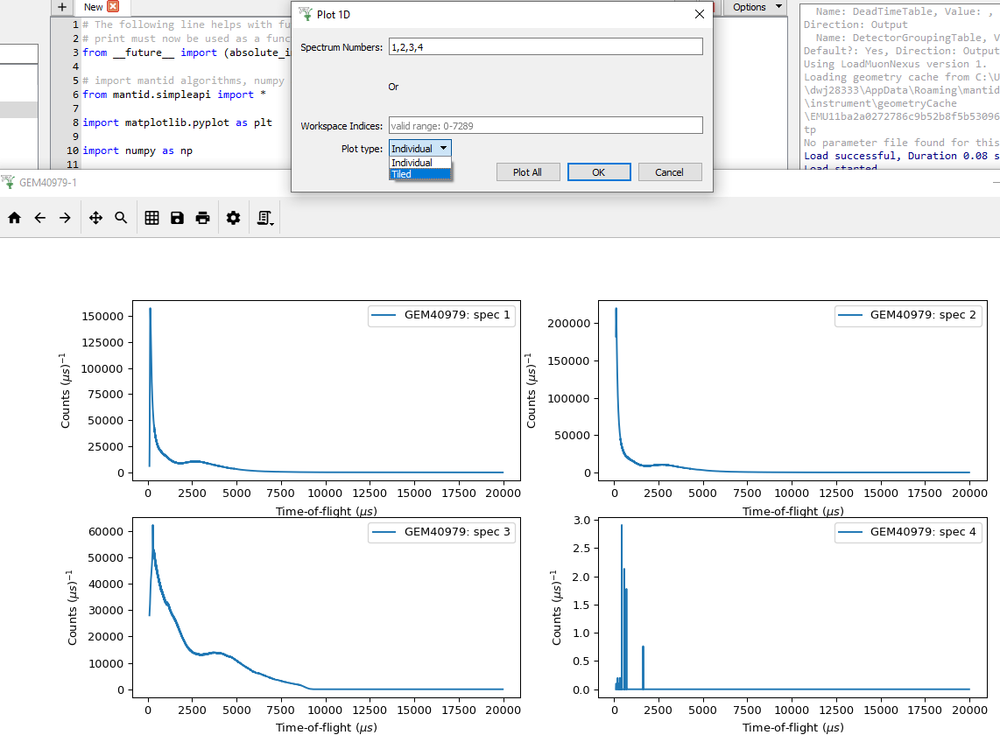
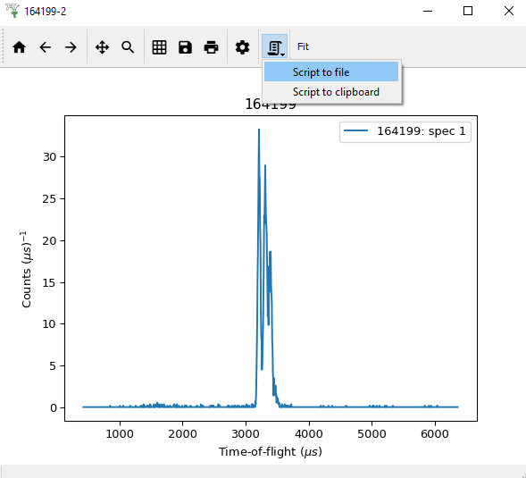
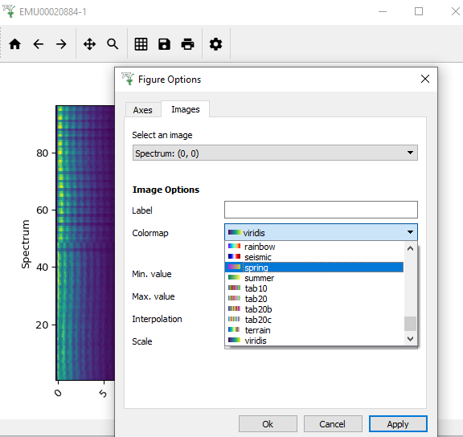

=======================
MantidWorkbench Changes
=======================

.. contents:: Table of Contents
   :local:

Improvements
############

User Interface
--------------

- ``*``The Script Repository - Download from 'File > Script' Repository to a folder of your choice!``*``
- 'File > Generate Recovery Script', essentially generates a Project Recovery script. It does NOT include Workspace Clean-Up or other features of Project Recovery.
- "Show Detectors" - Right-click a workspace and select "Show Detectors". This creates a table workspace with detector information relevant to the workspace.
- Clearer icons in SliceViewer and Plot Toolbars.
- Marker Label, Color and Line Style can be edited on a per-marker basis.
- Figure Options now has a Legend tab so that a plot's legend can be customised.
- Project Save and Load will no longer freeze when processing large amounts of workspaces and/or interfaces.
- Saving files larger than 10GB produces a pop-up to inform it may take a long time and gives the opportunity to cancel.
- Fit-Result Workspaces are now accessible from the Fitting Interface.
- Opening >1 instance of an interface is now disallowed, as was the case in MantidPlot.
- The Help [?] Button in Manage User Directories has been restored.
- It is now possible to fit Table Workspaces in the Fit Browser and in a script.

Scripting
---------

- New keyboard shortcuts:
	- Ctrl+ (Ctrl-) increases (decreases) font size in the script editor.
	- Ctrl+N opens a new tab in the script editor.
	- Ctrl+D aborts a running script
- The auto-complete in Workbench's script editor has been improved.
- ``*``"View" option, allowing you to filter Messages output by script - Right-click in the Messages Display and hover over "View" to see the options. ``*``

Plotting
--------

- ``*``Added basic Tiled plots.``*``
- Changing the Axes' scale, by Right-clicking on a figure with multiple plots, changes only the plot that was clicked on.
- Spectrum Label included in Legend (instead of Spectrum Number) if provided
- Plotting Dialog uses Spectrum Number by default.
- Home Button on Plot Windows now always centres the figure's contents.
- Forward and Back Arrows on Plot Windows to navigate Zoom levels.
- ``*``"Generate Script" Button on Plot Window to produce a script to re-create the current figure.``*``
- You can now zoom in/out on figures by scrolling and pan figures using the middle mouse button.
- The X value headers on data display now shows values to 4 decimal places.
- Plot Windows stay on top of Workbench's main window, so you can easily Drag and Drop workspaces onto existing figures.
- Draggable horizontal and vertical markers can be inserted into plots.
- ``*``Colormap Icons - In a Plot Window open Figure Options (Gear Icon, under Images>Colormap shows Colormap Icons beside names.``*``
- Hex Codes can be input into the Color Selectors in Figure Options.
- Scientific Notation can be used to input Axis Limits in the Figure Options.
- Sub-tabs in the Curves tab in Figure Options on plots now contain "Apply to All" buttons. It copies the current curve's properties to all others in the plot.

Bugfixes
########

- Pressing the tab key while in the axis quick editor now selects each input field in the correct order.
- Clicking Cancel after attempting to save a project upon closing now keeps Workbench open instead of closing without saving.
- Dialog windows no longer contain a useless help [?] button in their title bar.
- Instrument view now keeps the saved rendering option when loading projects.
- Fixes an issue where choosing to not overwrite an existing project when attempting to save upon closing would cause Workbench to close without saving.
- Fit results on normalised plots are now also normalised to match the plot.
- A crash in the Fit Browser when the default peak was not a registered peak type has been fixed.
- Fixed an issue where you could not edit table workspaces to enter negative numbers.
- The data display will now update automatically when deleting a column in a table workspace.
- The colorbar in the colorfill plot window now correctly resizes when the scale is changed by double-clicking on the colorbar axis.
- Fixes an issue in the Slice Viewer where changing the colormap, min value, or max value via the figure options would not update the scale.
- Fixes an issue where changing the curve properties in the figure options menu would reset the plot's axes scales.
- Fixed an issue with fitting where the difference would be plotted even if the Plot Difference option in the fit property browser was not enabled.
- Fixed an issue where the plot legend would no longer be movable after removing a plot guess.
- The fitting curves in the plot are now deleted when the fit results workspaces are deleted.
- An error is no longer raised when attempting to open plot options, or the fitting tab, on a figure containing a line plotted using a script without a spectrum number being specified.
- Sequential fit now updates parameters in fit browser and plots them
- Imports from the __future__ module now have the expected effect in scripts. E.g. after importing ``print_function``, ``print("A", "B")`` will output "``A B``" instead of "``('A', 'B')``".
- Tabs in the script editor no longer change order when Workbench is closed and reopened.
- Fixes an issue where subscribing a new algorithm duplicates the list of algorithms in the algorithm selector widget.
- Plots are no longer zoomed out along their y-axis when you perform a fit or do a plot guess.
- You can now save scripts that contain unicode characters.
- A crash no longer occurs when the GenerateEventsFilter algorithm fails in the Filter Events Interface
- Workspaces contained within groups are no longer duplicated when saving a project.
- The button to "Remove" a curve in Figure Options is now the same size as the drop-down list of curves.
- "MantidPlot" in window titles have been removed.

``*``Bold: See associated image

:ref:`Release 4.2.0 <v4.2.0>`
