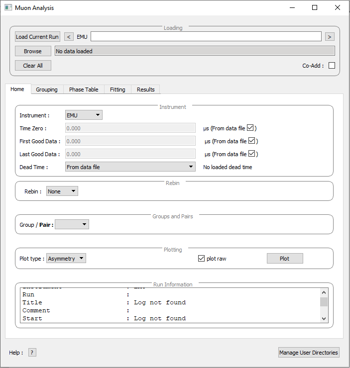

============
MuSR Changes
============

.. contents:: Table of Contents
   :local:

New
###

- New fitting functions added and muon fitting functions re-organised into MuonGeneric, MuonSpecific and MuonModelling.
- Newly added functions are:
   - MuonGeneric
      - :ref:`CombGaussLorenzKT<func-CombGaussLorentzKT>`
      - :ref:`StaticLorentzianKT <func-StaticLorentzianKT>`
      - :ref:`StretchedKT <func-StretchedKT>`
      - :ref:`StandardSC <func-StandardSC>`
   - MuonModelling
      - :ref:`Redfield <func-Redfield>`
   - MuonSpecific
       - :ref:`AFMLF <func-AFMLF>`
       - :ref:`AFMZF <func-AFMZF>`
       - :ref:`Bessel <func-Bessel>`
       - :ref:`CompositePCRmagnet <func-CompositePCRmagnet>`
       - :ref:`DampedBessel <func-DampedBessel>`
       - :ref:`FmuF <func-FmuF>`
       - :ref:`GauBroadGauKT <func-GauBroadGauKT>`
       - :ref:`GaussBessel <func-GaussBessel>`
       - :ref:`HighTFMuonium <func-HighTFMuonium>`
       - :ref:`LowTFMuonium <func-LowTFMuonium>`
       - :ref:`Meier <func-Meier>`
       - :ref:`ModOsc <func-ModOsc>`
       - :ref:`MuMinusExpTF <func-MuMinusExpTF>`
       - :ref:`MuH <func-MuH>`
       - :ref:`PCRmagRedfield <func-PCRmagRedfield>`
       - :ref:`PCRmagnetZFKT <func-PCRmagnetZFKT>`
       - :ref:`PCRmagnet <func-PCRmagnet>`
       - :ref:`PCRmagnetfnorm <func-PCRmagnetfnorm>`
       - :ref:`RFresonance <func-RFresonance>`
       - :ref:`SpinGlass <func-SpinGlass>`
       - :ref:`TFMuonium <func-TFMuonium>`
       - :ref:`ZFdipole <func-ZFdipole>`
       - :ref:`ZFelectronDipole <func-ZFelectronDipole>`
       - :ref:`ZFMuonium <func-ZFMuonium>`
       - :ref:`ZFprotonDipole <func-ZFprotonDipole>` 

Improvements
############

- The speed of plotting during Sequential Fits.
- Removed the creation of a group of groups from the Elemental Analysis GUI. It will now create a workspace for each detector, with each workspace containing three spectra corresponding to Total, Delayed and Prompt data.
- Muon Analysis Interface>Fitting>Property>TF Asymmetry mode now rescales the fit to match the rescaled data.
- Adding a pair by right clicking now allows a name to be specified.
- The ALC interface can now safely be closed while loading a set of runs. On an initial close request the algoirthm will be cancelled. The window then be closed.

Algorithms
-------------

- Improve the handling of :ref:`LoadPSIMuonBin<algm-LoadPSIMuonBin-v1>` where a poor date is provided.
- :ref:`LoadPSIMuonBin <algm-LoadPSIMuonBin>` has been improved to correctly load data other than data from Dolly at the SmuS/PSI.
- When there is a T0 for each spectrum, :ref:`LoadPSIMuonBin <algm-LoadPSIMuonBin>` chooses the max value out of the array instead of the first value.

Muon Analysis 2 and Frequency Domain Interfaces
---------------------------------------------------

- When loading PSI data if the groups given are poorly stored in the file, it should now produce unique names in the grouping tab for groups.
- When switching between Data Sets, Groups selected to fit are remembered.
- The Frequency Domain>Transform>FFT tab now uses Group Pair Selection to guess at the User's selection for workspaces.
- Can now plot FFT's of PhaseQuad data.
- Both interfaces work with Project Recovery. 
- The original Muon Analysis GUI has been renamed "Muon Analysis Old" and has been deprecated. 
- \* **The new Muon Analysis GUI has been renamed Muon Analysis.** \*

Bug Fixes
#########

- No longer produces an error if using multiple runs and the user plots all the FFT results when no imaginary data was used.
- Fixed an issue where changing the normalisation on a plot with auto-scale disabled throws an exception.
- Fixed an issue where warnings about adding workspaces to workspace groups multiple times were appearing in the log.
- Fixed an issue where logs in TF asymmetry mode were not being propogated to the results tab.
- Fixed an issue where Muon Analysis 2 would crash if a polynomial background was used in combination with another fitting function.
- Fixed an issue where changing the dead time to from table workspace or other file did not work and reverted back to from data file.
- Fixed an issue where the Auto button in the ALC interface would crash mantid if it failed to find a list of valid of files. It will now show an error if it fails to find a set of files.

\* **See associated Image** \*

:ref:`Release 4.2.0 <v4.2.0>`
