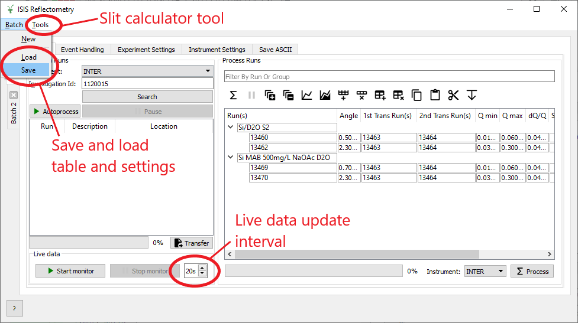

=====================
Reflectometry Changes
=====================

.. contents:: Table of Contents
   :local:
   

ISIS Reflectometry Interface
----------------------------

        
   *New features on the ISIS Reflectometry interface*

New
###

- **Batch Save/Load**: you can now save and re-load a full "batch reduction". This includes the runs table and all of the reduction settings for a particular Batch tab.
- **Project Save/Load**: the interface's full state will be saved when you save a project. Re-loading the project will reinstate all batch tabs. Any processed rows will remain linked to their original output workspaces.
- **Project Recovery**: the interface state will be saved if Mantid crashes and will be reinstated as long as project recovery can recreate all of the workspaces.
- The **live data update interval** can now be configured on the interface.
- The **Slit Calculator** dialog can now be accessed from the Tools menu.
- The **polarization correction** inputs have been simplified to a single checkbox which when ticked will apply polarization corrections based on properties in the instrument parameters file.

Bug fixes
#########

- A bug has been fixed where the interface could sometimes not be closed after a failed attempt at starting Autoprocessing.
- Row/group state will now be reset if renaming another workspace overwrites its output.
- The Instrument can no longer be different on different Batch tabs.
- Batch tabs can no longer have duplicate names.
- The Pause button is now disabled upon opening the interface and is only enabled when processing is in progress.

Algorithms
----------

- :ref:`ReflectometryReductionOneAuto <algm-ReflectometryReductionOneAuto-v3>` has been updated to version 3. This version has simplified the polarization correction options to a single True/False argument. When True, this will apply polarization corrections based on properties in the instrument parameters file.
- An issue has been fixed in `CreateTransmissionWorkspace <algm-CreateTransmissionWorkspace>` where the incorrect transmission workspaces were being output when debug is on/off.
- The :ref:`ReflectometryISISLoadAndProcess <algm-ReflectometryISISLoadAndProcess>` algorithm now ensures that the TOF group cannot contain non-TOF workspaces or nested groups (nested groups are not supported so are now flattened into a single group instead).

:ref:`Release 4.2.0 <v4.2.0>`
