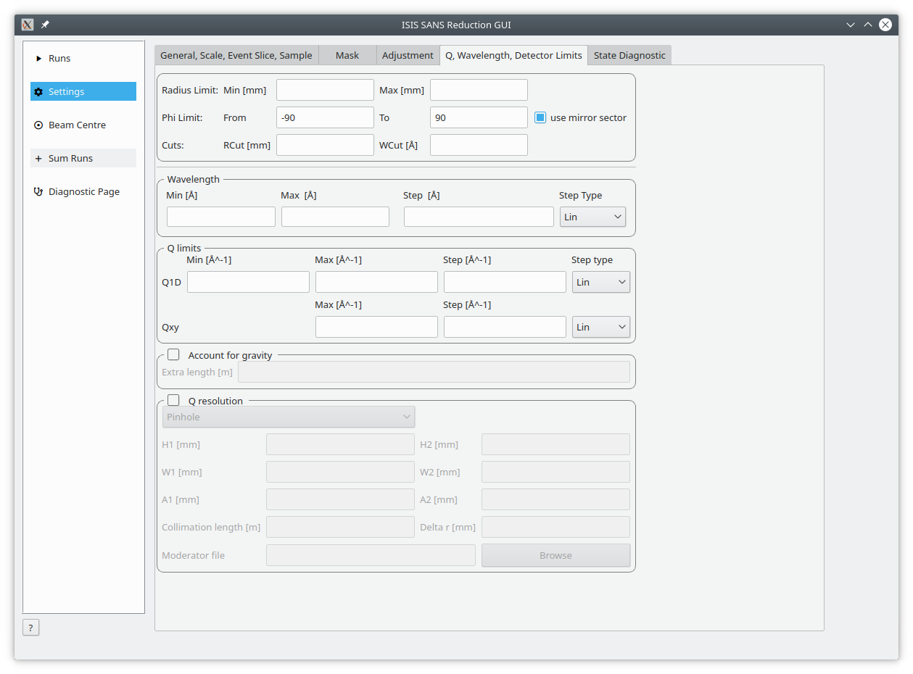

============
SANS Changes
============

.. contents:: Table of Contents
   :local:

New
###
- Support for shifting both monitor 4 and 5 on Zoom including a new setting in the 
  ISIS SANS GUI. A new user file command has also been added to
  perform monitor shifts without changing the selected transmission spectrum.
- New :ref:`HFIRSANS2Wavelength <algm-HFIRSANS2Wavelength-v1>` algorithm to "convert" CG2 event files
  to histograms in wavelength.
- New BIOSANS instrument definition file to accompany the data collection in event nexus new mode.
- New CG2 definition file

Improved
########

- Option in :ref:`EQSANSCorrectFrame <algm-EQSANSCorrectFrame>` to correct
  TOF by path to individual pixel.
- :ref:`ApplyTransmissionCorrection <algm-ApplyTransmissionCorrection-v1>` now
  can be supplied any transmission workspace that is supported
  by :ref:`Divide <algm-Divide-v1>` .

Multiple ISIS SANS GUI Usability
-----------------------------------

- \* **The "visual noise" of the *General* and *Q, Wavelength* settings tabs has
  been reduced.** \*
- Clicking on a cell in the table and typing will automatically start editing
  the cell without having to double click it.
- Sample thickness is set when a user presses load or process selected,
  this resolves problems with a run not being found and having to re-enter
  each number individually.
- Wavelength ranges such as *1,2,4,5* are now accepted. This example would
  convert into 1-2, 2-4, 4-5.
- *Open Mask File* and *Open Batch File* will remember their previously
  selected files.
- *Open Mask File* and *Open Batch File* will only show .txt and .csv files
  respectively by default.
- The Check-boxes enabling extra table options, such as *Sample Geometry* have
  been moved alongside the table controls.
- Multiple SANS Workflow Algorithms were converted into internal scripts.
  This removes the need for passing SANSState objects in unrolled histories.
  Additionally, it speeds up the reduction of each run by ~35%.

Bug Fixes
##########

- Fixed a bug where Mantid would crash when a user went to change their default
  save directory if no instrument was selected.
- A bug causing large batch files (1000+ runs) to take minutes to load into the
  ISIS SANS GUI has been fixed. Large batch files will now load within seconds.
- Processing data with a custom output name will append the same details to
  the final output workspace name as those without a custom name.
- Workspace names and output files use the run number from the table, rather
  than the run number in the nxs file. If there is no run number it will
  continue to use the run number from the nxs file, but emit a warning.

Removed
#######

- SANSCalculateTransmission
- SANSCreateAdjustment
- SANSCrop
- SANSConvertToQ
- SANSConvertToWavelength
- SANSMaskWorkspace
- SANSMove
- SANSNormalizeToMonitor
- SANSScale
- SANSSliceEvent

These SANS Workflow algorithms have been removed from the list of executable algorithms as they are only required for internal use.

\* **See associated Image** \*

:ref:`Release 4.2.0 <v4.2.0>`
