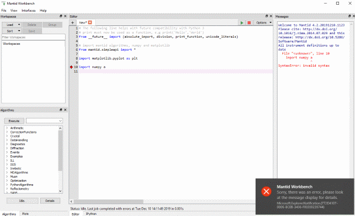
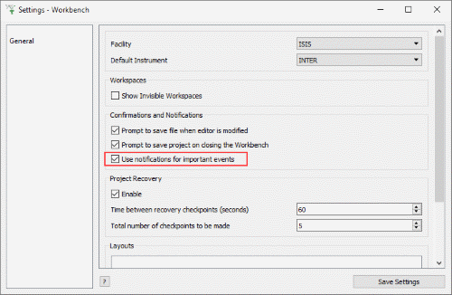

=======================
MantidWorkbench Changes
=======================

.. contents:: Table of Contents
   :local:

New
###
- Waterfall Plots
- Mantid Workbench can now load all of the workspaces from projects saved from Mantidplot.  Graphs and interface values are not imported from the project.

Improvements
############

- If you have ever found it hard to spot when errors appear in the Messages window, and perhaps miss them if there are lots of graphs on the screen, then you will like this.  We have added system notifications when Mantid enounters an error, and directs you to look at the Messages window for details.  You can enable or disable these notifications from the File->Settings window.

- You can now save Table Workspaces to Ascii using the `SaveAscii <algm-SaveAscii>` algorithm, and the Ascii Save option on the workspaces toolbox.
- Normalization options have been added to 2d plots and sliceviewer.
- An exclude property has been added to the fit property browser
- The images tab in figure options no longer forces the max value to be greater than the min value.
- Double clicking on a workspace that only has a single bin of data (for example from a constant wavelength source) will now plot that bin, also for single bin workspaces a plot bin option has been added to the right click plot menu of the workspace.

Bugfixes
########

- Colorbar scale no longer vanish on colorfill plots with a logarithmic scale
- Figure options no longer causes a crash when using 2d plots created from a script.
- Running an algorithm that reduces the number of spectra on an active plot (eg SumSpectra) no longer causes an error
- Fix crash when loading a script with syntax errors
- The Show Instruments right click menu option is now disabled for workspaces that have had their spectrum axis converted to another axis using :ref:`ConvertSpectrumAxis <algm-ConvertSpectrumAxis>`.  Once this axis has been converetd the workspace loses it's link between the data values and the detectors they were recorded on so we cannot display it in the instrument view.

:ref:`Release 4.3.0 <v4.3.0>`
