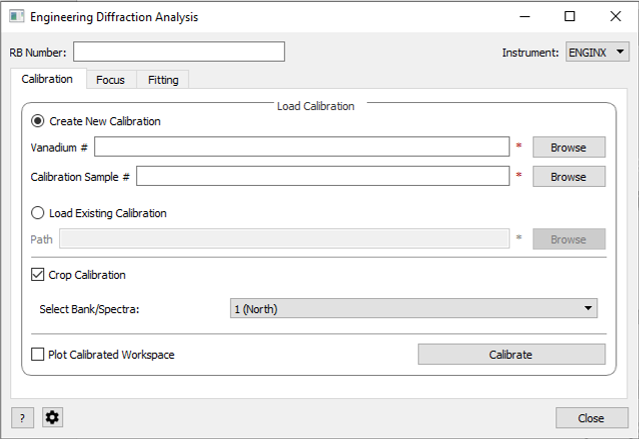
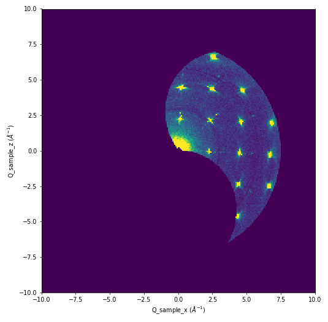

===================
Diffraction Changes
===================

.. contents:: Table of Contents
   :local:

New Features
############

Engineering Diffraction
-----------------------
- Introduction of new Engineering Diffraction interface. Currently supports calibration and focusing for ENGINX. Fitting functionality is currently under development.

Improvements
############

Powder Diffraction
------------------

Several improvements have been made to the total scattering functionality in the Polaris powder diffraction scripts. The following changes relate specifically to the create_total_scattering_pdf function:

- Merging banks now matches spectra to the spectrum with the largest x range.
- Merging banks no longer matches spectra with scale, it now only matches with offset.
- It can now be given a parameter `output_binning` that will be used to rebin the output_pdf.
- It can now accept a `pdf_type` argument to set the pdf_output type.
- It can now accept a `freq_params` argument to perform a fourier filter on the run.
- A :ref:`SaveRMCProfile <algm-SaveRMCProfile-v1>` algorithm has been made that saves workspaces in a format readable by the RMCProfile package.

The following changes have also been made to other parts of the power diffraction scripts:

- :ref:`HRPDSlabCanAbsorption <algm-HRPDSlabCanAbsorption-v1>` now accepts any thickness parameter and not those in a specified list.

Engineering Diffraction
-----------------------

- :ref:`EnggCalibrateFull <algm-EnggCalibrateFull-v1>` now uses the new :ref:`SaveAscii <algm-SaveAscii-v2>` to save its output files as TSVs, allowing them to be loaded back into Mantid.
- :ref:`FitPeaks <algm-FitPeaks-v1>` allows for specifying some of the peak parameters (e.g. only ``Mixing`` for :ref:`func-PseudoVoigt`) and observing the other parameters. The new functionality allows for more automated execution for peak functions other than :ref:`func-Gaussian`.
- Instrument Definition File for HFIR HB2B (HiDRA) has been added.

Single Crystal Diffraction
--------------------------

- :ref:`PredictFractionalPeaks <algm-PredictFractionalPeaks-v1>` now accepts the same set of modulation vector properties as :ref:`IndexPeaks <algm-IndexPeaks-v1>`.
- New algorithm :ref:`ConvertHFIRSCDtoMDE <algm-ConvertHFIRSCDtoMDE-v1>` for converting HFIR single crystal data (from WAND and DEMAND) into MDEventWorkspace in units Q_sample.

- The output peak workspace from :ref:`PredictFractionalPeaks<algm-PredictFractionalPeaks-v1>` now keeps the same lattice parameters as the input workspace.
- :ref:`SaveReflections <algm-SaveReflections>` now has the option to save peaks to separate files based on their associated modulation vectors when using the Jana format.
- ``IndexPeaksWithSatellites`` has been deleted as it had been deprecated and superseded by :ref:`IndexPeaks <algm-IndexPeaks-v1>`.

Miscellaneous
------------------

- :ref:`LoadILLTOF2 <algm-LoadILLTOF-v2>` now supports loading data taken from PANTHER in diffraction mode.
- A unit `AtomicDistance` measured in units of Angstrom has been added to the unit factory to describe atomic structure. The initial use of this is in the pair distribution functions generated by the Polaris scripts

Bug Fixes
#########

Powder Diffraction
------------------

- Unicode strings can now be given as a lim file directory in polaris create_total_scattering_pdf merging banks.
- Polaris.focus no longer fails with `do_absorption_Corrections=True`.
- Empty runs are no longer subtracted twice when specifying `sample_empty` in `Polaris.focus`.
- Lists can now be given for `q_lims` in polaris create_total_scattering_pdf while merging banks.
- SavePDF no longer fails when asked to save histogram data
- Bug fixed affecting Diffraction > Powder Diffraction Reduction interface - only facilities with applicable instruments can now be selected.

Single Crystal Diffraction
--------------------------

- Support added for DEMAND (HB3A) to the algorithms :ref:`ConvertWANDSCDtoQ <algm-ConvertWANDSCDtoQ-v1>` and :ref:`FindPeaksMD <algm-FindPeaksMD-v1>` in order to handle additional goniometers.
- Fixed PredictSatellitePeaks producing an empty table when using cross-terms with crystallography convention for sign of Q.
- Two fixes to IntegrateEllipsoids and IntegrateEllipsoidsTwoStep. For non Event mode data the algorithms now:

  - calculate the count-weighted variance as required.
  - return the correct error on the integrated intensity.

Miscellaneous
------------------

- Fixed a bug where :ref:`SaveGSS <algm-SaveGSS-v1>` could crash when attempting to pass a group workspace into it. GSS files are produced by the focus functionality in the powder diffraction scripts and also the EnginX scripts

:ref:`Release 5.0.0 <v5.0.0>`
