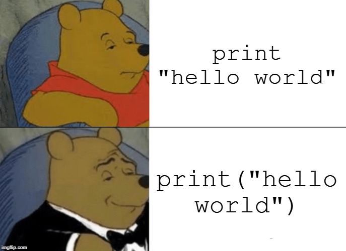

=================
Framework Changes
=================

.. contents:: Table of Contents
   :local:

New Features
############

- Mantid is now built against Python 3. Windows/macOS bundle Python 3.8 & 3.7 respectively. Ubuntu & Red Hat use system Python 3.6.
- Users at ORNL have a more robust usage of ``vglrun`` when using mantidplot/mantidworkbench remotely through thin-linc
- On Windows, search in the start menu for "Workbench", "Plot" to open Mantid, previously only
  "Mantid" worked.

Imporovements
#############

Concepts
--------

- Ties set to peaks in crystal field fits now work correctly.
- Error bars on calculated normalized fits are now correct.

- Prevent units that are not suitable for :ref:`ConvertUnits <algm-ConvertUnits>` being entered as the target unit.
- Save the units for single value logs in :ref:`SaveNexusProcessed <algm-SaveNexusProcessed>`
- Fixed a bug in :ref:`LoadNGEM <algm-LoadNGEM>` where precision was lost due to integer arithmetic.

Algorithms
----------

- :ref:`LoadEventNexus <algm-LoadEventNexus>` Now has a new property `NumberOfBins` to select how many linear bins to initially apply to the data.  This allows event data to be plotted immediately without having to :ref:`Rebin <algm-Rebin>` it first.  This is a change from before where event data was initially loaded with a single bin, now by default it will be split into 500 linear bins.
- :ref:`SaveAscii <algm-SaveAscii>` can now save table workspaces, and :ref:`LoadAscii <algm-LoadAscii>` can load them again.
- :ref:`TotScatCalculateSelfScattering <algm-TotScatCalculateSelfScattering>` will calculate a normalized self scattering correction for focused total scattering data.
- :ref:`MatchAndMergeWorkspaces <algm-MatchAndMergeWorkspaces>` will merge workspaces in a workspace group with weighting from a set of limits for each workspace and using :ref:`MatchSpectra <algm-MatchSpectra>`.
- :ref:`MonteCarloAbsorption <algm-MonteCarloAbsorption>` Sampling of scattering points during MC simulation now takes into account relative volume of sample and environment components. The calculation also now reuses the same set of simulated tracks to calculate the attenuation for different wavelengths. A new parameter ResimulateTracksForDifferentWavelengths has been added to control this behaviour with a default value of false. NOTE: This has been inserted in the middle of the parameter list so any usage of positional parameters with this algorithm will need to be adjusted.
- :ref:`AddSampleLogMultiple <algm-AddSampleLogMultiple>` Add parameter LogTypes to specify the type of each log value.
- :ref:`ApplyCalibration <algm-ApplyCalibration>` can now independently change the pixel heights, widths, and Y-coordinate. Property "PositionTable" has been deprecated and property "CalibrationTable" should be used in its place.
- :ref:`FilterEvents <algm-FilterEvents>` Now has an accurate algorithm to calculate duration of each split-out workspace and add the duration value to split-out workspace as a single value property named "duration".

Data Handling
-------------

- Sample environment (.xml) files that act as extensions to Instrument Definition Files can now support .stl file paths to load mesh geometries for environment components or the sample. This new feature can be used when running SetSample. In addition, a sample environment xml file has been created for Pearl

Geometry
--------

- Increased numerical accuracy when calculating the bounding box of milli-meter sized cylindrical detector pixels.

Python
------

- :py:meth:`mantid.api.Run.getTimeAveragedStd` method has been added to the :py:obj:`mantid.api.Run` object.
- All simpleapi Dialog functions that raised the corresponding algorithm dialog from a
  script have been deprecated. They had low to zero usage and will not work in the future workbench.
  They will be deleted in a future release.

:ref:`Release 5.0.0 <v5.0.0>`
