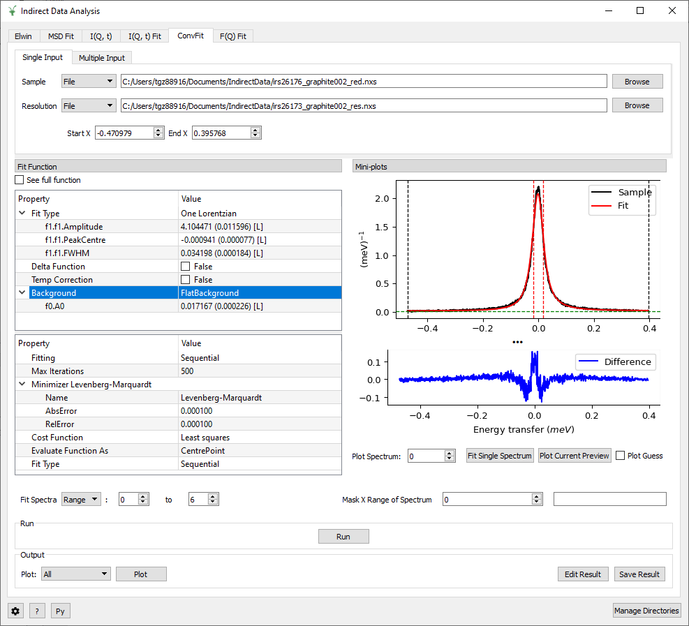

=========================
Indirect Geometry Changes
=========================

.. contents:: Table of Contents
   :local:

New
###

- Simultaneous fitting has been added as an option on the convolutional, F(Q) and Msd fitting tabs in QENS Data Analysis. This allows multiple spectra from one or more reductions
  to be fitted with parameters tied together. For more information on these changes, see the updated documentation :ref:`Inelastic Data Analysis <interface-inelastic-qens-fitting>`.

Improvements
############

- On workbench a plotting related issue was slowing down Mantid when some of the interfaces were open. This issue has been resolved, speeding up many of the indirect workflows.

- In Abins the instrumental broadening implementation has been overhauled.

  - Output spectra from Abins should now be smooth and free of artefacts.
  - A fast approximate scheme is implemented and automatically applied
    when appropriate for simulations of TOSCA spectra. Alternative
    broadening implementations may be selected through the
    AbinsParameters system, including slow reference methods.
  - Spectra now follow the broader Mantid convention for histograms:
    values correspond to frequencies at the mid-points of the
    histogram bins. (Previously the values would correspond to one
    bin-edge.)

- In Abins the iterative thresholding system, which was used to
  suppress high-intensity terms at high quantum orders, has been
  removed.

  - Instead, a user warning is printed at the end of the calculation
    (before writing files) if the threshold for small values (set in
    AbinsParameters.sampling) was large compared to the data.
  - This will lead to performance improvements for systems with
    large second-order contributions.
  - Calculation of third- and fourth-order spectra is disabled while
    the implementation of these terms is reviewed. Benchmarking has
    shown that the results of these terms are unreasonably large, and
    are not recommended for production calculations.

BugFixes
########

- The Abins file parser no longer fails to read data from non-periodic vibration calculations performed with CRYSTAL17.
- :ref:`ApplyPaalmanPingsCorrection <algm-ApplyPaalmanPingsCorrection>` will now run also for fixed window scan reduced data and will not crash on workspace groups.
- Fixed a bug crashing the ``Indirect ILL Data Reduction GUI`` when Run is clicked.
- Indirect ILL reductions for BATS and Doppler QENS modes will now flag the outputs as distributions if the data is normalised by the monitor.
- :ref:`IndirectILLReductionFWS <algm-IndirectILLReductionFWS>` will now allow for manual setting of the inelastic peak channels.
- The context menu on the fitting preview plots for Data Analysis has been temporarily disabled due to lack of communication between it and the interface causing bugs.
- Fixed an issue which caused the Indirect Data Analysis GUI to crash when a function was changed in the I(Q, t) Fit tab.

:ref:`Release 5.0.0 <v5.0.0>`
