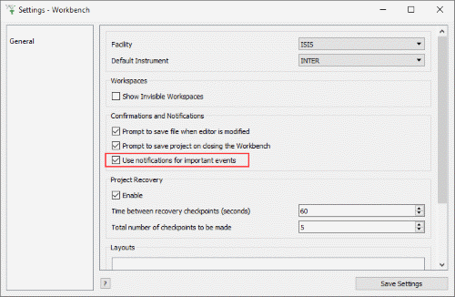

=======================
MantidWorkbench Changes
=======================

.. contents:: Table of Contents
   :local:

   *Waterfall Plots new to Workbench*

New
###

- *Waterfall Plots* with options for spacing and filling curves.
- Workbench has many more options in the :ref:`settings menu <01_save_settings>`, including setting defaults for plotting and fitting!
- Mantid Workbench can now load all of the workspaces from projects saved from Mantidplot.  Graphs and interface values are not imported from the project.
- Added a compatibility implementation of plotSpectrum and plotBin for python scripts in Workbench, all of the previous arguments are supported with the exception of distribution, which will be ignored. For example the following commands are supported.

.. code-block:: python

	#setup a couple of workspaces
	ws = CreateSampleWorkspace(Function='Powder Diffraction')
	ws2 = ws+ws

	#simple plots
	plotSpectrum(ws ,1)
	plotBin(ws ,1)

	#With Error Bars
	plotSpectrum(ws ,1,error_bars=True)
	plotBin(ws ,1,error_bars=True)

	#Multi line plots
	plotSpectrum([ws,ws2],1)
	plotBin([ws,ws2],1)
	plotSpectrum([ws ,ws2],[1,2,3])
	plotBin([ws ,ws2],[1,2,3])
	plotSpectrum(["ws","ws2"],[1,2,3])

	#plotting with spectra numbers
	plotSpectrum(ws,spectrum_nums=2,error_bars=True)
	plotSpectrum(ws,spectrum_nums=[2,4,6])
	plotSpectrum([ws,ws2],spectrum_nums=list(range(2,10)))

	# add a curve to an existing plot
	plot1 = plotSpectrum(ws,1,error_bars=True)
	plot1 = plotSpectrum(ws,1,error_bars=True,window=plot1)

	# clear an existing plot use that window to plot
	plot2 = plotSpectrum(ws,1,error_bars=True)
	plot2 = plotSpectrum(ws2,1,error_bars=True,window=plot2, clearWindow = True)

	# plot as points not lines
	plotSpectrum(ws,1,error_bars=True,type=1)
	plotBin(ws,1,type=1)

	# plot as waterfall graphs
	plotSpectrum(["ws","ws2"],[1,2,3],waterfall=True)

.. figure:: ../../images/Notification_error.png
   :class: screenshot
   :width: 600px
   :align: right

   *Error Notification Service*

Improvements
############

**General**

- The way scripts are parsed and executed has been vastly improved, solving issues related to the progress arrow, blank lines after a colon and tabs in strings.
- Progress reporting for scripts has been vastly improved and now reports at the line level.
- Toggle Whitespace in the editor now shows line endings as well as spaces and tabs

- It is easy to miss errors in the Messages box (e.g. many plots on the screen). Now there is an *Error Notification service* when Mantid encounters an error, directing you to look at the Messages box for details. This can be dis/enabled in File > Settings > General > "Use notifications for important events".

   *Toggle Error Notification*

- Most changes in the settings dialog now take place immediately, no longer needing a restart, such as changing default instrument, hiding categories of algorithms and interfaces, or choosing whether to see invisible workspaces.

**Fitting**

- Fit functions can now be put into nested categories and into multiple categories.
- Now able to exclude regions of data from a fit, within the fit property browser.
- You can now search for functions when doing fits.
- A help button has been added to the fitting add function dialog.

**Plotting**

- Figure options>Images tab no longer requires Max > Min value. If Min > Max, they will be swapped!
- A warning now appears if you attempt to plot more than ten spectra.
- Normalization options have been added to 2d plots and sliceviewer.
- Double clicking on a workspace that only has a single bin of data (for example from a constant wavelength source) will now plot that bin, also for single bin workspaces a plot bin option has been added to the right click plot menu of the workspace.
- The context menu for WorkspaceGroups now contains plotting options so you can plot all of the workspaces in the group.

   *Save drop-down menu*

**Algorithms**

- Table Workspaces can be saved to Ascii using the :ref:`SaveAscii <algm-SaveAscii>` algorithm, and the *Save > Ascii drop-down* option above the Workspaces Toolbox.
- The *Save drop-down* menu in the workspaces toolbox no longer has the old SaveAscii (version 1) as no one was using it and it only added confusion. The most recent version of SaveASCII is still available.
- The algorithm progress details dialog now fills immediately with all running algorithms rather than waiting for a progress update for the algorithm to appear.
- Algorithm dialogs will now use the selected workspace as the InputWorkspace when running an algorithm from the algorithms toolbox.

   *Live Data Details - easier to cancel*

- We have limited the maximum rate of algorithm progress updates to the progress bar to 1000/second.  This has resulted in a workbench completing certain intensive python scripts 4 times faster.
- Default values for algorithm properties now appear as greyed-out text on custom algorithm dialogs.
- *Live data sessions* can be more easily cancelled, now that MonitorLiveData appears promptly in the *algorithm details* window.

Bugfixes
########

**General**

- Scripts with syntax errors can now be opened.
- Scripts are saved properly on windows (no longer double line spaced).
- Scripts generated from plots now work for newer versions of Matplotlib.
- The Show Instrument right click menu option is now disabled for workspaces that have had their spectrum axis converted to another axis using :ref:`ConvertSpectrumAxis <algm-ConvertSpectrumAxis>`. Once this axis has been converted the workspace loses its link between the data values and the detectors they were recorded on so we cannot display it in the instrument view.
- Fixed a bug on the instrument viewer where changing projection and back to Full 3D would display the wrong point of view.
- Fixed a crash in the TOFConverter interface when leaving input fields blank or using invalid characters.
- Warnings from the Python ``warnings`` module are now show as warnings and not errors in the log display.
- Colorbar scale on Instrument view shows labelled ticks when the range is within an order of magnitude, in the SymmetricLog10 setting.

**Plotting**

- Overplots will be normalized by bin width if they are overplotting a curve from a distribution workspace.
- Colorbar scale shows helpful minor ticks and no longer vanishes on colorfill plots with a logarithmic scale.
- Axes limits of a plot no longer automatically rescale when errorbars are on/off.
- Figure options no longer causes a crash for 2d plots created from a script.
- Running an algorithm that reduces the number of spectra on an active plot (eg SumSpectra) no longer causes an error.
- Figure options on bin plots open without throwing an error.
- Right-click menu on the plot of an MDHistoWorkspace can be opened without an error.
- Fixed an uncaught exception when plotting logs on single spectrum workspaces.
- Fixed an issue with changing normalisation on single spectra plots done from a script.
- Axes editor menu now reads the state of the grids on the plot.
- Fixed a bug which caused graphic scaling issues when the double-click menu was used to set an axis as log-scaled.
- The mechanism to keep plots on top of the main Workbench window has been changed because some window managers would not release focus to their script editor rendering it useless.
  This has the effect on some Linux environments of removing the ability to minimize the figure. The control within the Plots toolbox still allows visibility to be toggled on/off if required.
- There is now appropriate protection around setting the colorbar scale to logarithmic while the min and/or max value is negative.
- Toggling error bars on a line with markers no longer causes an unhandled exception.

**Fitting**

- Fitting a distribution workspace is normalised correctly.
- The help button in fitting now finds the page for the relevant function.
- Fixed an issue where adding a Bk2BkExpConvPV function to the fit browser caused a crash

**Algorithms**

- In the Algorithm Toolbox, double-clicking on an algorithm always executes the algorithm. In the case, where previous versions of an algorithm are still available, this would show the other versions. You can still click on the triangle to see and execute previous versions.
- Unrolling consecutive workflow algorithms in Workspace History correctly includes every algorithm.

:ref:`Release 5.0.0 <v5.0.0>`
