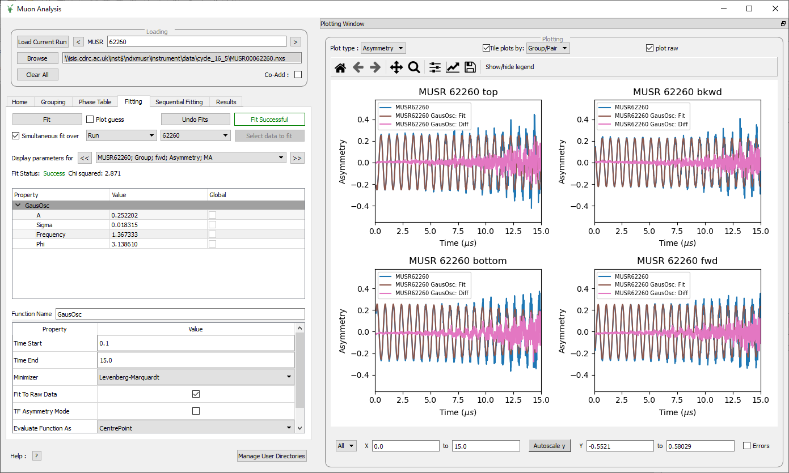

============
MuSR Changes
============

.. contents:: Table of Contents
   :local:

Muon Analysis 2 and Frequency Domain Interfaces
##################################################

New Features
------------
- The plotting window within the Muon Analysis 2 and Frequency Domain Interfaces has been converted into a dockable window,
  which can be docked and undocked at will. This change improves the user experience for those working on laptops.
- Improved the plotting within the Muon Analysis 2 and Frequency Domain interfaces by introducing tiled plotting.
  The user can choose whether they would like tiled plotting over the groups/pairs or by run. Within these plotting improvements
  a number of additional changes have been made, most notably the removal of the grouping options from the home tab. Instead,
  plots are controlled through the grouping tab, which is also used to determine which groups/pairs to undertake fitting on.
  In the fitting tab, improvements have been made to make the process of simultaneous fitting over groups/pairs easier, which in
  part due to the new tiled plotting feature.
- Added a plotting options toolbar to the docked plotting in the Muon Analysis 2 and Frequency Domain interfaces. This toolbar
  can be used to autoscale the axes, change the axes limits, and control the plotting of errors.
- Fixed a bug that prevented PSI data from being loaded.
- Reworked the fitting tab to improve the user experience when doing single, and simultaneous fits.
- Addition of a sequential fitting tab, enabling both sequential, and simultaneous sequential fits.

Bug Fixes
---------

- Fixed a bug with constraints in the Muon Analysis 2 GUI which would cause Mantid to crash.
- Data sets can now be reloaded while the Instrument View is open without crashing Mantid.
- Fixed a bug where the incorrect path would be shown after loading a data file by run number.
- The increment arrow no longer gives a spurious warning that the requested run exceeds the current run.

Elemental Analysis
##################

Bug Fixes
---------
- The elemental analysis GUI can now handle legacy data which is missing a response dataset, e.g Delayed.
- Fixed a bug where Elemental analysis gave an error when loading data.
- Elemental analysis bug has been fixed that prevented co-adding data.
- Peak data file has been updated. It now includes the same transition for different isotopes.

Algorithms
##########

Bug Fixes
---------
- :ref:`LoadPSIMuonBin <algm-LoadPSIMuonBin>` can produce an empty deadtime table, where the time data is offset such that the start of the pulse is at time zero. The start and end date logs have been fixed and if there is no group name present a default is generated.

Muon Analysis (old)
###################

Bug Fixes
---------
- Fixed a bug in Muon Analysis Old that prevented the muon fitting functions from appearing in the data analysis tab.

:ref:`Release 5.0.0 <v5.0.0>`
