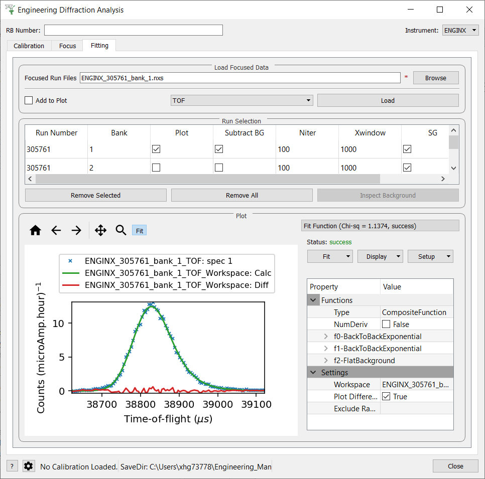

===================
Diffraction Changes
===================

.. contents:: Table of Contents
   :local:

Powder Diffraction
------------------
New features
############
- New algorithm to clip peaks, providing a background estimation :ref:`ClipPeaks <algm-ClipPeaks>`.

Improvements
############
- Various improvements have been made to Polaris.create_total_scattering_pdf:
  - The output workspace names now include run numbers.
  - Control of the output binning is no longer controlled by the parameter `output_binning`, instead `delta_r` should be used.
  - The Q space workspace can be rebinned before calculating the PDF by being given an input `delta_q`.
  - Running `Polaris.create_total_scattering_pdf` with `debug=true` will preserve the `self_scattering_correction` workspace.
  - The Lorch filter is no longer enabled by default and must be enabled with the `lorch_filter` parameter.
- The :ref:`LoadWAND <algm-LoadWAND>` algorithm now adds `duration` log to the workspace.
- The :ref:`PDFFourierTransform <algm-PDFFourierTransform>` algorithm has been updated to allow for
  the algorithm to be run on a PDF to obtain a spectrum density function.
- SampleDetails.set_materials now differentiates between sample density and crystal density for converting
  between pdf types.
- The :ref:`CalculatePlaczekSelfScattering <algm-CalculatePlaczekSelfScattering>` algorithm now accepts
  The crystallographic density of the sample to correct for the powder density.
- Square beam profile of 5mm x 5mm added to the PEARL_Definition_new_lowangle instrument definition file.

Bugfixes
########
- The Fourier filter on `Polaris.create_total_scattering_pdf` no longer produces a jagged mark at the filter limit value.
- The fourier filter on Polaris.create_total_scattering_pdf no longer produces a jagged mark at the cut off point.
- Calling IndexPeaks with default modulation vectors `(0,0,0)` and `SaveModulationInfo=True` will no longer result in segmentation fault.

Engineering Diffraction
-----------------------

New features
############
- :ref:`EnggEstimateFocussedBackground <algm-EnggEstimateFocussedBackground>` is a new algorithm for
  estimating background of powder spectra using iterative smoothing.
- **The fitting tab of Engineering Diffraction UI now functions with standard Mantid fitting capability,
  but with a simplified browser.**
- Loading focussed runs into the fitting tab now creates a group of table workspaces containing the
  proton charge weighted average and standard deviation of select log values (set in the settings).

Improvements
############
- TOPAS files (`.abc`) have replaced the `.dat` files generated when focusing using the GUI.
- Focusing with the GUI will now generate a CSV containing the averaged values of all numerical sample logs.
- The currently loaded calibration is now shown at the bottom of the GUI.
- The location of the saved output files from the GUI is now shown in the messages log.
- The save directory is now displayed in the status bar of the GUI.
- The Inspect Background button of the Fitting tab is now only enabled when the selected
  run has had a background subtraction.

Bugfixes
########
- The Engineering diffraction gui no longer goes behind the workbench window when a plot is clicked on.
- A focused run cannot be loaded with the same x unit more than once
- Calling IndexPeaks with default modulation vectors `(0,0,0)` and `SaveModulationInfo=True` will no longer result in segmentation fault.

Single Crystal Diffraction
--------------------------
Improvements
############
- The :ref:`CombinePeaksWorkspaces <algm-CombinePeaksWorkspaces>` algorithm now combines the modulation
  vectors present in the two workspaces, provided the total number of vectors is less than 3.
- :ref:`FindGoniometerFromUB <algm-FindGoniometerFromUB-v1>` is a new algorithm for making UBs for runs at
  different goniometer angles share common indexing, and determine the goniometer axis and rotation
  required to match UBs to a reference.
- New instrument geometry for MaNDi instrument at SNS
- :ref:`AddAbsorptionWeightedPathLengths <algm-AddAbsorptionWeightedPathLengths-v1>` is a new algorithm
  for calculating the absorption weighted path length for each peak in a peaks workspace.
- H,K,L can now be edited in the table of a peaks workspace in workbench (now consistent with Mantid Plot)
- The peaks workspace table display now contains a column showing the value of the intensity/sigma for each peak.
- SliceViewer can now correctly display non-orthogonal axes for output of the :ref:`MDNorm <algm-MDNorm>` algorithm.
- Ellipsoid integration now supported in IntegratePeaksMD with option to fix orientation of ellipsoid to have one axis parallel to Q of peak.

:ref:`Release 5.1.0 <v5.1.0>`
