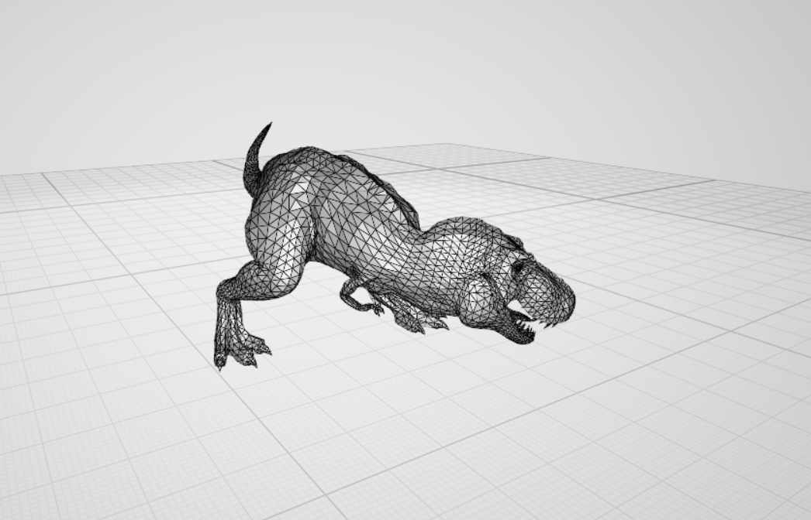

=================
Framework Changes
=================

.. contents:: Table of Contents
   :local:

Concepts
--------

New Algorithms
--------------

- :ref:`PaalmanPingsMonteCarloAbsorption <algm-PaalmanPingsMonteCarloAbsorption>` will calculate all 4 terms in self attenuation corrections following the Paalman and Pings formalism. Simple shapes are supported: ``FlatPlate``, ``Cylinder``, and ``Annulus``. Both elastic and inelastic, as well as direct and indirect geometries, are supported.
- :ref:`ISISJournalGetExperimentRuns <algm-ISISJournalGetExperimentRuns>` returns run information for a particular experiment from ISIS journal files.
- :ref:`LoadILLPolarizedDiffraction <algm-LoadILLPolarizedDiffraction>` reads raw NeXuS ILL files for D7 instrument data.

Algorithms
----------

- Algorithms now lazily load their documentation and function signatures, improving import times from the ``simpleapi``.

- :ref:`MonteCarloAbsorption <algm-MonteCarloAbsorption>` has received a number of updates:

  - Corrections are not calculated anymore for masked spectra.
  - Corrections can be calculated for a workspace without a sample, e.g. container only.
  - This algorithm now calculates the error on the absorption correction factors based on the spread of the attenuation factors across the simulated paths and the number of simulated paths. The error from any spatial interpolation and any wavelength interpolation performed is also included.
  - The random seed is now incremented for each detector.
  - Bug fixed where setting the ``ResimulateTracksForDifferentWavelengths`` parameter to True was ignored.
  - Added support for a Circular Beam Profile.

- :ref:`SetSample <algm-SetSample>` is extended to support composite shapes, such as ``FlatPlateHolder`` and ``HollowCylinderHolder``. Also, the input validation is made more stringent.
- Adjusted :ref:`AddPeak <algm-AddPeak>` to only allow peaks from the same instrument as the peaks workspace to be added to that workspace.

- :ref:`ReplaceSpecialValues <algm-ReplaceSpecialValues>` now can also check the Error axis for unwanted values if the appropriate checkbox is ticked.
- :ref:`MaskDetectorsIf <algm-MaskDetectorsIf>` has the following updates:

  - The algorithm now checks all of the data bins for each spectrum of a workspace, previously it only checked the first bin.
  - A new Operator option has been added ``NotFinite`` that allows you to mask detectors that contain infinite or `NaN <https://en.wikipedia.org/wiki/NaN>`_ values.

- A form of reversible masking that could lead to misleading and incorrect results has been removed from Mantid,
  this means that ClearMaskedSpectra is no longer necessary after calling :ref:`MaskInstrument <algm-MaskInstrument>` and :ref:`MaskDetectorsIf <algm-MaskDetectorsIf>`.
  ClearMaskedSpectra has been removed as it no longer has a use,
  and :ref:`MaskInstrument <algm-MaskInstrument>` is now deprecated and you should use :ref:`MaskDetectors <algm-MaskDetectors>` instead.

- Enhanced :ref:`LoadNGEM <algm-LoadNGEM>` to handle partially written events in the data file.
  When such incomplete data is encountered, it is skipped until the next valid data is encountered and a warning is printed at algorithm completion of the total number of data bytes discarded.

- Added specialization to :ref:`SetUncertainties <algm-SetUncertainties>` for the
  case where InputWorkspace == OutputWorkspace. Where possible, avoid the
  cost of cloning the InputWorkspace.

- Add parameters to :ref:`LoadSampleShape <algm-LoadSampleShape>` to allow the mesh in the input file to be rotated and/or translated
- Added alias for :ref:`GeneratePythonScript <algm-generatePythonScript>` as **ExportHistory**.
- :ref:`ExtractFFTSpectrum <algm-ExtractFFTSpectrum>` has extra properties (Shift, AutoShift, and AcceptXRoundingErrors) to reflect those of the underlying FFT.

Data Handling
-------------

- Added a case to :ref:`Load <algm-Load>` to handle ``WorkspaceGroup`` as the output type
- The material definition has been extended to include an optional filename containing a profile of attenuation factor versus wavelength. This new filename has been added as a parameter to these algorithms:

  - :ref:`SetSampleMaterial <algm-SetSampleMaterial>`
  - :ref:`LoadSampleEnvironment <algm-LoadSampleEnvironment>`

- The attenuation profile filename can also be specified in the materials section of the sample environment xml file.

   An example of a CAD 3D Geometry - Not typically found on beamlines

- **The sample environment xml file now supports the geometry being supplied in the form of a .3mf format file (so far on the Windows platform only). Previously it only supported** ``.stl`` **files. The** ``.3mf`` **format is a 3D printing format that allows multiple mesh objects to be stored in a single file that can be generated from many popular CAD applications. As part of this change the algorithms** :ref:`LoadSampleEnvironment <algm-LoadSampleEnvironment>` **and** :ref:`SaveSampleEnvironmentAndShape <algm-SaveSampleEnvironmentAndShape>` **have been updated to also support the .3mf format.**

- Nexus log data alarms are now supported by Mantid. Log data that is marked as invalid will trigger a warning in the log and be filtered by default.  If the entire log is marked as invalid, then the values will be used as unfiltered as no better values exist, but the warning will still appear in the log.
- A new Instrument Definition File for NIMROD is now shipped with Mantid, replacing the existing definition.

- The :ref:`LoadISISNexus <algm-LoadISISNexus>` algorithm has been modified to remove the need for the VMS compatibility block.
  This has led to the removal of the following variables from the sample logs as they were deemed unnecessary: dmp,
  dmp_freq, dmp_units dur, dur_freq, dur_secs, dur_wanted, durunits, mon_sum1, mon_sum2, mon_sum3, run_header (this is available in the workspace title).

Data Objects
------------

- Added MatrixWorkspace::findY to find the histogram and bin with a given value
- Matrix Workspaces now ignore non-finite values when integrating values for the instrument view.  Please note this is different from the :ref:`Integration <algm-Integration>` algorithm.

HistogramData
-------------

- The linear and spline interpolation functionality that acts on histograms has been updated to add the ability to calculate errors. This has involved swapping out the gsl implementations of linear and spline interpolation and replacing with a native Mantid implementation. The new functionality is off by default and has been explicitly enabled for the MonteCarloAbsorption algorithm. The histogram interpolation functionality is currently used by these algorithms: :ref:`MonteCarloAbsorption <algm-MonteCarloAbsorption>` , :ref:`AbsorptionCorrection <algm-AbsorptionCorrection>`, :ref:`LoadILLPolarizationFactors <algm-LoadILLPolarizationFactors>`, :ref:`JoinISISPolarizationEfficiencies <algm-JoinISISPolarizationEfficiencies>`.

Python
------

- To get a list of Spectrum Numbers, call ``getSpectrumNumbers()`` on a
  workspace. For example: ``spec_nums = ws.getSpectrumNumbers()``
- Documentation for manipulating :ref:`workspaces <02_scripting_workspaces>` and :ref:`plots <02_scripting_plots>` within a script has been produced.
- ``Property.units`` now attempts to encode with windows-1252 if utf-8 fails.
- ``Property.unitsAsBytes`` has been added to retrieve the raw bytes from the units string.
- Various file finding methods have been moved to ``mantid.api.InstrumentFileFinder``. For compatibility
  these still exist in ``ExperimentInfo`` but the helpers should be used instead in the future.
- A new method for finding IPF files has been added to the ``InstrumentFileFinder``
  ``getParameterPath``, which will accept an instrument name and return the full path to the associated
  IPF file.

Improvements
------------

- Updated the convolution function in the fitting framework to allow the convolution of two composite functions.
- Added an unroll all checkbox in the Algorithm History Window, which allows all algorithms to be unrolled at once when copying the script.
- Added a function to the Matrix class to support an analytic calculation of the inverse of a symmetric tridiagonal matrix

Bugfixes
--------

- Loading empty fields from NeXus files now returns an empty vector.
- Subscribing algorithms from a separate thread is now handled safely.
- Log filtering (run status and period filtering) is now correctly being applied after reloading a Mantid processed NeXus file, as was configured by the user when processing the original data.
- Running :ref:`algm-ExtractFFTSpectrum` with only a real input, no longer produces a blank output at the end of the workspace.
- :ref:`algm-ExtractFFTSpectrum` now gives the correct units.
- Error values no longer tend to zero, after multiple instances of :ref:`Rebin2D <algm-Rebin2D>` on the same workspace.
- LoadRaw no longer tries to load non-existent log files that were listed in the alternate data stream.

Deprecations
------------
- **CalculateMonteCarloAbsorption** and **SimpleShapeMonteCarloAbsorption** are deprecated and functionality is replaced by the new :ref:`PaalmanPingsMonteCarloAbsorption <algm-PaalmanPingsMonteCarloAbsorption>`. While the new one provides more complete and more correct calculation, it can also fall back to the simpler calculation if the container is not specified.
- **RecordPythonScript** algorithm hsa been deprecated and functionality continues with :ref:`GeneratePythonScript <algm-GeneratePythonScript>`

:ref:`Release 5.1.0 <v5.1.0>`
