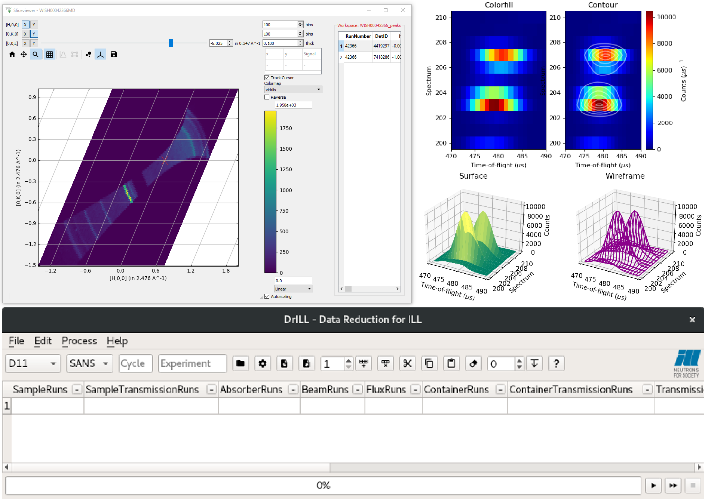

.. _v5.1.0:

===========================
Mantid 5.1.0 Release Notes
===========================

.. contents:: Table of Contents
   :local:

We are proud to announce version 5.1.0 of Mantid.

:doc:`MantidWorkbench <mantidworkbench>` **is replacing MantidPlot**. While :doc:`MantidPlot <mantidplot>` is still fully functional for this release,
**MantidPlot will not be included in future releases**.

:doc:`Sliceviewer <sliceviewer>` has been majorly updated this release, with advanced features for peak finding in Single Crystal Diffraction data.
On top of this, taking slices of data is now possible and there is an interactive data table last seen in the Spectrum Viewer in MantidPlot. **Workbench now also supports 3D and Advanced plotting!**

Check out the brand new :ref:`DrILL interface <DrILL-ref>` for Workbench, that currently supports SANS and Reflectometry at ILL.
There have also been many upgrades to our existing interfaces, such as providing background subtraction for ISIS Reflectometry and significant  speed up for the Muon and Indirect interfaces.

These are just some of the many improvements in this release, so please take a
look at the release notes, which are filled with details of the
important changes and improvements in many areas. The development team
has put a great effort into making all of these improvements within
Mantid, and we would like to thank all of our beta testers for their
time and effort helping us to make this another reliable version of Mantid.

Throughout the Mantid project we put a lot of effort into ensuring
Mantid is a robust and reliable product. Thank you to everyone that has
reported any issues to us. Please keep on reporting any problems you
have, or crashes that occur on our `forum`_.

Installation packages can be found on our `download page`_
which now links to sourceforge to mirror our download files around the world. You can also
access the source code on `GitHub release page`_.

Citation
--------

Please cite any usage of Mantid as follows:

- *Mantid 5.1.0: Manipulation and Analysis Toolkit for Instrument Data.; Mantid Project*. `doi: 10.5286/SOFTWARE/MANTID5.1 <https://dx.doi.org/10.5286/SOFTWARE/MANTID5.1>`_

- Arnold, O. et al. *Mantid-Data Analysis and Visualization Package for Neutron Scattering and mu-SR Experiments.* Nuclear Instruments
  and Methods in Physics Research Section A: Accelerators, Spectrometers, Detectors and Associated Equipment 764 (2014): 156-166
  `doi: 10.1016/j.nima.2014.07.029 <https://doi.org/10.1016/j.nima.2014.07.029>`_
  (`download bibtex <https://raw.githubusercontent.com/mantidproject/mantid/master/docs/source/mantid.bib>`_)

Changes
-------

.. toctree::
   :hidden:
   :glob:

   *

- :doc:`Framework <framework>`
- General UI & Usability

  - :doc:`MantidPlot <mantidplot>`
  - :doc:`MantidWorkbench <mantidworkbench>`
  - :doc:`Sliceviewer <sliceviewer>`
- :doc:`Diffraction <diffraction>`
- :doc:`Muon Analysis <muon>`
- Low Q

  - :doc:`Reflectometry <reflectometry>`

  - :doc:`SANS <sans>`
- Spectroscopy

  - :doc:`Direct Geometry <direct_geometry>`

  - :doc:`Indirect Geometry <indirect_geometry>`

Full Change Listings
--------------------

For a full list of all issues addressed during this release please see the `GitHub milestone`_.

.. _download page: https://download.mantidproject.org

.. _forum: https://forum.mantidproject.org

.. _GitHub milestone: https://github.com/mantidproject/mantid/pulls?utf8=%E2%9C%93&q=is%3Apr+milestone%3A"Release Release 5.1"+is%3Amerged

.. _GitHub release page: https://github.com/mantidproject/mantid/releases/tag/v5.1.0
