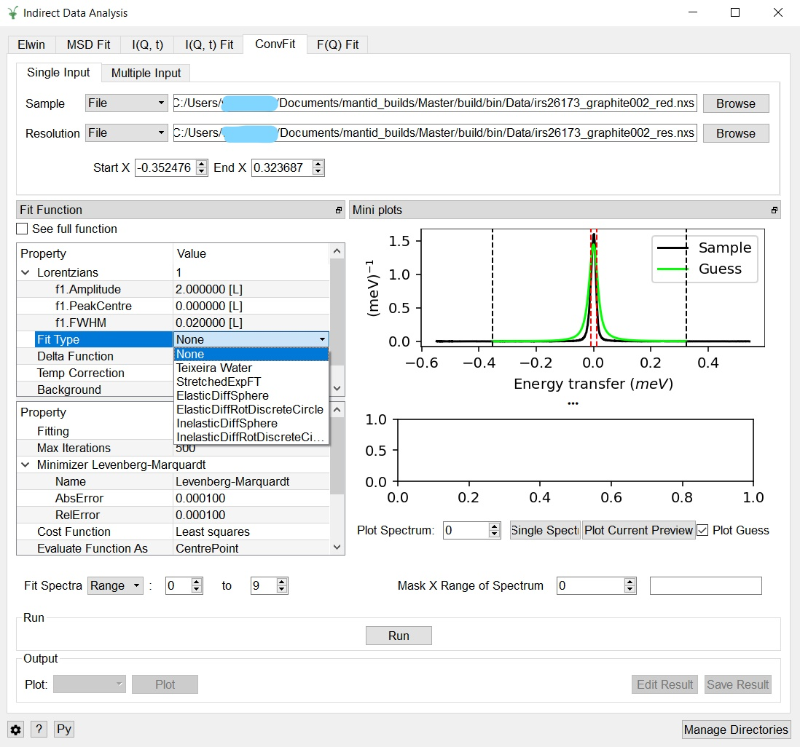
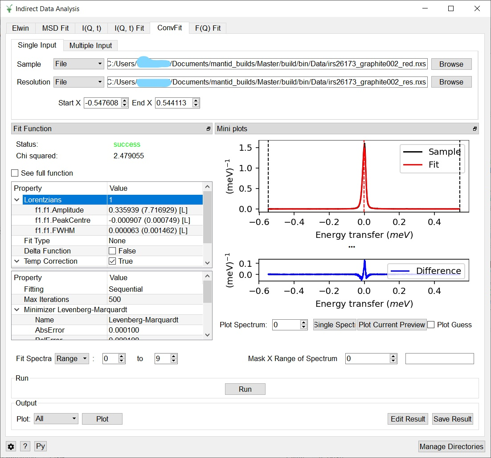

=========================
Indirect Geometry Changes
=========================

.. contents:: Table of Contents
   :local:

Improvements
------------

- Processing speed of IndirectDataReduction when open has improved.
- Scientific constraints have been added to all fitting tabs in IndirectDataAnalysis.
- The Abins python library in *scripts* has been substantially
  re-organised, including a re-name from ``AbinsModules`` to
  ``abins``. These changes should make the library more approachable and maintainable.
  They should not impact functionality of the Abins Algorithm, but will break any user python scripts
  that import ``AbinsModules``.
- Vibrational calculations performed within the VASP quantum chemistry
  package are now supported by Abins. When the IBRION parameter of
  VASP is set to an integer from 5-8, Gamma-point vibrational
  frequencies are written to the vasprun.xml output file which may be
  loaded into Abins. Results for crystalline benzene were validated
  against data from CASTEP and found to give fairly similar
  frequencies and intensities.
- The :ref:`CalculateMonteCarloAbsorption <algm-CalculateMonteCarloAbsorption>` algorithm
  will now work  also for ILL fixed window scan reduced data, in which case the
  correction will be calculated for elastic wavelength.
- The centre parameter has been added to delta function in the ConvFit tab of Indirect Data Analysis.
- :ref:`IndirectILLEnergyTransfer <algm-IndirectILLEnergyTransfer>` will produce
  energy transfer axis which takes into account that doppler channels are linear in
  velocity (not in time, neither energy as was assumed before). This will affect doppler mode QENS only.
- Added docking and undocking to the plot window and function browser window for the fit
  tabs in Indirect Data Analysis on workbench.
- Update the Indirect, Corrections user interface to use the
  :ref:`PaalmanPingsMonteCarloAbsorption <algm-PaalmanPingsMonteCarloAbsorption>` algorithm and make it
  work for elastic datasets.
- OutputCompositeMembers and ConvolveOutputs have been added as options in the ConvFit tab of Indirect
  Data Analysis.
- Improved the responsiveness of the function browsers within the Indirect Data Analysis interface.
- Added a lower bound (0.0 < height) to the Delta function defined in the ConvFit tab of the Indirect
  Data Analysis interface.
- In Indirect Data Analysis interface, raw data will now be plotted from the input workspace, rather
  than the fit workspace, allowing the full range of data to be seen irrespective of the fitting bounds.
- Added fit parameter estimations to the MSD fitting tab within the Indirect Data Analysis interface.
- Added the fit output information (Algorithm status and Chi squared) to each fitting tab of the
  Indirect Data Analysis interface.
  This change introduces two optional outputs from the QENSFit algorithms (fit status and Chi squared),
  which may be used to monitor the outcome of the fit.
- Default parameter estimations have been added to the F(q) tab of the Indirect Data Analysis interface.
- The ConvFit tab within the Indirect Data Analysis interface will now output convolved members by default.
- Added a Help option to the right-click menu in the function browser (in full function view) which
  brings up a relevant documentation page describing the function.
- The eq2 workspace output from the Indirect Data analysis Elwin tab now accurately has
  the Y axis label as being the natural log of eq1.

Bug Fixes
---------

- The :ref:`CalculateMonteCarloAbsorption <algm-CalculateMonteCarloAbsorption>` algorithm will
  now work correctly for an annular sample in a container.
- FQ and Msd tabs in the Indirect Data Analysis interface now label output workspaces with the
  fitting function.
- Fixed a crash when switching between linear and flat backgrounds in the ConvFit tab.
- Disabled the plot guess checkbox within the ConvFit tab if a resolution file has not been loaded.
  This prevents a hard crash which can occur.
- Abins now supports vibrational calculations performed within the DMOL3 quantum chemistry code
  with open boundary conditions (i.e. free molecules). Previously, data files from such calculations
  would yield a parsing error.
- **Fixed errors with the temperature correction in the ConvFit tab of the Indirect Data Analysis interface.
  These issues occurred when the function was evaluated at Q=0, where it is undefined.**
- F(Q) fit in the Indirect Data Analysis interface can now load more than one spectra from each workspace.
- Fixed a crash in the corrections interface which occurred when the user attempted to save the results
  in the Monte Carlo tab.
- Fixed a bug in the Indirect->Bayes->Quasi Interface, which caused the same parameter to be plotted twice.
- Fixed a crash in Elwin when plotting the output workspace ending with `_elf`.

New
---

- :ref:`VesuvioAnalysis <algm-VesuvioAnalysis>` is a new algorithm that has been added as a
  beta method for analysing Vesuvio data.

:ref:`Release 5.1.0 <v5.1.0>`
