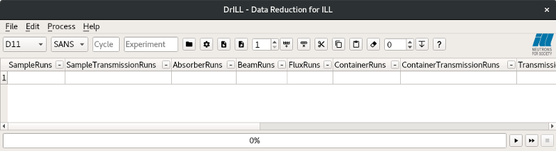
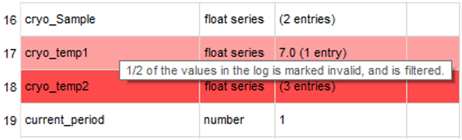
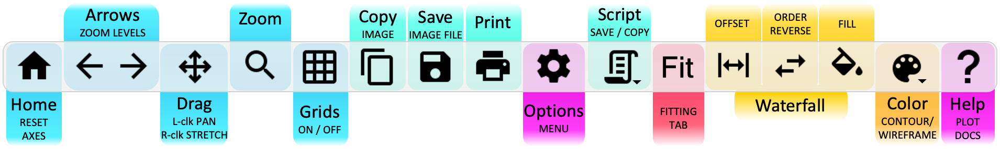
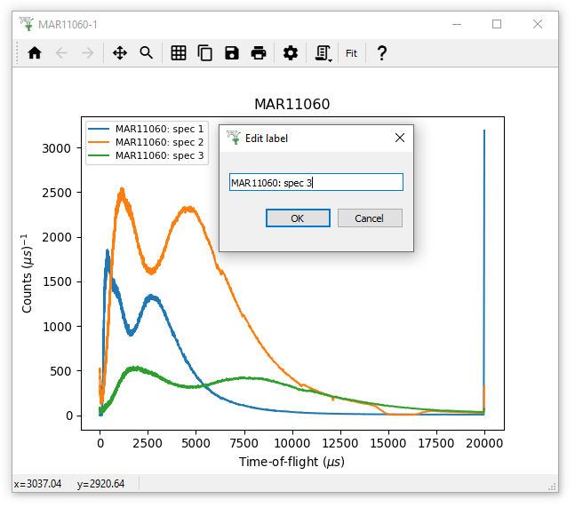
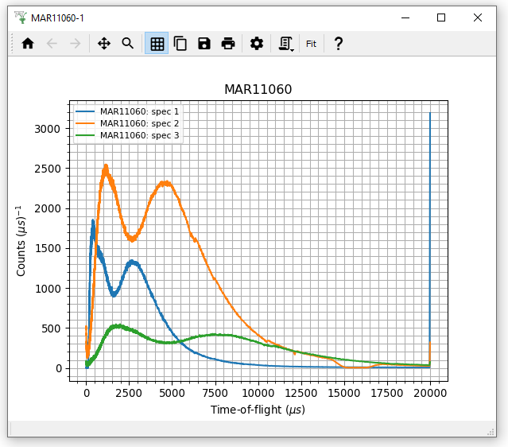
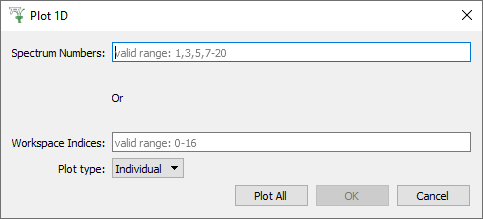
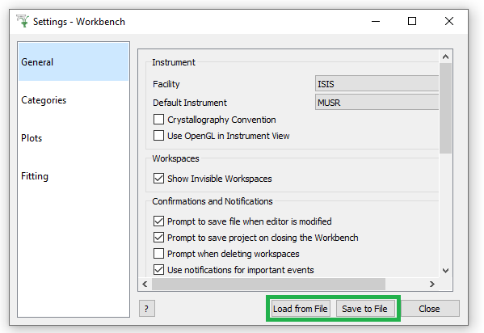
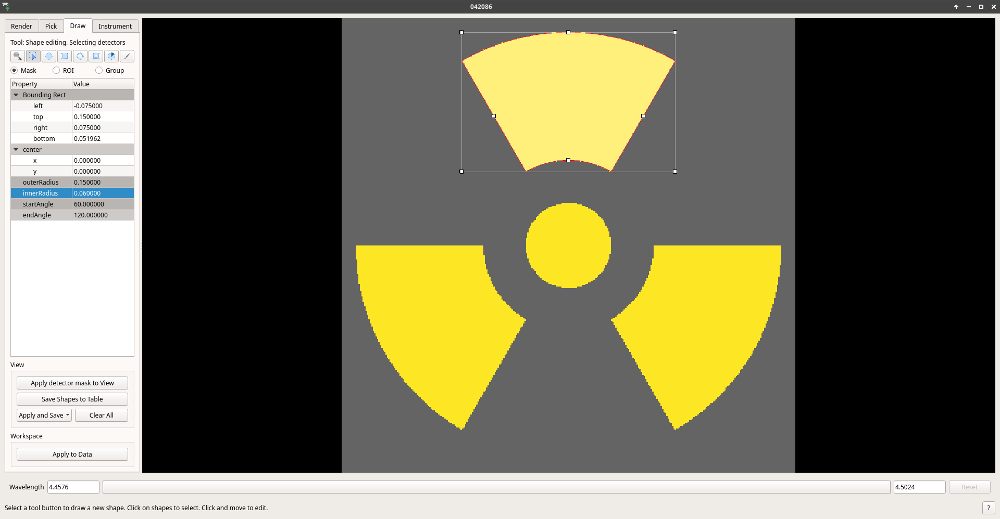

=================
Workbench Changes
=================

.. contents:: Table of Contents
   :local:

New and Improved
----------------

Interfaces
##########

- **DrILL interface: Spreadsheet based data processing interface is created for ILL data reduction.
  SANS and reflectometry are currently supported. See** :ref:`DrILL documentation <DrILL-ref>`
  **for more information.**
- There is now a Project Saving dialog that allows you to choose between saving *all* workspaces or *only altered* workspaces.
- The Sample Transmission Calculator has now been implemented in Workbench.
- There is now a Help > About screen that pops up automatically on start-up to provide links to the release notes and training courses, and prompts you to set some important settings such as Facility, Instrument and accept usage tracking. You can choose to hide it until the next release.
- Added File > Recently Closed Scripts sub-menu to workbench, displaying recently closed scripts in descending order.

Sample Logs Dialog
##################

- **Logs containing invalid data (indicated by NeXus log alarm states) are now shaded in red, and a tool tip informs how many values are invalid.**
- The complete log data can be viewed, as well as filtered data that only includes values for the current period, the running status, and with invalid values removed.  Click the "Filtered Data" checkbox to swap between them.
- The built-in plot and statistics display will be hidden if there are no suitable logs in the workspace that need it.  This is particularly applicable for some instruments at reactor-based facilities.
- Plots extracted from Sample Logs, by double clicking the plot, can now be converted to a python script, just like other workbench plots.
- Now the arrow keys can be used to move between logs.

Plotting
########

- :ref:`3D plots (surface, contour and wireframe) <3D_Plots>` **can now be created in Workbench.**

.. plot::

    # import mantid algorithms, numpy and matplotlib
    from mantid.simpleapi import *
    import matplotlib.pyplot as plt
    import numpy as np

    # Load the data and extract the region of interest
    data=Load('164198.nxs')
    data=ExtractSpectra(data, XMin=470, XMax=490, StartWorkspaceIndex=199, EndWorkspaceIndex=209)

    '''2D Plotting - Colorfill and Contour'''

    # Get a figure and axes for
    figC,axC = plt.subplots(ncols=2, subplot_kw={'projection':'mantid'}, figsize = (6,4))

    # Plot the data as a 2D colorfill: IMPORTANT to set origin to lower
    c=axC[0].imshow(data,cmap='jet', aspect='auto', origin = 'lower')

    # Change the title
    axC[0].set_title("Colorfill")

    # Plot the data as a 2D colorfill: IMPORTANT to set origin to lower
    c=axC[1].imshow(data,cmap='jet', aspect='auto', origin = 'lower')

    # Overlay Contour lines
    axC[1].contour(data, levels=np.linspace(0, 10000, 7), colors='white', alpha=0.5)

    # Change the title
    axC[1].set_title("Contour")

    # Add a Colorbar with a label
    cbar=figC.colorbar(c)
    cbar.set_label('Counts ($\mu s$)$^{-1}$')

    '''3D Plotting - Surface and Wireframe'''

    # Get a different set of figure and axes with 3 subplots for 3D plotting
    fig3d,ax3d = plt.subplots(ncols=2, subplot_kw={'projection':'mantid3d'}, figsize = (8,3))

    # 3D plot the data, and choose colormaps and colors
    ax3d[0].plot_surface(data, cmap='summer')
    ax3d[1].plot_wireframe(data, color='darkmagenta')

    # Add titles to the 3D plots
    ax3d[0].set_title("Surface")
    ax3d[1].set_title("Wireframe")

    #figC.show()# uncomment to show the plots
    #fig3d.show()

- The Advanced Plotting menu is now in Workbench. This enables creating surface and contour plots of three or more workspaces, and choosing which log value to plot against.

**Toolbar Updates**

- A Copy (image) to Clipboard button has been added to the plot toolbar.
- A Help button leading to appropriate documentation (e.g. Colorfill, Tiled ...) has been added to the plot toolbar.
- Right-clicking a plot without dragging while using the zoom tool now resets the axes limits.

- **Legends in 1D plots are now editable in-situ.**
- On tiled plots, the axes limits and labels can be set simultaneously for all subplots with the `Apply to all` button in figure options.
- Tiled plots are now reloaded correctly by project recovery.

- The x-axis tick labels on colorfill plots are now horizontal rather than diagonal.
- The colorbar on colorfill plots is now labelled, and the label can be set in the figure options.
- Monitor spectra are no longer displayed on bin and colorfill plots.
- Colorfill plots of very large workspaces now take less than 10 seconds to plot.

- **Minor ticks and minor gridlines on plots can be enabled in Figure Options.**
- Script generation now supports colorfill plots and basic fitting.

- The axis tick markers on a plot can be switched between Log and decimal formats independently of the axes scale, from axis double-click menus.

- In Figure Options > Curves tab, the drop-down list of curves now follows the same order as the plot legend.
- :ref:`algm-SavePlot1D` can now be executed in Workbench.
- **The plot selection dialog now correctly shows the full range of valid spectra to plot, not just the min to max range.**
- The canvas (background) color for a plot can now be altered in the figure options.
- When a marker style is chosen in figure options, the face and/or edge color is disabled if they are not applicable. e.g. a plus marker only uses the edge colour, so the face colour is disabled

User Settings
#############

- **User settings can now be saved and loaded from a file to enable sharing with others.**
- Any changes in the settings menu that require a restart (currently only changing the default font) will be detailed in
  a pop-up notification when leaving the settings window.
- The Python Extensions directory setting, to find script to run on launch, is now available in Workbench within Manage User Directories.

**Now you can set the following defaults:**

- Font for plots.
- Legend location.
- Legend text size.
- Minor ticks and minor gridlines on plots can be enabled by default.
- Drawstyle for plot lines.
- Linestyle for plots can now be set to 'None'.
- Colormap for colorfill plots.

Instrument Viewer
#################

- **Added a circular sector shape in the Pick and Mask tab.**
- The instrument viewer now ignores non-finite (infinity and NaN) values and should now display workspaces containing those values.
  If there are no valid values for that detector the value will appear as invalid (grayed out).
  It can also now display negative values in workspaces correctly.
- The ``gray`` and ``plasma`` colormaps have been added.
- For monochromatic workspaces, the integration bar, the pick widget and the detector spectra mini-plot will be disabled.
- The render tab now has a Reset view button to restore to default projection.
- On the draw tab, the Mask, ROI and Group now work for just a single pixel / tube.
- Instrument view now updates on zoom with a mouse wheel.
- Failing to open for a certain workspace now outputs useful error messages.

Sliceviewer
###########

In this release many improvements have been made to Sliceviewer and are listed :doc:`separately <sliceviewer>`.

Launch
######
- There is a new profiling option in the workbench launch script, allowing for timing of start-up and other internal processes.
- Improved loading of python plugins at start-up on slow disks.
- User data directories are no longer checked at start-up, reducing launch times with slow network drives.

Scripting
#########

- Code completions are now loaded when the code editor is first changed.
- Variables assigned in python scripts are now cleared when a script is run in its entirety.
- When a running script is aborted, Mantid will automatically attempt to cancel the current algorithm rather than wait for it to complete. In some cases, this can result a lot of time saved!

Misc
####

- Added a Clear button to the workspaces toolbox which removes all workspaces from the tree including hidden ones
- The workbench launch scripts have been replaced by an executable on macOS & Windows. On Windows this will stop virus scanners
  flagging the old ``launch_workbench.exe`` as a threat and quarantining it.
- Improved the usability of the fit function and peak selection pop-up menus by allowing the user to immediately search for the desired function and activate autocompletion by pressing "enter" if there is just a single possible function.
- Slow running algorithms will now display an estimated time to completion in their progress bars.
- Algorithm Dialogs with a Combo box (Drop-down list) for workspace selection, are now editable to support searching and autocompletion.
- Added an option to matrix workspaces to export bins and spectra to a table workspace.
- ``TableWorkspaces`` can now have columns containing errors linked to corresponding columns containing values, using the ``setLinkedYCol(errColumn, dataColumn)``.
- Use Jemalloc for memory allocation on Linux so memory can be released to the system.

Bugfixes
--------

General
#######

- Workbench launch is no longer blocked when the Process ID assigned by project recovery has been reassigned to another programme.
- Improved the handling of ``WorkspaceSingleValue`` workspaces in workbench. This fixes a crash which occurred when interacting with workspaces of this type.
- Workbench will now spot if it is about to create the settings window off the available screen, and will move it so it is all visible. This is important as it is a modal dialog and could freeze the application in an unrecoverable way before.

- Scripts no longer run slower if a plot is open.
- The names of new tabs in the script editor now correctly incrementing on KDE display environments (i.e. KUbuntu).

- Selecting spectra to plot that are out of range for the workspace is handled safely.
- Opening the plot options for a sample logs plot now works.
- Masking a workspace while its data table is displayed now works as expected.
- There is now a warning if ``File > Generate Recovery Script`` is executed with no workspaces present.

Plotting
########

- ``plt.show()`` now shows the most recently created figure.
- The logs from a multi-dimensional workspace (that combines several different original workspaces) can be successfully plotted.
- Opening figure options on a plot with an empty legend now works.
- The plot setting for default axis scale now applies to the correct axis.
- Overplotting no longer resets the axes scales.
- Altering a line/curve no longer changes the order of curves in the legend.
- The double-click axis menus now work as expected for tiled plots.
- 3D Surface plots of data with monitors now have the correct initial colorbar limits.
- The plot toolbar now shows the correct toolbar buttons for 3D plots.
- Reduce log level of project recovery when it fails to save a plot correctly, from warning to debug, to avoid excess messages in the console.

Colorfill Plots
^^^^^^^^^^^^^^^

- The scale of the color bars on colorfill plots of ragged workspaces now uses the maximum and minimum values of the data.
- Being able to zoom in and out of colorbars on colorfill plots has been disabled.
- Deleting a workspace now correctly removes waterfall plots with a fill and colorfill plots.
- Performing an overplot by dragging workspaces onto colorfill plots now correctly replaces the workspace.
- Gridlines no longer appear on the colorbar of colorfill plots.
- The colorfill plot interpolation now updates correctly in figure options.
- The methods for changing the axis scale on colorfill plots (from the context menu or figure options) has been harmonised.
- Changing the figure options on tiled colorfill plots now applies to all the plots if there is only one colorbar.
- Colorfill plots now correctly use the workspace name as the plot title.
- ``Select image`` in figure options now contains each image, rather than each spectrum, for colorfil plots of workspaces with a numeric vertical axis.
- Monitor only spectra can be plotted as a colorfill successfuly.
- The y axis labels will now appear in the correct order if imshow is called from a script with origin=upper.
- Fixed a bug with colorfill plot script generation for distribution workspaces.
- Changing the normalisation and scale on colorfill plots now safely handles negative limits.

Fitting
#######

- Defining a new Fit Function after deleting a plot is now handled safely.
- The plot guess of the ``Bk2BkExpConvPV`` is now correct.
- A sign error has been corrected in the ``Bk2Bk2ExpConvPV`` function.
- The peak cursor now maintains its cross shape when ready to add a peak.
- The fit property browser can be resized now a workaround for a QT bug has been implemented.

:ref:`Release 5.1.0 <v5.1.0>`
