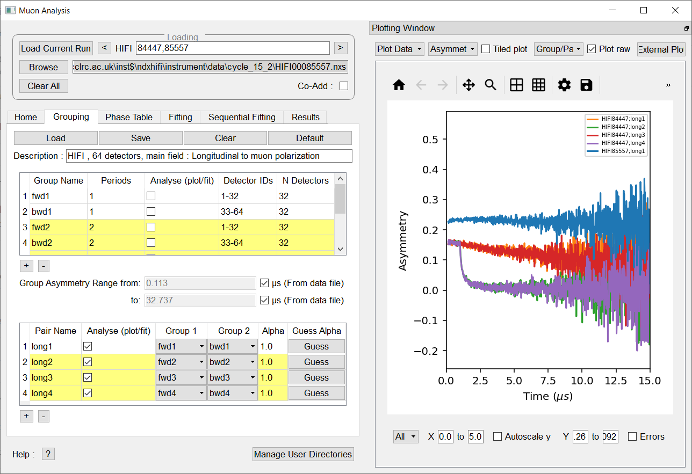

============
MuSR Changes
============

.. contents:: Table of Contents
   :local:

Muon Analysis 2 and Frequency Domain Analysis
---------------------------------------------

New Features
############
- The plotting logic within the Muon Analysis 2 GUI has updated to prevent all the workspaces from a
  fit being plotted at the same time. Instead, the choice of which fit workspace to plot can be made in
  fitting and sequential fitting tabs.
- When the user switches to the fitting tab, the workspace present in the fit display box is plotted.
  To switch back to a view of all the data, the user can switch to the home, grouping or phase table tabs.
- The sequential fitting table now allows multiple selections to be made.
- Addition of an external plotting button to the Muon Analysis 2 GUI.
  This allows the user to create a standalone Workbench (or MantidPlot) plot of the displayed data.
  The user may then perform standard operations on the plot, e.g drag and drop workspaces onto the figure.
- The loading in the Muon and Frequency domain interfaces has been sped up by reducing the number of calls made to
  algorithms. On average, this should result in a 50% decrease in load times. This reduction in the number of algorithms
  also improves the clarity of the workspace history, as the number of algorithms present in the history is now reduced.
- On the fitting tab, only one fit object (fit output and input workspaces) will be shown at a time.
- Addition of background correction algorithm (PSIBackgroundCorrection) to remove the background present in
  PSI bin data loaded using :ref:`LoadPSIMuonBin <algm-LoadPSIMuonBin>`.
- Addition of a LoadMuonNexusV2 algorithm to load the new Muon V2 files, see :ref:`LoadMuonNexusV2 <algm-LoadMuonNexusV2>`.
- Updated rounding for time zero and first good data to be 3 decimal places.
- Added double pulse analysis, see :ref:`Muon home tab <muon_home_tab-ref>`.
- Added multi-period support to the LoadMuonNexusV2 algorithm.
- Added support for specifying which groups should be used to calculate a group.
- Added support for specifying which periods should be used to calculate a group.
- Added two buttons to the Muon analysis and Frequency domain analysis plot toolbar to allow users to
  show major and minor gridlines.
- Added a Plot difference checkbox to the Muon Analysis GUI, which allows user to choose whether the
  fit difference curve is shown.
- Added support for loading and saving group period data from xml files.
- Added a Help option to the right-click menu in the function browser which brings up a relevant
  documentation page describing the function.

Improvements
############
- The plot guess option within the fitting tab will now update when a parameter is changed.
- Have updated the FDA GUI so that it functions correctly for frequency transforms and single fits.
- Updated :ref:`DoublePulseFit <algm-DoublePulseFit>` to allow composite function input.
- Updated :ref:`CalculateMuonAsymmetry <algm-CalculateMuonAsymmetry>` to allow double pulse fits.
- Tf asymmetry mode can now be performed on double pulse fits from the Muon Analysis GUI.
- Updated :ref:`LoadMuonNexusV2 <algm-LoadMuonNexusV2>` and :ref:`LoadPSIMuonBin <algm-LoadPSIMuonBin>` to
  load a list of time zeros into a new property TimZeroList.
- Updated :ref:`LoadMuonNexusV2 <algm-LoadMuonNexusV2>` and :ref:`LoadPSIMuonBin <algm-LoadPSIMuonBin>` to
  add an option to not auto-correct the time by loaded timezero.
- Fitting tab in Muon analysis and Frequency domain analysis GUI's are now disabled when
  no valid fitting data is present.
- Global parameters within the function browser will no longer reset when a new function is added/removed.
- Updated plotting to make line colours more consistent. The maximum number of unique line colors in each plot is 10.
- Have updated the FDA GUI so that it functions correctly for frequency transforms and single fits.
- Added in default group and pair selection when loading grouping files from xml.
- Updated CHRONUS TF asymmetry mode default grouping. Now uses eight groups by default.
- Added warnings when the selected runs do not have the relevant periods to calculate the groups or pairs.
- Autoscale has been replaced with a checkbox. It does not work with pan/zoom on.

Bug fixes
---------
- Fixed an issue where ties set in Muon Analysis were not being respected.
- The plot will always match the state of the `Plot raw` checkbox.
- Fixed a bug that caused rebinned data to override non-binned data.
- Fixed an issue where switching to simultaneous fit mode was occasionally throwing an exception.
- Fixed an issue where loading additional data in simultaneous fit mode was throwing an exception.
- Fixed an issue where Mantid crashed when the Muon Analysis plotting window crashed was resized to be too small.
- Fixed an issue where groups were all being plotted on the same tiled plot.
- Fixed an issue with setting the current workspace before adding a function.
- Fixed an issue with the results tab not updating correctly after multiple fits with different functions.
- Fixed an issue where Muon Analysis and Frequency Domain Analysis gui was not properly disabling during calculations.
- Fixed an issue where Muon Analysis and Frequency Domain Analysis was not correctly resetting
  the DeadTime property to default when a user changes the instrument.
- Fixed issue where select data was enabled incorrectly.
- Fixed a bug in simultaneous TF asymmetry mode fitting, which would cause a crash when the run
  was incremented. Note that currently the single fitting tab will not update with the new normalization
  constants after a new run is loaded.
- Fixed a bug were fitting in TF asymmetry mode for group data, then switching instrument and
  loading pair data would cause mantid to crash.

ALC
---

New Features
------------
- The ALC interface has been updated and now only has a single runs box.
- 'Auto' has been renamed to 'Auto Find Current Run' and its functionality slightly altered.
  See :ref:`Muon ALC <MuonALC-ref>` for more.

Improvements
############
- The ALC interface in workbench will now show errors by default. The error bars can also be
  turned on/off using the right-click plot menu.

Bug fixes
##########
- Fixed an issue in the ALC interface baseline fit where corrected data from all fits were plotted at
  the same time in the corrected data tab. Now only corrected data from the most recent fit is plotted.

Elemental Analysis
------------------

New Features
------------
- Added a deselect all elements button.
- Fixed an issue where groups were all being plotted on the same tiled plot.

Bug fixes
---------
- Fixed an issue where Elemental Analysis gui was crashing when any peak checkbox was unselected.
- Fixed an issue with reloading data after closing gui.

Algorithms
##########

New Features
############
- A new parameter has been added to the :ref:`PlotAsymmetryByLogValue <algm-PlotAsymmetryByLogValue>` algorithm
  which accepts a range of runs to be processed.
- In the :ref:`PlotAsymmetryByLogValue <algm-PlotAsymmetryByLogValue>` algorithm parameters 'FirstRun' and
  'LastRun' are no longer mandatory. Either WorkspaceNames, or FirstRun and LastRun must be supplied for a valid input.
  Preference is given to WorkspaceNames if FirstRun, LastRun, and WorkspaceNames is supplied.
  An example of a valid range is '62260-3, 62267, 62270-4'.

:ref:`Release 5.1.0 <v5.1.0>`
