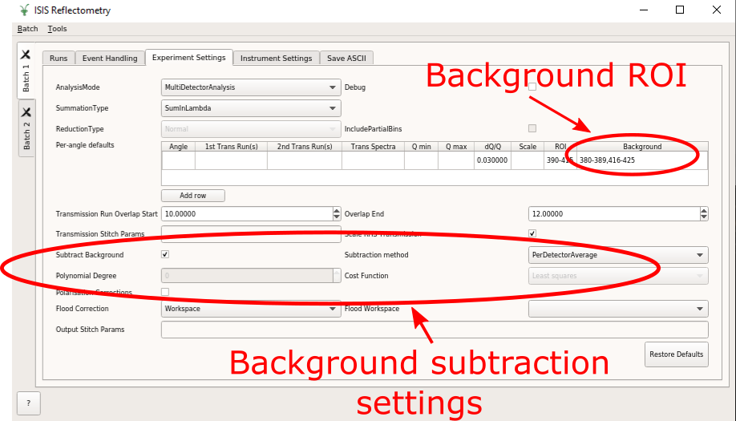
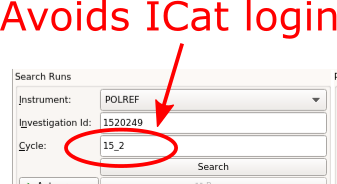

=====================
Reflectometry Changes
=====================

.. contents:: Table of Contents
   :local:

Algorithms
----------

New
###

- :ref:`algm-LRReductionWithReference` is a new algorithm to use a measured standard with a model reflectivity
  curve calculated by the `refl1d` package to produce a normalization curve for a sample reduction.
  This requires `refl1d` to be installed separately.

Improvements
############

- The ensemble of ILL reflectometry reduction is improved to produce results more consistent with the
  legacy software for D17 instrument.
- Sample waviness term is removed from resolution calculation in incoherent mode in the
  :ref:`ReflectometryMomentumTransfer <algm-ReflectometryMomentumTransfer>` algorithm.
- A flag to enable / disable apply scaling factor from `ScalingFactorFile`, called `ApplyScalingFactor`,
  has been added to the :ref:`algm-LiquidsReflectometryReduction` algorithm.
- The :ref:`algm-LRAutoReduction` algorithm has been modified to allow the option to autoreduce data with
  a reference measurement for normalization (instead of only direct beam) using the new
  :ref:`algm-LRReductionWithReference` algorithm of this release.
- The leading separator is no longer included for Custom and ANSTO formats in the
  :ref:`algm-SaveReflectometryAscii` algorithm; Custom format header now uses the same separator as the
  columns and includes the 4th column header if applicable.

Bug fixes
#########

- The :ref:`LoadILLReflectometry <algm-LoadILLReflectometry>` algorithm has been fixed to update the sample
  logs of chopper gap and chopper position with correct units regardless the wrong setting in nexus files.
- The history for the :ref:`algm-ReflectometryReductionOne` algorithm has been fixed so that the conversion
  to Q is now always included in the history.
- The sort function in the :ref:`LRDirectBeamSort <algm-LRDirectBeamSort>` algorithm has been updated for Python3.

Removed
#######

- The following deprecated algorithms have been removed: ``SaveANSTOAscii``, ``SaveILLCosmosAscii``,
  ``SaveReflCustomAscii``, and ``SaveReflThreeColumnAscii``. They have been replaced by :ref:`algm-SaveReflectometryAscii`.

ISIS Reflectometry Interface
----------------------------

New
###

- **Background subtraction** options have been added to the ISIS Reflectometry Interface. The subtraction is
  performed using the :ref:`algm-ReflectometryBackgroundSubtraction` algorithm.

  *Background subtraction on the ISIS Reflectometry Interface*

- **More reliable search** has been added - specify the cycle name in the search inputs to use journal file
  search instead of ICat. This is currently recommended due to ICat instability. However, ICat can still be
  used if the cycle number is not known/provided.

  *Provide cycle name for more reliable search results*

- The output formats from the **Save ASCII** tab now follow standards more rigidly - see
  :ref:`algm-SaveReflectometryAscii`, which replaces the old deprecated algorithms.
- The **Options** dialog can now be accessed from the Tools menu, controlling the display of warnings and
  rounding precision.

Bug fixes
#########

- A bug has been fixed where Experiment/Instrument settings were not being restored if the instrument changes on load.
- A bug has been fixed where creating a new Batch would result in the Experiment/Instrument
  settings of all batches being reset to their defaults.
- A bug has been fixed where clicking Restore Defaults on an Experiment/Instrument tab would cause all Experiment and
  Instrument tabs in every batch to be reset to defaults. Now, only the tab where you click Restore Defaults is changed.
- A bug has been fixed where Mantid could crash if you transfer search results into an empty group

:ref:`Release 5.1.0 <v5.1.0>`
