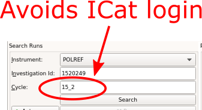

=====================
Reflectometry Changes
=====================

.. contents:: Table of Contents
   :local:

.. warning:: **Developers:** Sort changes under appropriate heading
    putting new features at the top of the section, followed by
    improvements, followed by bug fixes.

Algorithms
##########

New
----

- Added new :ref:`algm-LRReductionWithReference` to use a measured standard with a model reflectivity curve calculated by the `refl1d` package to produce a normalization curve for a sample reduction. Requires `refl1d` to be installed seperately. 

Improvements
------------

- Sample waviness term is removed from resolution calculation in incoherent mode in :ref:`ReflectometryMomentumTransfer <algm-ReflectometryMomentumTransfer>`.
- Flag to enable / disable apply scaling factor from `ScalingFactorFile`, called `ApplyScalingFactor`, added to :ref:`algm-LiquidsReflectometryReduction`.
- Modified :ref:`algm-LRAutoReduction` to allow the option to autoreduce data with a reference measurement for normalization (instead of only direct beam) using the new :ref:`algm-LRReductionWithReference` algorithm of this release

Bug fixes
---------

- :ref:`LoadILLReflectometry <algm-LoadILLReflectometry>` has been fixed to update the sample logs of chopper gap and chopper position with correct units regardless the wrong setting in nexus files.

ISIS Reflectometry Interface
############################

New
---

- **Background subtraction** options have been added to the ISIS Reflectometry Interface. The subtraction is performed using :ref:`algm-ReflectometryBackgroundSubtraction`.

.. figure:: ../../images/ISISReflectometryInterface/background_subtraction.png
  :class: screenshot
  :width: 500px
  :align: right
  :alt: Background subtraction on the ISIS Reflectometry Interface

  *Background subtraction on the ISIS Reflectometry Interface*

- **More reliable search** has been added - specify the cycle name in the search inputs to use journal file search instead of ICat. This is currently recommended due to ICat instability. However, ICat can still be used if the cycle number is not known/provided.

  *Provide cycle name for more reliable search results*

- The output formats from the **Save ASCII** tab now follow standards more rigidly - see :ref:`algm-SaveReflectometryAscii`, which replaces the old deprecated algorithms.

- The **Options** dialog can now be accessed from the Tools menu, controlling the display of warnings and rounding precision.

Bug fixes
---------

- Save/Load settings: A bug has been fixed where Experiment/Instrument settings were not being restored if the instrument changes on load.
- Lost settings on New Batch and Restore Defaults:

  - A bug has been fixed where creating a new Batch would result in the Experiment/Instrument settings of all batches being reset to their defaults.
  - A bug has been fixed where clicking Restore Defaults on an Experiment/Instrument tab would cause all Experiment and Instrument tabs in every batch to be reset to defaults. Now, only the tab where you click Restore Defaults is changed.

:ref:`Release 5.1.0 <v5.1.0>`
