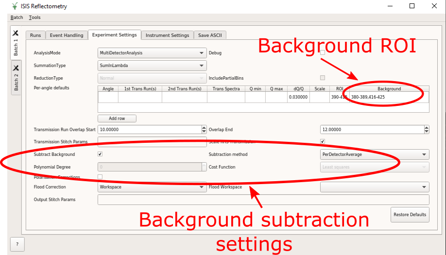

=====================
Reflectometry Changes
=====================

.. contents:: Table of Contents
   :local:

.. warning:: **Developers:** Sort changes under appropriate heading
    putting new features at the top of the section, followed by
    improvements, followed by bug fixes.

ISIS Reflectometry Interface
############################

New
---

  *Background subtraction on the ISIS Reflectometry Interface*

- Background subtraction options have been added to the ISIS Reflectometry Interface. The subtraction is performed using :ref:`algm-ReflectometryBackgroundSubtraction`.

Improvements
------------

- Flag to enable / disable apply scaling factor from `ScalingFactorFile`, called `ApplyScalingFactor`, added to :ref:`algm-LiquidsReflectometryReduction`.

Bug fixes
---------

- Save/Load settings: A bug has been fixed where Experiment/Instrument settings were not being restored if the instrument changes on load.
- Lost settings on New Batch and Restore Defaults:

  - A bug has been fixed where creating a new Batch would result in the Experiment/Instrument settings of all batches being reset to their defaults.
  - A bug has been fixed where clicking Restore Defaults on an Experiment/Instrument tab would cause all Experiment and Instrument tabs in every batch to be reset to defaults. Now, only the tab where you click Restore Defaults is changed.

:ref:`Release 5.1.0 <v5.1.0>`
