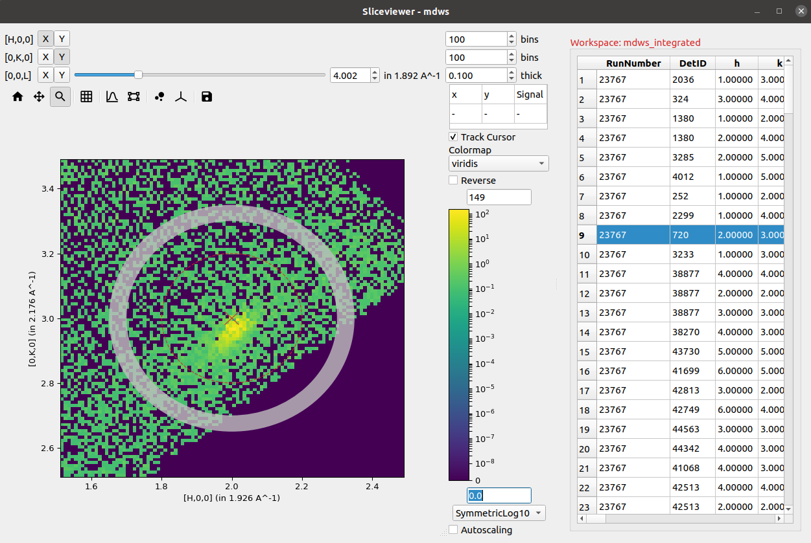
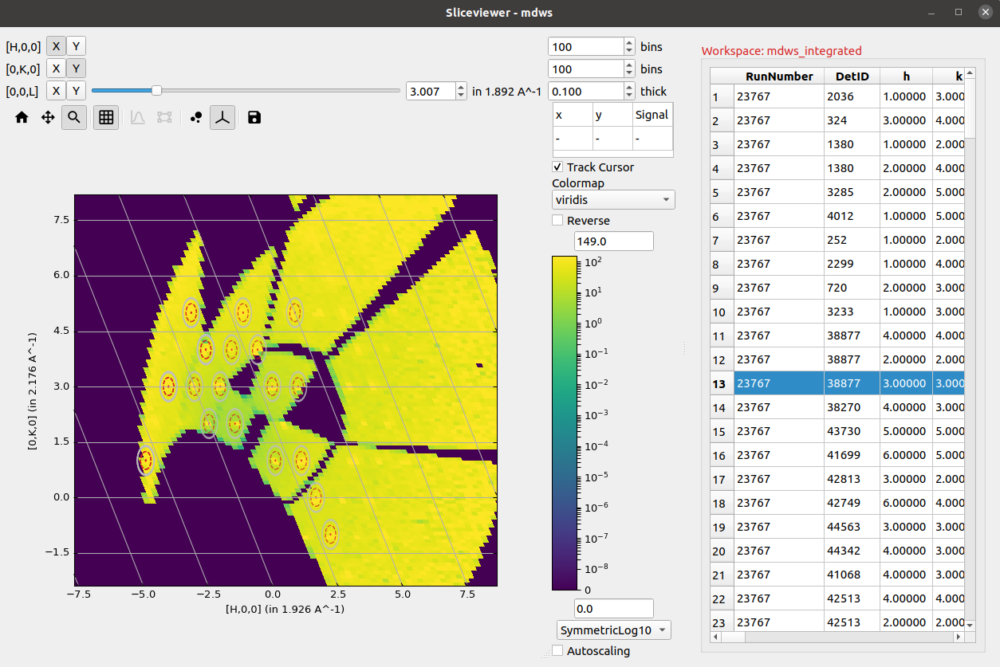
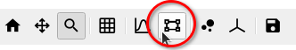
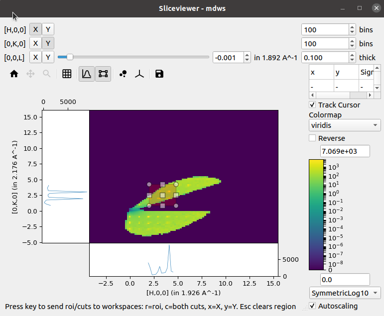
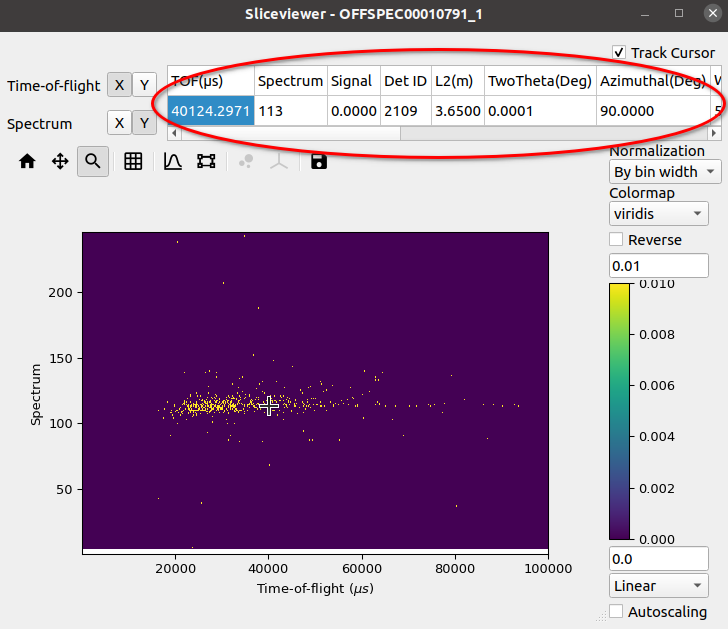
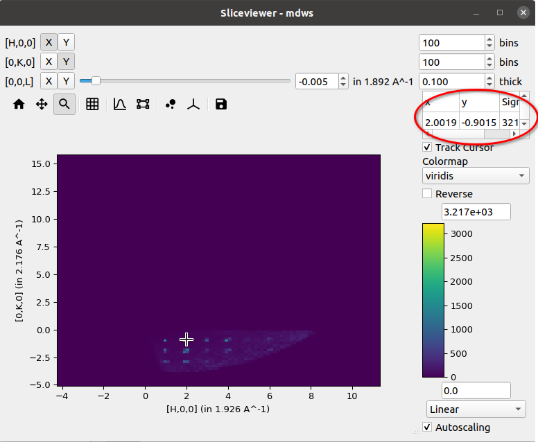

.. _sliceviewer_release:

===================
Sliceviewer Changes
===================

.. contents:: Table of Contents
   :local:

New Features
------------

The new Sliceviewer provided in mantidworkbench has acquired several new features in this release including:

- Overlay of peaks workspaces
- Non-orthogonal axes view mode, including peaks workspace overlays
- ROI preview and extraction
- New cursor information widget that, for a MatrixWorkspace, includes quantities such as :math:`l1, l2, 2\theta` etc
- Arrow keys can now be used to move the cursor a pixel at a time when single-pixel line plots are enabled
- Zoom mode is now selected by default
- Removed reverse colormaps and added a checkbox
- Colormap follows default in settings
- Colorbar scale remains set when reopened
- Width of line plot lines has been reduced
- The intensity scale on the line plots now follows the scaling set on the colorbar
- The figure options button has been removed as most options did not apply to it.

The following sections illustrate some of these key new features.

PeaksWorkspace Overlay
######################

The peaks overlay button allows selection of one or more PeaksWorkspaces
to display on top of the main data image.
This is only enabled for MD workspaces.

.. figure:: ../../images/wb-sliceviewer51-peaksbutton.png
   :class: screenshot
   :align: center

Peaks are displayed at the locations defined by each peak center
with an 'x', while optionally displaying any peak shape if a given peak has
been integrated.

Non-Orthogonal Axes View
^^^^^^^^^^^^^^^^^^^^^^^^

If the units of an MDWorkspace are HKL and the workspace has an attached
UB matrix then the option to display the image using axes aligned with the
crystal (so-called non-orthogonal view) will be now be visible:

.. figure:: ../../images/wb-sliceviewer51-nonorthobutton.png
   :class: screenshot
   :align: center

Activating this option transforms the axes taking into account the lattice
angles encoded by the UB matrix:

ROI Preview & Extraction
########################

In addition to the single-pixel line plots that were present in the previous release,
a new tool to allow selection of a rectangular region of interest has been added:

Selecting this tool enables the line plots attached to the image axes but instead of
the line plots being the sum over a single pixel in the orthogonal direction the sum
is now limited to the selected region:

A new status bar has been added at the bottom to indicate that the cuts can be extracted
to separate workspaces by using the relevant keys. Similar keys and status information is
presented in the single-pixel line plots mode.

Cursor Information Widget
#########################

The revamped Sliceviewer has merged several features from the SpectrumViewer
in MantidPlot. One of these new features is the ability to show information
regarding a given pixel as the mouse cursor moves of the image. The new table
shows the following quantities for a MatrixWorkspace:

- Signal
- Spectrum Number
- Detector ID
- Two Theta
- Azimuthal angle
- Time-of-flight
- Wavelength
- Energy
- dSpacing
- \|Q\|

and for an MDWorkspace:

- Signal
- x
- y

:ref:`Release 5.1.0 <v5.1.0>`
