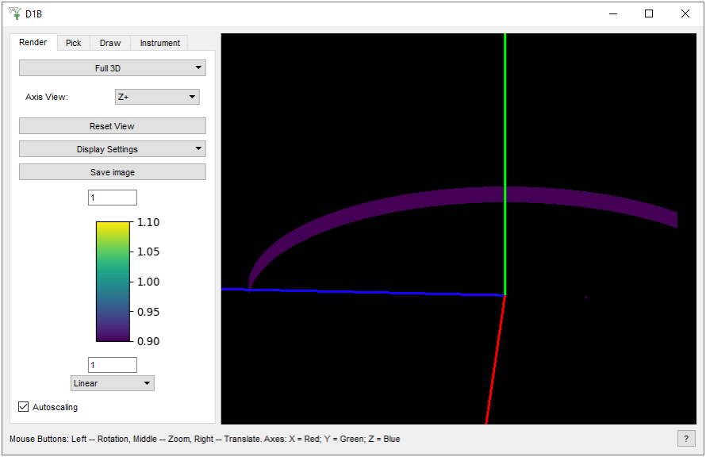
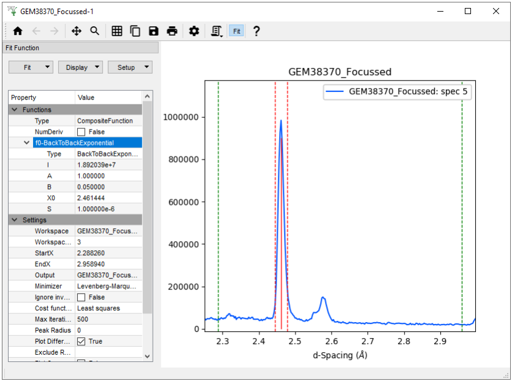
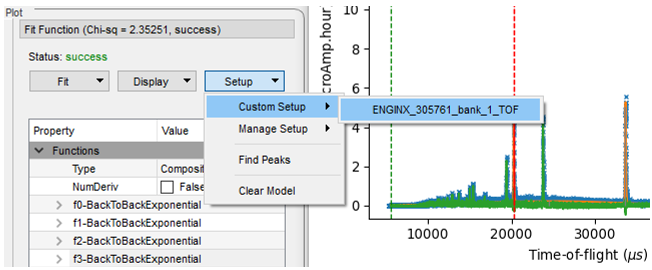

===================
Diffraction Changes
===================

.. contents:: Table of Contents
   :local:

Powder Diffraction
------------------

New Algorithms
##############

- :ref:`LeadPressureCalc <algm-LeadPressureCalc>` to calculate the pressure of a sample given the d-Spacing of the Lead (111) peak and the sample temperature
- :ref:`PEARLTransfit <algm-PEARLTransfit>` for PEARL that uses a TransVoigt function to determine the temperature of a given sample
- :ref:`PaalmanPingsAbsorptionCorrection <algm-PaalmanPingsAbsorptionCorrection>` uses a numerical integration method to calculate attenuation factors for all Paalman Pings terms
- :ref:`CorelliCalibrationDatabase <algm-CorelliCalibrationDatabase>` to save CORELLI geometry calibration to database
- :ref:`CorelliCalibrationApply <algm-CorelliCalibrationApply>` to apply a CORELLI calibration table to CORELLI EventWorkspace
- :ref:`ClipPeaks <algm-ClipPeaks>` to clip peaks, providing a background estimation.
- :ref:`PolDiffILLReduction <algm-PolDiffILLReduction>` to perform polarised diffraction data reduction for the ILL D7 instrument
- :ref:`D7AbsoluteCrossSections <algm-D7AbsoluteCrossSections>` to separate magnetic, nuclear coherent, and incoherent cross-sections using spin-flip and non-spin-flip cross-sections, and to normalise D7 data to a given standard

Improvements
############

- **Nexus files from ILL's instrument D1B can now be loaded (see InstrumentViewer)**
- Powder diffraction support (instruments D2B and D20) has been added to DrILL interface. See :ref:`DrILL documentation <DrILL-ref>` for more information.

- **The height of the** :ref:`func-BackToBackExponential` **peak is now preserved when changing the FWHM sliders during fitting**
- :ref:`PaalmanPingsMonteCarloAbsorption <algm-PaalmanPingsMonteCarloAbsorption>` can now use tabulated density values, and allows for overridden X Sections

- Add ability to store multiple alternative attenuation file paths in the PEARL YAML configuration file
- Add ``sample_empty`` and ``sample_empty_scale`` into PEARL powder diffraction scripts
- Modify filenames of XYE outputs from running a focus in the PEARL powder diffraction scripts
- Remove ``_noatten`` workspace that was produced by the PEARL powder diffraction scripts when run with ``perform_attenuation=True``
- Speed up focus action in ISIS powder diffraction scripts by saving pre-summed empty instrument workspace during calibration step

- :ref:`SNSPowderReduction <algm-SNSPowderReduction>` now includes several different absorption correction methods
- The vanadium absorption correction in :ref:`SNSPowderReduction <algm-SNSPowderReduction>` is now calculated using numerical integration rather than Carpenter method
- In the creation of absorption input in :ref:`SNSPowderReduction <algm-SNSPowderReduction>` automatically gets information from sample logs
- Added new absorption options from :ref:`SNSPowderReduction <algm-SNSPowderReduction>` to Powder Diffraction Reduction GUI
- :ref:`PDCalibration <algm-PDCalibration>` now supports workspaces with grouped detectors (i.e. more than one detector per spectrum)

- :ref:`AlignAndFocusPowderFromFiles <algm-AlignAndFocusPowderFromFiles>` copies the sample from the absorption workspace to the output workspace
- Scripts for pixel calibration of CORELLI 16-packs produce a calibration table, a masking table, and a goodness of fit workspace
- :ref:`WANDPowderReduction <algm-WANDPowderReduction>` now accepts a sequence of input workspaces, combining them to reduce to a single spectrum
- The :ref:`HB2AReduce <algm-HB2AReduce>` now can save reduced data to GSAS or XYE file

- :ref:`PowderILLDetectorScan <algm-PowderILLDetectorScan>` is corrected when treating multiple scans merged
- The :ref:`D7YIGPositionCalibration <algm-D7YIGPositionCalibration>` now can do the YIG Bragg peak fitting individually or simultaneously, or not at all and provide feedback on the initial guess quality
- :ref:`PDCalibration <algm-PDCalibration>` now intitialises A,B and S of BackToBackExponential if correpsonding coeficients are in the instrument parameter.xml file.
- PaalmanPingsMonteCarloAbsorption can now make use of predefined sample and container geometries

Bugfixes
########

- Dummy detectors in POLARIS workspaces no longer prevent unit conversion
- Focus in PEARL powder diffraction scripts no longer fails if previous run has created a Van splines WorkspaceGroup
- Fix out-of-range bug in :ref:`FitPeaks <algm-FitPeaks>` for histogram data.
- Fix bug to actually implement intended sequential fit of DIFC, DIFA, TZERO in :ref:`PDCalibration <algm-PDCalibration>`.
- :ref:`WANDPowderReduction <algm-WANDPowderReduction>` once again accepts multiple input workspaces and outputs a WorkspaceGroup when specified by user

Engineering Diffraction
-----------------------

New features
############

- Added refined :ref:`func-BackToBackExponential` coefficients (from standard Ceria run) to ENGIN-X Parameters.xml so A, B and S are guessed automatically.
- The plot pane in the Engineering Diffraction GUI can now be undocked from the main window, making this more clear, especially with the fit browser open.
- The fitting tab now creates a WorkspaceGroup that stores the model string, the fit value and error on each parameter for each loaded workspace.
- Sequential fitting now provided in fitting tab by average value of a log set in settings

Improvements
############

- The default load path in the fitting tab of the Engineering Diffraction GUI is now set to the most recently focused files.

- **When a fit is successful, the model will be stored as a** ``Custom Setup`` **in the fit property browser under the name of the workspace fitted**.
- In the fit browser, the user is no longer asked before overwriting an automatically generated  model ``Custom Setup``; it is overwritten.

- When a sequential fit is performed in the fitting tab, the status of the fit is updated in the fit browser.
- The generic Sequential Fit button removed from fit menu (users should use sequential fit button below the table in the fitting tab).

Bugfixes
########

- GUI Settings are now saved only when the ``Apply`` or ``OK`` button are clicked (i.e. clicking ``Cancel`` will not update the settings).
- For focussed data in the fitting tab, each sample log will only be averaged if the log exists

Single Crystal Diffraction
--------------------------

New Algorithms
##############

- :ref:`ConvertQtoHKLMDHisto <algm-ConvertQtoHKLMDHisto>` to convert from a QSample MDEventWorkspace to HKL MDHistoWorkspace with correct peak overlaying
- :ref:`SaveHKLCW <algm-SaveHKLCW>` for SHELX76 constant wavelength format
- :ref:`HB3AAdjustSampleNorm <algm-HB3AAdjustSampleNorm>` to convert DEMAND data to Q-space and allow the detector position to be adjusted by offsets
- :ref:`HB3AFindPeaks <algm-HB3AFindPeaks>` to find peaks and set the UB matrix for DEMAND data
- :ref:`HB3APredictPeaks <algm-HB3APredictPeaks>` to predict peaks for DEMAND data
- :ref:`HB3AIntegratePeaks <algm-HB3AIntegratePeaks>` used to integrate peaks from an MDEventWorkspace and apply Lorentz correction on DEMAND data

Improvements
############

- Support added for DEMAND (HB3A) to :ref:`PredictPeaks <algm-PredictPeaks-v1>` in order to handle additional goniometers.
- Added refined :ref:`func-BackToBackExponential` coefficients (from standard sample) to WISH Parameters.xml so A, B and S are guessed automatically.

Bugfixes
########
- :ref:`SaveHKL <algm-SaveHKL>` calculates the DirectionCosines correctly again.
- :ref:`SaveHKL <algm-SaveHKL>` only recalculates TBAR if it's not already populated in the input peaks workspace
- Matrix diagonalization is no longer returning NaNs in certain cases. The diagonalization is used in :ref:`CalculateUMatrix <algm-CalculateUMatrix>` and :ref:`IntegratePeaksMD <algm-IntegratePeaksMD>`

:ref:`Release 6.0.0 <v6.0.0>`
