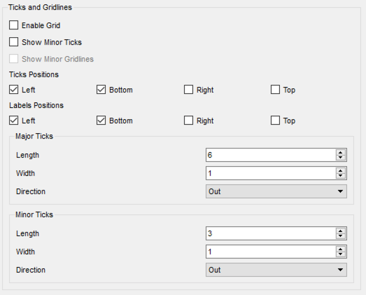
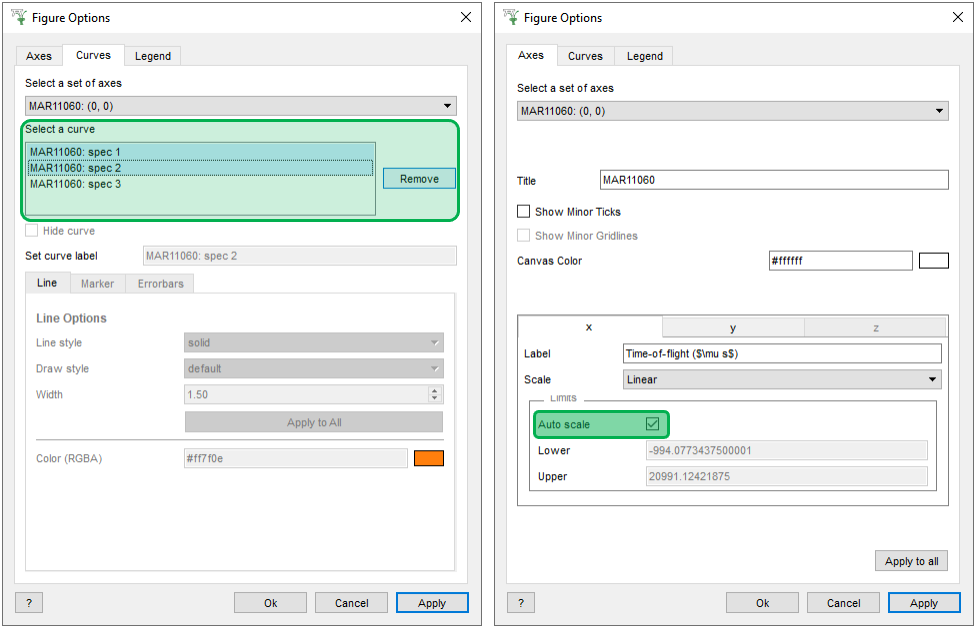
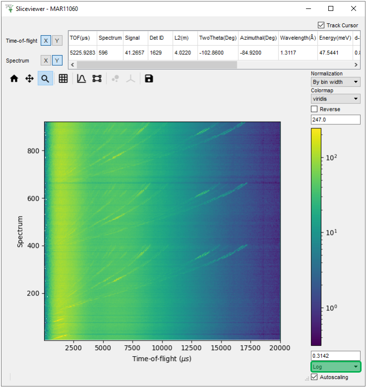
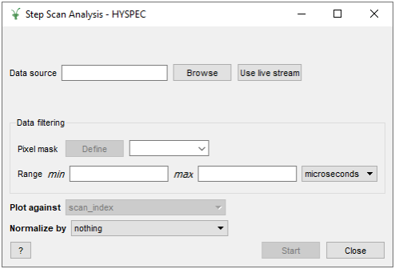

========================
Mantid Workbench Changes
========================

.. contents:: Table of Contents
   :local:

New & Improved Features
#######################

Plotting
--------

- New preferences can be set in ``File > Settings > Plots``:
    - **Tick customisation**
    - **Enabling grids by default**
    - Colorbar scale preference to linear or logarithmic
    - Show (Hide) legend checkbox

- **In** ``Figure options > Curves tab`` **multiple curves can be selected and removed at once. The delete key was added as a shortcut**
- **Add an autoscale checkbox to figure options**
- Improved plot generated scripts to better support major and minor tick settings at time of generation
- Enabled the plotting of individual functions in the fit browser. Plotting of each function can be performed by right clicking on the fit function within the browser and selecting plot

- 1D Plots from MantidPlot project files can be loaded in Workbench
- Plots containing ``axvline`` and ``axhline`` can be successfully reproduced by project save
- Vertical and horizontal markers on a plot no longer appear in front of the legend
- Allow plotting a 1D spectrum (plot, overplot, plot_with_error, overplot_with_error) from an IMDHistoWorkspace with only 1 non-integrated dimension (but do not enable SliceViewer)

- Wireframe plots no longer spill over the axes when their limits are reduced
- Colorbar limits on colorfill plots allow greater precision and scientific notation
- The zoom selection box has greater contrast with the image for SliceViewer and colorfill plots

SliceViewer
-----------
- **The colorbar scale can now be set to** ``Log`` **which differs from the existing** ``Symlog`` **option as it prohibits negative values**
- Replots when the underlying workspace is modified .
- Improved spectra selection, which should ensure that high counting spectra are shown immediately when opened.
- Dynamic binning has been enabled for MDHistoWorkspaces with an attached original in the SliceViewer. Manual rebinning options are now also shown.

Sample Logs
-----------

- SampleLogs in multiperiod event workspaces are now filtered by current period
- Added QLineEdit to SampleLogs widget to allow filtering its entries

Interfaces
----------

- **Migrate Step Scan interface to Workbench**

- Expose :ref:`Instrument View <InstrumentViewer>` control to Python
- Add the possibility to copy and paste shapes in the InstrumentViewer using ``Ctrl + C`` and ``Ctrl + V``
- In the InstrumentViewer, the integration scroll bar can be moved, widened and shrunk using the arrow keys
- Add a Python function to replace the workspace being shown by InstrumentViewer

- A system to group samples and avoid repetition in DrILL has been added. See the :ref:`DrILL documentation <DrILL-ref>` for more information.
- In the plot config, multiple curves can be selected and removed at once. The delete key was added as a shortcut.
- Support for D16 sample scan mode in DrILL.
- Automatic data export in DrILL. See the :ref:`DrILL documentation <DrILL-ref>` for more information.
- A bug has been fixed in SliceViewer where attempting to plot a workspace with a text axis would cause a crash when zoomed out.
- Improved plot generated scripts to better support major and minor tick settings at time of generation.
- Allowed the use of greater precision and scientific notation when changing the colorbar limits on a colorfill plot from the Figure Options.

Miscellaneous
-------------

- Added a Dx data tab on the ``Show Data`` table when a workspace has Dx data
- Improved the clarity of error messages generated by algorithms when access to a file is denied due to insufficient user permissions
- Remove Load and Fit algorithm dialogs from autocompletion

Bugfixes
########

SliceViewer
-----------

- Displayed data updates correctly when changing axis selection
- The axis limits for non-orthogonal data are now calculated to display all data for that zoom level
- Axes limits of sliceviewer are now updated correctly when orthogonal axes were transposed.
- Now monitor spectra and spectra with nan or inf values are ignored in determining axes limits
- Opening SliceViewer for a workspace with a text axis is now handled correctly.

- Cursor data now work for Direct or Indirect data
- It is now not possible to zoom in too far on MDE workspaces
- Only enable SliceViewer for MDEventWorkspaces with 2 or more dimensions

- Ellipsoid axes of integrated peaks are correctly transformed when axes swapped
- A number of issues with displaying ellipsoid peak shapes have been fixed
- For the elliptical shell of integrated peaks, the inner background radius is now correct
- The background shell of spherical peaks is now plotted if inner radius equals the peak radius
- The sort order of peaks in the peaks overlay has been corrected
- Now the correct view is displayed for orthogonal axis indices in non-orthogonal view
- Displayed peaks update if the underlying PeaksWorkspace has been changed, removed or cleared

Miscellaneous
-------------

- For ragged workspaces, the data table can be shown, they can be plotted, and colorfill plots have the correct horizontal extent

- Script generation for bin plots now matches the output bin plot from a data table
- Show spectrum numbers instead of workspace index in plotBin
- A bin plot for a workspace with a numerical spectrum axis, the x axis values are from the numerical axis rather than the spectrum numbers

- A colorfill plot rescales after the underlying workspace is replaced
- Editing legends in-situ is now also possible on Linux platforms
- Removing the last curve on a plot is now handled smoothly
- In figure options the axes title is synced between the axis and curves tabs

- Error handling for using broken e notation for plot axis limits
- The error every value in figure options now matches the plotted error bars

- Deleting rows or columns in a TableWorkspace is handled smoothly
- The fit button in the fit browser is now disabled when all functions are removed
- Pressing ``Esc`` to close ManageUserDirectories is now handled correctly
- Fixed a crash when selecting Show Detectors on a workspace with a spectrum which is missing an EFixed and is not a monitor.

:ref:`Release 6.0.0 <v6.0.0>`
