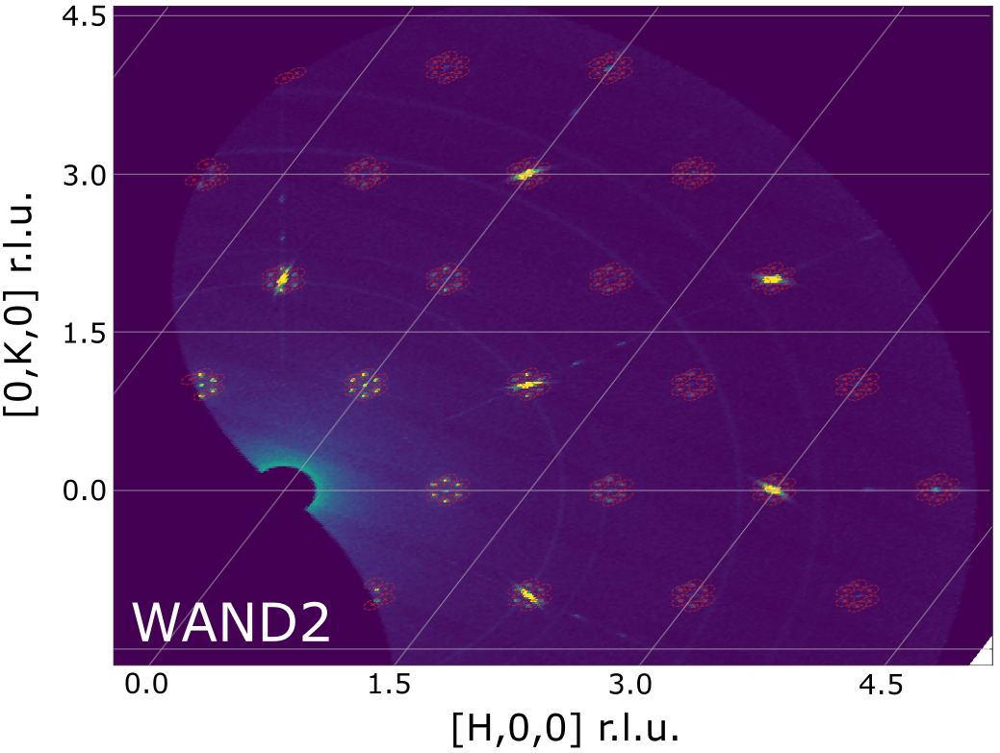

===================
Diffraction Changes
===================

.. contents:: Table of Contents
   :local:

Powder Diffraction
------------------
New features
############

- The :ref:`ConvertUnits <algm-ConvertUnits>` algorithm has been extended to use a calibration when converting between d spacing, momentum transfer and TOF. A calibration can be loaded into a workspace using a new :ref:`ApplyDiffCal <algm-ApplyDiffCal>` algorithm and then viewed in the Show Detectors screen. The calibration consists of the diffractometer constants DIFA, DIFC and TZERO that determine the form of the quadratic relationship between d spacing and TOF. This functionality was previously only available in :ref:`AlignDetectors <algm-AlignDetectors>` which only performed the conversion in the direction TOF to d spacing. This change will provide several benefits:

  - Allow the user to choose the calibration to use when converting focused data from d-spacing to TOF
  - Improved integration with GSAS e.g. both the calibration and the data will be loaded from GSAS files when running the algorithm :ref:`LoadGSS <algm-LoadGSS>` and subsequent unit conversions will respect the calibration
  - Make the unit conversions based on a calibration more accessible in the main ConvertUnits algorithm
- :ref:`PDCalibration <algm-PDCalibration>` now supports workspaces with grouped detectors (i.e. more than one detector per spectrum).
- New diagnostic plotting tools:

  - `Calibration.tofpd..diagnostics.plot2d` which adds markers for expected peak positions.
  - `Calibration.tofpd.diagnostics.difc_plot2d` which plots the change in DIFC between two instrument calibrations.
  - `Calibration.tofpd.diagnostics.plot_peakd` which plots the d-spacing relative strain of peak positions.
  - `Calibration.tofpd.diagnostics.plot_corr` which plots the Pearson correlation coefficient for time-of-flight and d-spacing for each detector.
  - `Calibration.tofpd.diagnostics.plot_peak_info` which plots fitted peak parameters for instrument banks.
- New algorithm :ref:`IndirectILLReductionDIFF <algm-IndirectILLReductionDIFF>` to reduce Doppler diffraction data for ILL's IN16B instrument.
- :ref:`SNSPowderReduction <algm-SNSPowderReduction>` has additional property, ``DeltaRagged``, which allows using :ref:`RebinRagged <algm-RebinRagged>` to bin each spectrum differently.
- A new caching feature is added to :ref:`SNSPowderReduction <algm-SNSPowderReduction>` to speed up calculation using same sample and container.
- New property `CleanCache` in algorithm :ref:`SNSPowderReduction <algm-SNSPowderReduction>`.
- Including three options for "cache directory" and one for "clean cache" in the Advanced Setup tab of the SNS Powder Reduction interface.

Improvements
############

- New motor convention for HB2A implemented in :ref:`HB2AReduce <algm-HB2AReduce>`.
- :ref:`FitPeaks <algm-FitPeaks>` can now fit multiple peaks in the same spectrum with a :ref:`BackToBackExponential <func-BackToBackExponential>` starting from user specified parameters.
- :ref:`PDCalibration <algm-PDCalibration>` now initialises the parameters A,B and S of the :ref:`BackToBackExponential <func-BackToBackExponential>` function if corresponding coefficients are in the instrument parameter.xml file.
- Support for fitting diffractometer constants with chi-squared cost function in :ref:`PDCalibration <algm-PDCalibration>`.
- :ref:`SNSPowderReduction <algm-SNSPowderReduction>` now checks if a previous container was created using the same method before reusing it.
- A differential evolution minimizer was added to :ref:`AlignComponents <algm-AlignComponents>`.
- A differential evolution minimizer was added to :ref:`CorelliPowderCalibrationCreate <algm-CorelliPowderCalibrationCreate>`.
- Added option to fix banks' vertical coordinate in :ref:`CorelliPowderCalibrationCreate <algm-CorelliPowderCalibrationCreate>`.
- Loading a CORELLI tube calibration also returns a ``MaskWorkspace``.
- :ref:`AlignComponents <algm-AlignComponents>` has option to output a table listing the changes in position and orientation for each component
- :ref:`CorelliPowderCalibrationCreate <algm-CorelliPowderCalibrationCreate>` now outputs a table listing the changes in position and orientation for each bank
- :ref:`PolDiffILLReduction <algm-PolDiffILLReduction>` now outputs flipping ratios along with polarisation corrections.
- :ref:`WANDPowderReduction <algm-WANDPowderReduction>` GUI now only shows relevant items in drop down menu and no longer has a confusing copy input workspace name button.

Bugfixes
########

- Use the correct version of exponential integral (i.e., the E1 function) in peak profile function :ref:`Bk2BkExpConvPV <func-Bk2BkExpConvPV>` so it can be evaluated properly.
- Fix the issue with SNS Powder Reduction interface when multiple run numbers are provided and separated with comma.
- Fix an issue when saving reduced data as GSAS format using :ref:`HB2AReduce <algm-HB2AReduce>`.
- Fix the format inconsistency (with data saved from autoreduction workflow) issue for saving GSAS data using :ref:`HB2AReduce <algm-HB2AReduce>` - both are now using :ref:`SaveGSSCW <algm-SaveGSSCW>` for saving GSAS data.
- Fix out-of-range bug in :ref:`FitPeaks <algm-FitPeaks>` for histogram data.
- Fix bug in :ref:`FitPeaks <algm-FitPeaks>` not correctly checking right window for an individual peak.
- Fix :ref:`CalculatePlaczekSelfScattering <algm-CalculatePlaczekSelfScattering>` calculation of mass term for multiple-element materials
- Fix bug to implement intended sequential fit of DIFC, DIFA, TZERO in :ref:`PDCalibration <algm-PDCalibration>`.
- Correct unit to TOF for ``_tof_xye`` files output for PEARL, when the focusing mode is set to *all*.
- Allow a different number of spectra for absorption correction division of PEARL data. This allows ``create_vanadium`` to work for a non-standard dataset.
- Saved filenames for summed empty workspaces now include spline properties to avoid long_mode confusion when focussing.
- Fix segmentation violation issues for ILL instruments D1B, D2B, and D20, caused by change of scanned data type
- :ref:`D7AbsoluteCrossSections <algm-D7AbsoluteCrossSections>` fixed the wrong assumption on the order of spin-flip and non-spin-flip data, and fixed the relative normalisation issues.
- Fix crashing issue in :ref:`AlignAndFocusPowder<algm-AlignAndFocusPowder>` due to using new unit conversion APIs.
- Support for data with x-axis unit of TOF has been deprecated in :ref:`DiffractionFocussing version 2 <algm-DiffractionFocussing-v2>`, please use :ref:`GroupDetectors <algm-GroupDetectors>` instead.
- Fixed an error in the final calculation for the PEARLTransVoigt function, used in PEARLTransfit

Engineering Diffraction
-----------------------

New features
############

- New IDF for upgraded VULCAN instrument

Improvements
############

- :ref:`BackToBackExponential <func-BackToBackExponential>` coefficients for A,B and S now read from .xml file and output to .prm file for GSAS-II.
- The Engineering Diffraction interface can now be saved as part of a project file, and can save/restore in the event of a crash as part of the general project save system.

Bugfixes
########

- Engineering diffraction interface now converts fitted TOF centre to d-spacing using diffractometer constants post sequential fit (in a matrix workspace).
- Error on the fitted peak centre converted from TOF to d-spacing will now be correct for non-zero difa in the Engineering diffraction interface.
- Added checks for the existence of non-zero proton charge before attempting to average log values weighted by proton charge in the fitting tab of the engineering diffraction interface.
- :ref:`EnggFocus <algm-EnggFocus>` algorithm doesn't attempt to normalise by current if the run has no proton charge and will not throw an error (but will print a warning to the log).

Single Crystal Diffraction
--------------------------

New features
############

- New version of algorithm :ref:`SCDCalibratePanels <algm-SCDCalibratePanels-v2>` provides more accurate calibration results for CORELLI instrument.
- Modified some logs in output workspace from :ref:`LoadWANDSCD <algm-LoadWANDSCD>` to be TimeSeriesProperty so they work with :ref:`SetGoniometer <algm-SetGoniometer>`.
- :ref:`IntegratePeaksMD <algm-IntegratePeaksMD>` has option to integrate ellipsoids around estimated centroid instead of nominal position.
- :ref:`IntegratePeaksMD <algm-IntegratePeaksMD>` has option to determine ellipsoid covariance iteratively and to use the estimated standard deviation rather than scale the major axis of the ellipsoid to the spherical radius.
- Algorithms :ref:`ConvertWANDSCDtoQ <algm-ConvertWANDSCDtoQ>` and :ref:`ConvertHFIRSCDtoMDE <algm-ConvertHFIRSCDtoMDE>` have a new geometrical correction factor `ObliquityParallaxCoefficient` for shift in vertical beam position due to wide beam.
- :ref:`TransformHKL <algm-TransformHKL>` has new keyword argument `FindError` allowing the lattice parameter error calculation to be skipped. This can be used to transform HKL of a peaks workspace without enough peaks to do an optimization so they are simply set to zero.
- Added new detector to MANDI instrument geometry with updated calibration. Valid-to dates changed in previous files ``MANDI_Definition_2020_04_01.xml`` and ``MANDI_Parameters_2020_04_01.xml``. Valid-from dates changed in newly added files ``MANDI_Definition_2021_02_01.xml`` and ``MANDI_Parameters_2021_02_01.xml``.

LeanElasticPeak
^^^^^^^^^^^^^^^

**A new Peak concept has been create, a LeanElasticPeak where the instrument is not included as part of Peak. The only requirement for this peak is a Q-sample vector. There are a number of modifications made to facilitate this. The new LeanElasticPeak and LeanElasticPeakWorkspace concept is show in detail at** :ref:`LeanElasticPeaksWorkspace <LeanElasticPeaksWorkspace>`

- :ref:`CreatePeaksWorkspace <algm-CreatePeaksWorkspace>` has been modified to optionally create a :ref:`LeanElasticPeaksWorkspace <LeanElasticPeaksWorkspace>`.
- :ref:`FindPeaksMD <algm-FindPeaksMD>` has been modified to optionally create a :ref:`LeanElasticPeaksWorkspace <LeanElasticPeaksWorkspace>`.
- :ref:`PredictPeaks <algm-PredictPeaks>` has been modified to optionally create a :ref:`LeanElasticPeaksWorkspace <LeanElasticPeaksWorkspace>`.
- :ref:`PredictSatellitePeaks <algm-PredictSatellitePeaks>` will work with :ref:`LeanElasticPeaksWorkspace <LeanElasticPeaksWorkspace>`.
- New algorithm :ref:`HFIRCalculateGoniometer <algm-HFIRCalculateGoniometer>` allows the goniometer to be found for constant wavelength peaks after creation, works with :ref:`LeanElasticPeaksWorkspace <LeanElasticPeaksWorkspace>`.
- These following other algorithms have either been made to work or confirmed to already work with the LeanElasticPeak:

   - :ref:`algm-AddPeakHKL`
   - :ref:`algm-CalculatePeaksHKL`
   - :ref:`algm-CalculateUMatrix`
   - :ref:`algm-CentroidPeaksMD`
   - :ref:`algm-CompareWorkspaces`
   - :ref:`algm-CombinePeaksWorkspaces`
   - :ref:`algm-FilterPeaks`
   - :ref:`algm-FindUBUsingFFT`
   - :ref:`algm-FindUBUsingIndexedPeaks`
   - :ref:`algm-FindUBUsingLatticeParameters`
   - FindUBUsingMinMaxD
   - :ref:`algm-IndexPeaks`
   - :ref:`algm-IntegratePeaksMD`
   - :ref:`algm-LoadNexusProcessed`
   - :ref:`algm-OptimizeLatticeForCellType`
   - :ref:`algm-SaveNexusProcessed`
   - :ref:`algm-SaveHKLCW`
   - :ref:`algm-SelectCellOfType`
   - :ref:`algm-SelectCellWithForm`
   - :ref:`algm-SortPeaksWorkspace`
   - :ref:`algm-ShowPossibleCells`
   - :ref:`algm-TransformHKL`

Improvements
############

- Added option to :ref:`IntegratePeaksMD <algm-IntegratePeaksMD>` to stop masking the first and last tubes of each bank (masked pixels are used to determine whether the integration region of a peak is near the edge of the detector). Previously adjacent tubes on adjacent banks were masked which are not always to be considered edges (e.g. on WISH). A custom masking can be applied to the peak workspace (e.g. using :ref:`MaskBTP <algm-MaskBTP>`) prior to integration to denote detector edges.
- :ref:`IntegratePeaksMD <algm-IntegratePeaksMD>` now allows ellipsoidal shapes to be manually defined for the PeakRadius and Background radii options.
- The :ref:`IntegratePeaksMD <algm-IntegratePeaksMD>` input dialog has been reorganised to present the many input properties in a more user-friendly manner.
- :ref:`IntegrateEllipsoids <algm-IntegrateEllipsoids>` calculates intensity for satellite peaks with fractional HKL.
- :ref:`SCDCalibratePanels <algm-SCDCalibratePanels-v2>` can optionally update the attached UB matrix with given lattice constants.
- :ref:`FilterPeaks <algm-FilterPeaks>` can select banks in addition to filtering by values.
- :ref:`FindPeaksMD <algm-FindPeaksMD>` has been modified to make use of the multiple goniometers add to :ref:`Run <mantid.api.Run>` and `goniometerIndex` add to MDEvents.
- :ref:`HB3APredictPeaks <algm-HB3APredictPeaks>` can now predict satellite peaks for DEMAND data.
- :ref:`MDNorm <algm-MDNorm>` algorithm can now efficiently process background.
- method ``IPeaksWorkspace.addPeak(V3D, SpecialCoordinateSystem)`` exposed to the python interface.

Bugfixes
########

- Correctly format FullProf files in :ref:`SaveReflections <algm-SaveReflections>`: there is now a title line and two rows per modulation vector in the header; the multiplicity of a reflection is by default 1.
- :ref:`SaveReflections <algm-SaveReflections>` now determines the parent HKL of a satellite correctly, previously the satellite HKL was rounded.
- :ref:`PredictPeaks <algm-PredictPeaks>` no longer segfaults when the instrument of the input workspace doesn't have the sample position set.
- :ref:`SCDCalibratePanels <algm-SCDCalibratePanels-v2>` no longer returns null calibration outputs.
- Fix failure in :ref:`HB3AFindPeaks <algm-HB3AFindPeaks>` when switching to crystallographic convention.
- Make :ref:`ConvertWANDSCDtoQ <algm-ConvertWANDSCDtoQ>` aware of k convention.
- Output of :ref:`ConvertQtoHKLMDHisto <algm-ConvertQtoHKLMDHisto>` now accommodates zoom in slice viewer, as a result this algorithm will now drop the connection to the original workspace

:ref:`Release 6.1.0 <v6.1.0>`
