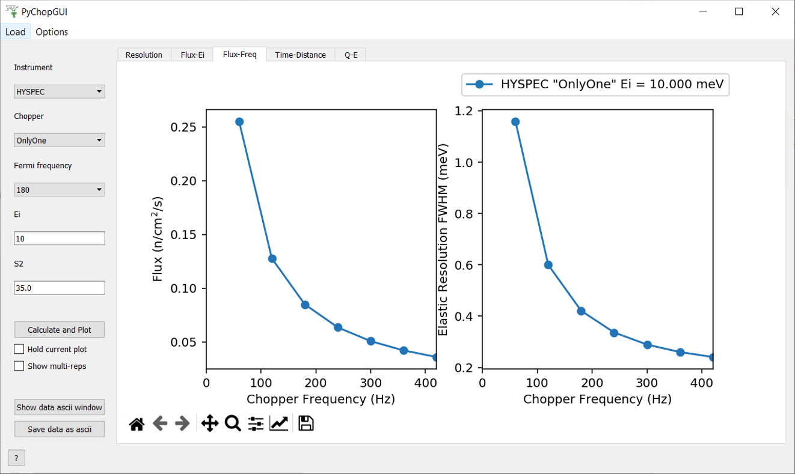

=======================
Direct Geometry Changes
=======================

.. contents:: Table of Contents
   :local:

General
-------

New Features
############

* Added a new algorithm :ref:`PelicanReduction <algm-PelicanReduction>` for the ANSTO PELICAN instrument that reduces time of flight data versus two theta to S(Q,w).
* **Added SNS instruments to** :ref:`PyChop <PyChop>`

* Updated instrument geometry for CHESS
* Loading of SHARP TOF and single-channel data has been added to :ref:`LoadILLTOF <algm-LoadILLTOF-v2>`
* New function to calculate angles for final momentum and for momentum transfer, in the `mantid.utils.dgs` library
* Loading of the omega-scan mode is supported for ILL instruments IN5, PANTHER, and SHARP via :ref:`LoadILLDiffraction <algm-LoadILLDiffraction>` loader

Improvements
############
* :ref:`MDNorm <algm-MDNorm>` algorithm can now efficiently process background.

MSlice
------

New Features
############

- Implemented floating/ontop window behaviour.
- Added a 'close all' command for plots in the command line interface.
- Added a button for deleting a line in the settings of a 1D plot.
- Added a wrapper for the commands necessary for adding a workspace via the command line interface.
- Added feature of raising or bringing forward plot window for plotover in cuts.

BugFixes
########

- Fixed bug that overwrote selection of background workspace when subtracting workspaces.
- Fixed runtime error when trying to delete workspace for the second time.
- Fix for colorcycle problem for multiple curves on one plot.
- Fixed a bug that caused hidden lines to be shown when generating a script from a plot.
- Corrected workspace names in scripts generated from plots.
- Prevented crashes when converting Intensity from S(Q,E) to GDOS.
- Fixed bug that caused specifying the fixed final energy for more than one workspace at once to fail.
- Release active interactive cuts on existing slice plots to enable a new slice plot in order to prevent crash.
- Fixed bug that caused crashes when displaying or closing an empty plot window.

:ref:`Release 6.1.0 <v6.1.0>`
