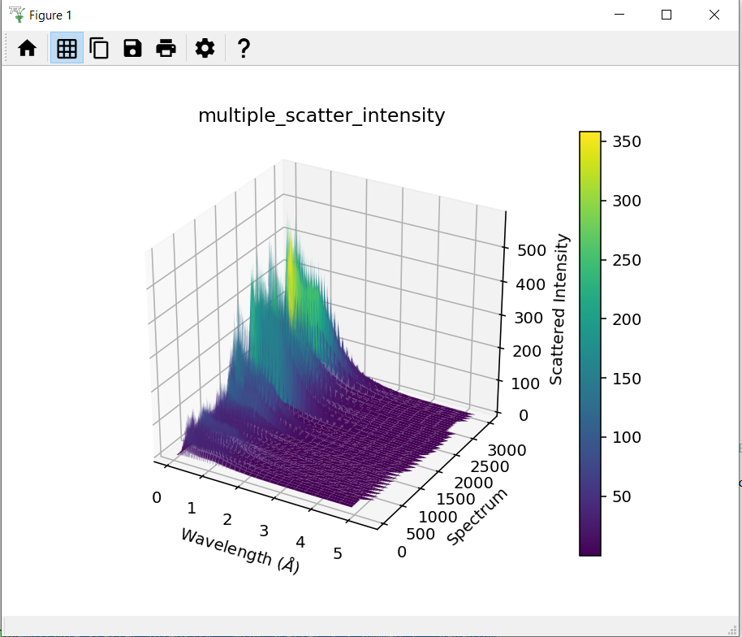
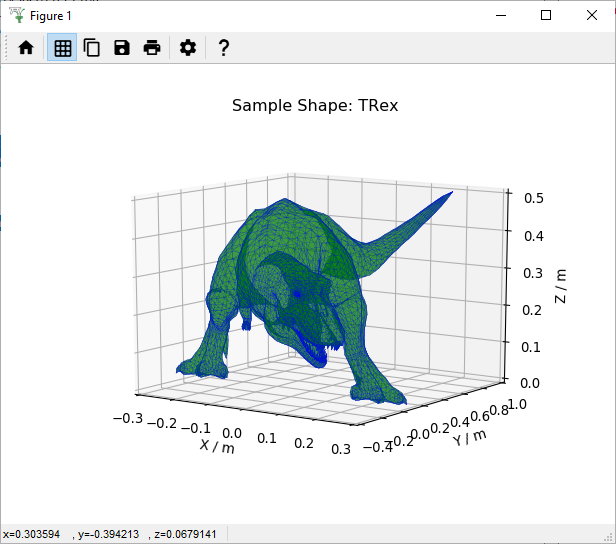

=================
Framework Changes
=================

.. contents:: Table of Contents
   :local:

   Calculated multiple scattering intensity using POLARIS data for a cylindrical Si sample

Algorithms
----------

New Features
############

- New algorithm :ref:`RebinRagged <algm-RebinRagged>` which can rebin a workspace with different binning parameters for each spectrum.
- New algorithm :ref:`CalculateMultipleScattering <algm-DiscusMultipleScatteringCorrection>` to calculate multiple scattering corrections using a Monte Carlo integration approach that doesn't rely on assumptions about isotropic scattering or constant ratios between different scattering orders and can run on any sample shape (mesh or CSG). The implementation is based on Fortran code developed by Mike Johnson and Spencer Howells under the names Muscat, MODES and DISCUS. The algorithm only supports elastic instruments so far but support for inelastic instruments will be added at a later date.
- New algorithm :ref:`GeneratePythonFitScript <algm-GeneratePythonFitScript>` allows the creation of a python script for sequential fitting.
- New algorithm :ref:`GenerateLogbook <algm-GenerateLogbook>`, that allows creating TableWorkspace logbooks based on provided directory path with raw data.
- New algorithm :ref:`ProfileChiSquared1D <algm-ProfileChiSquared1D>` to profile chi squared after a fit. This can be used to find better estimates of parameter errors.

Improvements
############

- :py:obj:`mantid.kernel.Material` has a new attribute ``totalAtoms`` to aid in converting atom multiplicity to concentration
- :ref:`LoadNexusLogs <algm-LoadNexusLogs>` has additional parameters to allow or block specific logs from being loaded.
- :ref:`LoadEventNexus <algm-LoadEventNexus>` now utilizes the log filter provided by `LoadNexusLogs <algm-LoadNexusLogs>`.
- :ref:`CompareWorkspaces <algm-CompareWorkspaces>` now compares the positions of both source and sample (if extant) when property `checkInstrument` is set.
- :ref:`SetGoniometer <algm-SetGoniometer>` can now set multiple goniometers from log values instead of just the time-averaged value.
- Added the ability to specify the spectrum number in :ref:`FindPeaksAutomatic <algm-FindPeaksAutomatic>`.
- :ref:`LoadLog <algm-LoadLog>` will now detect old unsupported log files and will provide a user-friendly error explaining the problem.
- :ref:`Stitch1DMany <algm-Stitch1DMany>` has additional property `IndexOfReference` to allow user to decide which of the provided workspaces should give reference for scaling
- :ref:`SaveAscii <algm-SaveAscii>` can now create a header for the output file containing sample logs specified through the new property `LogList`.
- The algorithm :ref:`PaalmanPingsMonteCarloAbsorption <algm-PaalmanPingsMonteCarloAbsorption>` now accepts a negative angle for the SampleAngle parameter of the FlatPlate shape
- :ref:`AnvredCorrection <algm-AnvredCorrection>` now extrapolates to determine the spherical absorption correction factor for very absorbing samples (a warning is printed to the log to inform the user when this occurs).

Bugfixes
########
- Fix problem with dictionary parameters on :ref:`SetSample <algm-SetSample>` algorithm when running from the algorithm dialog
- Fix segmentation fault when running :ref:`MonteCarloAbsorption <algm-MonteCarloAbsorption>` algorithm on Ubuntu without a material defined on one of the sample\environment shapes
- Fix calculation of region where scattering points are sampled in :ref:`MonteCarloAbsorption <algm-MonteCarloAbsorption>` when a shape is defined for the environment but not the sample
- Fix bug in the a\ :sub:`ss` calculation in :ref:`PaalmanPingsMonteCarloAbsorption <algm-PaalmanPingsMonteCarloAbsorption>` when run on shapes already present on input workspace

Instrument Definition Files
---------------------------
- The ARGUS IDF has been updated

Data Objects
------------

New Features
############
- **Sample Shapes from .stl mesh files can now be plotted in Workbench. For more details see** :ref:`Mesh_Plots`.

Improvements
############

- Exposed ``geographicalAngles`` method on :py:obj:`mantid.api.SpectrumInfo`.
- ``BinEdgeAxis`` now overrides the label in order to return the bin center and not the edge.
- :ref:`Run <mantid.api.Run>` has been modified to allow multiple goniometers to be stored.
- :ref:`FileFinder <mantid.api.FileFinderImpl>` has been modified to improve search times when loading multiple runs on the same instrument.

Bugfixes
########
- Fix crash on macOS when creating a UnitLabel with non-ascii characters using the single argument constructor

:ref:`Release 6.1.0 <v6.1.0>`
