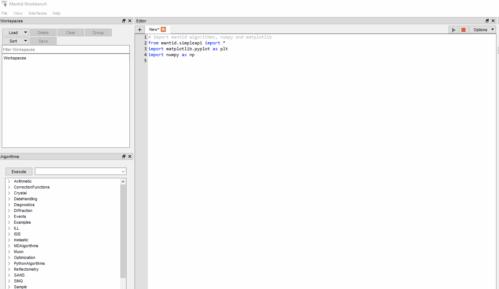
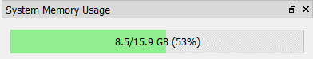

========================
Mantid Workbench Changes
========================

.. contents:: Table of Contents
   :local:

New and Improved
----------------

General
#######
- **Added setting to allow user to select Floating/On Top behaviour for all the windows that are opened by workbench (plots, interfaces, etc.). For more detail see** :ref:`Window Behavior <WorkbenchWindowBehavior>`.

- New command line options: ``--version`` will print the version on mantid, ``--error-on-warning`` will convert python warnings into exceptions. This is intended for developers so they can find deprecation warnings more easily.
- Calling python's `input` now raises an input dialog in the script editor and the iPython shell.
- Improved the performance of the table workspace display for large datasets.
- Added a sample material dialog that is accessed via the context menu in the workspace widget.
- A new empty facility with empty instrument is the default facility now, and  user has to select their choice of facility (including ISIS) and instrument for the first time.
- **Added memory widget to display total memory usage. This means that your widget layout will be reset when starting workbench v6.1.0 for the first time (see** :ref:`Workbench Main Window <main_window>` **for more details). Previously saved layouts accessible from** ``View > User Layouts`` **may need to be saved again to include the memory bar widget.**

Interfaces
##########
- Add a checkbox to freeze the rotation in the instrument viewer in Full 3D mode.
- In instrument view when in tube selection mode, the sum of pixel counts is now output to the selection pane.
- Automatic data export in DrILL now creates a header for ASCII files, through the new property in :ref:`SaveAscii <algm-SaveAscii>`.

Plotting
########
- New plot interactions: Double click a legend to hide it, double click a curve to open it in the plot config dialog.
- It is now possible to overplot bin data from the matrix workspace view.
- When a workspace is renamed it now updates the relevant plot labels with the new workspace name.
- Added legend property commands to the plot script generator.
- Plotting will accept grouped workspaces in addition to single workspaces in the list of workspaces to plot.

Bugfixes
--------

General
#######
- Display Debug and Information messages generated during workbench start up
- If the facility in `Mantid.user.properties` is empty, it is consistently reflected as empty in the GUI
- First time dialog box will not appear recurrently, if user selected their choice of facility and instrument at least once and checked "Do not show again until next version".
- Workbench no longer hangs on startup when running on Big Sur.
- TableWorkspace column names are now updated correctly when a table is open.
- Fixed a bug applying constraints with the conjugate gradient minimizer.
- Fixed a bug where running a selection of a script could cause the error reporter to appear.

Interfaces
##########
- Correct help links in certain interfaces.
- Fixed a bug that would not let the user input the bounding box of a shape in the instrument viewer.
- Fixed a bug that would cause a crash if the user right clicked on the plot in the instrument view pick tab after the stored curves were cleared.
- The y-axis in the instrument view's pick tab will now rescale if the range changes.
- On the instrument view's pick tab, when the integration range is changed the current tool will stay selected.
- Remove a "failed to build unwrapped surface" warning when viewing certain instruments in the instrument viewer using the cylindrical projections
- In sliceveiwer the background shell of spherical and elliptical peaks is now correctly plotted when viewing slices that do not cut through the peak center
- In sliceveiwer the elliptical shell of integrated peaks is plotted correctly for varying background thicknesses.
- Integrated spherical peaks are now plotted correctly in the non-orthogonal view of sliceviewer.
- Prevent crash when attempting to sort invalid data when overlaying a peaks workspace in sliceviewer.
- Fixed a bug which occurred when switching to a log scale in sliceviewer with negative data.
- Axes limits correctly reset when home clicked on sliceviewer plot of ragged matrix workspace.
- Line plots in sliceviewer now respect the status of the Track Cursor checkbox.
- Cursor coordinates in sliceviewer are now correct for transposed and non-orthogonal data.
- Stop sliceviewer crash when selecting the same peak after the overlaid peak workspace replaced or renamed.

Plotting
########
- The label of 1D curves in the legend of the plots is corrected to match the vertical axis bin center, if it is a BinEdgeAxis.
- Fixed a scenario where workbench could hang if the user closed a plot while live data was being read.
- Fixed a crash that happens when multiple plot windows are open, and the users closes one of them.
- Panning on a colour fill plot no longer stretches a dataset along spectrum axis instead of panning
- It is now possible to change the normalisation of an active plot after renaming the corresponding workspace.
- Fixed a bug where plotting a 3D Contour plot would produce the error reporter in some cases.
- Fixed a problem with scripts generated from tiled plots.
- Restrict scroll wheel zooming out to +/-10^300 to avoid crash.
- Exported axis tick formatter related commands to plot script.
- Restore axis tick format for plots on project save and load.
- Log scale normalisation of colorfill plots is now saved correctly during project save.

:ref:`Release 6.1.0 <v6.1.0>`
