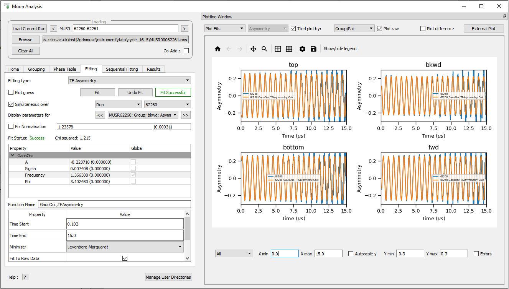

============
MuSR Changes
============

.. contents:: Table of Contents
   :local:

Muon Analysis 2 and Frequency Domain Analysis
---------------------------------------------

New Features
############
- **Added a new "periods" button to the grouping tab which displays a table of information on periods (currently only supporting nexus V1 files).**

.. figure:: ../../images/MuonAnalysis_PeriodsTable.png
   :class: screenshot
   :width: 500px
   :align: right

- Plotting ranges can now be edited individually for tile plots.

Improvements
############

- The muon fitting tab has been redesigned making it easier to use and more stable. TF Asymmetry fitting has seen
  the largest improvement in usability as the fit function is now displayed in a much simpler form.

- Frequency Domain Analysis default values have been improved.
- Improved the validation on the start and end X so that their values could not be outside the data x range.

Bug fixes
#########
- Fixed a bug where removing a pair in use would cause a crash.
- Fixed a bug where an error message would appear in workbench after loading a run in both MA and FDA.
- Fixed a bug where rows in the difference table were not being highlighted correctly.
- Fixed a bug where the color of the fitted line would sometimes match the color of the raw data line, making it
  difficult to see.
- Fixed a bug in the Grouping tab where an error message would appear when changing the source of Group Asymmetry Range with no data loaded.
- Fixed a crash caused when switching between tabs in Muon Analysis.
- Fixed a bug where the plot window would sometimes become disabled when loading new data.
- Fixed a usability issue where tabs became unattached too easily. It is now possible to unattach the tabs only by double clicking on them.
- Fixed a bug that caused the `AutoScale` check box to reset when editing the selected groups/pairs.
- Fixed a bug where the start and end X would reset in the fitting tab when stepping to the next or previous run.
- Fixed a bug caused by entering an empty string into the start and end X fields.
- Fixed a bug when loading PSI data in co-add mode

ALC
---

Improvements
############
- Exported workspaces now have history.
- The interface saves previous settings if possible instead of resetting.
- The interface can now load runs from different directories/cycles

Bug fixes
#########
- Fixed a bug where after changing the axis scales of the plot, when loading new data the default scale would be used instead.
- Fixed a crash when changing between log and linear scale on the preview plot.

Elemental Analysis
------------------

Improvements
############
- Updated :ref:`LoadElementalAnalysisData <algm-LoadElementalAnalysisData>` algorithm to crop workspace.

Algorithms
----------

New Features
############

- Added the ability to specify the spectrum number in :ref:`FindPeaksAutomatic <algm-FindPeaksAutomatic>`.
- Added :ref:`PeakMatching <algm-PeakMatching>` algorithm.
- Added the ability to specify a Start and End X in :ref:`PSIBackgroundSubtraction <algm-PSIBackgroundSubtraction>`.
- Added the ability to specify an optional Function to add onto the end of the default function in :ref:`PSIBackgroundSubtraction <algm-PSIBackgroundSubtraction>`.

:ref:`Release 6.1.0 <v6.1.0>`
